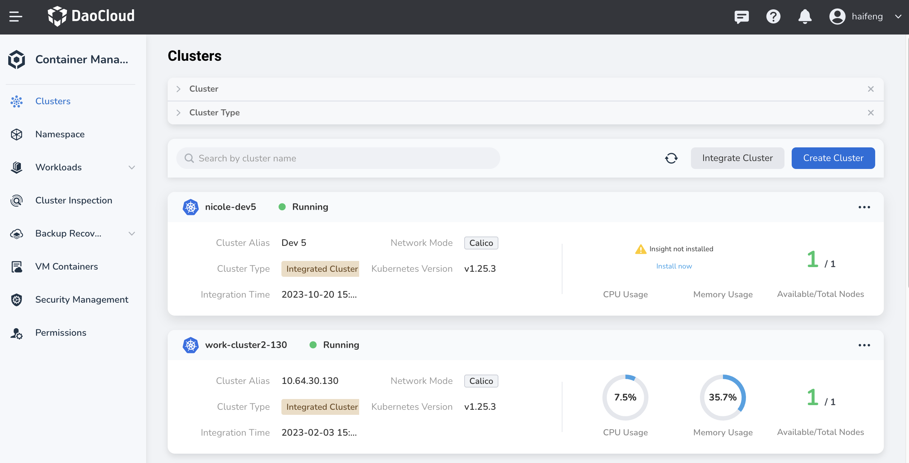
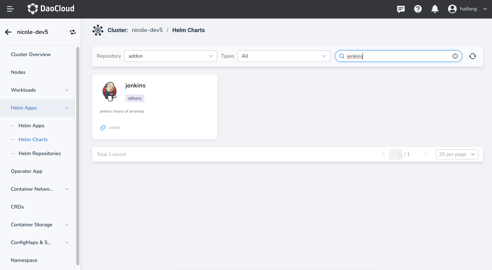
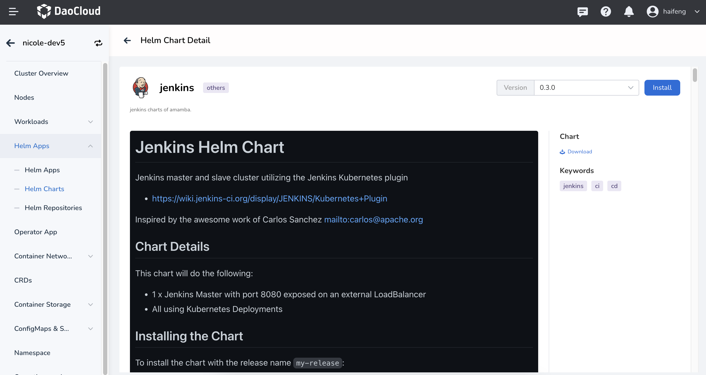
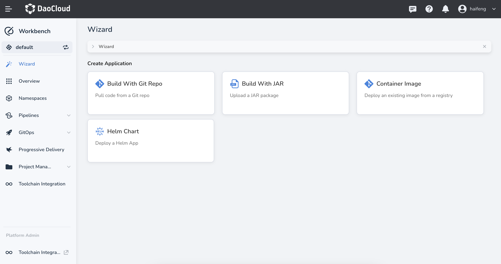
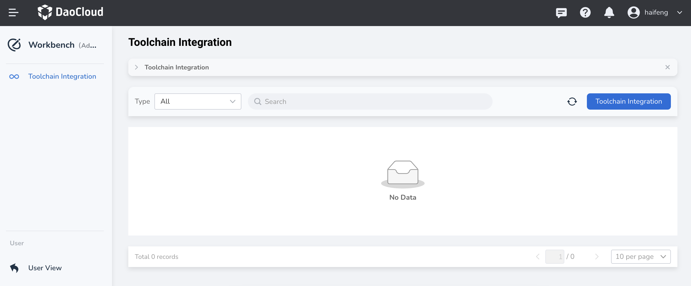
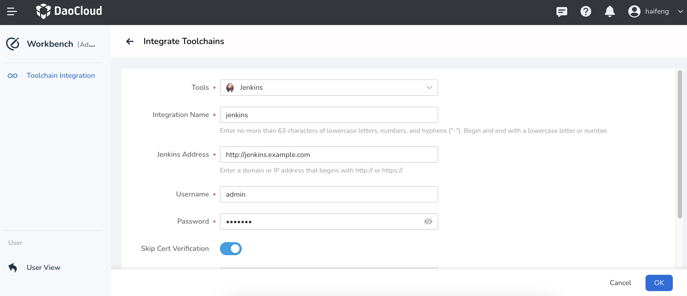

# Installing Jenkins

## Prerequisites

- Before installing Jenkins, make sure there is a default storage class in the cluster where Jenkins will be installed.
- Please ensure that it is installed in the `amamba-system` namespace.
- If installing on a global service cluster, make sure to have an instance of `amamba-jenkins` in the `Container Management` -> `Helm Applications`, under the `amamba-system` namespace.

## Getting Started with Installation

1. Go to the `Container Management` module and find the cluster where you want to install Jenkins in the `Cluster List`. Click on the name of that cluster.

    !!! note

        Select the deployment cluster for Jenkins based on your actual situation. Currently, it is not recommended to deploy it on the global service cluster as executing pipelines in Jenkins with high concurrency can consume a significant amount of resources and may cause the global service cluster to become unresponsive.

    

2. In the left navigation bar, select `Helm Applications` -> `Helm Templates`, and find and click on `Jenkins`.

    

3. In the `Version Selection`, choose the desired version of Jenkins to install, and click on `Install`.

    

4. On the installation page, fill in the required installation parameters, and finally click the `Confirm` button at the bottom right.

    

    Here are some important parameter explanations. Change and write the parameters according to your actual business needs.

    | Parameter                            | Description                                                   |
    | ------------------------------------ | ------------------------------------------------------------- |
    | AdminUser                            | Username for Jenkins                                          |
    | AdminPassword                        | Password for Jenkins                                          |
    | Deploy.JenkinsHost                   | Access link to Jenkins. If using Node Port, the access address will be: http://{cluster address:port} |
    | JavaOpts                             | Specify JVM startup parameters for running Jenkins            |
    | ServiceType                          | Default is ClusterIP, supports ClusterIP, NodePort, LoadBalancer |
    | ServicePort                          | Service access port                                           |
    | NodePort                             | Required if ServiceType=NodePort, range: 30000-32767          |
    | resources.requests                   | Resource requests for Jenkins                                 |
    | resources.limits                     | Resource limits for Jenkins                                   |
    | image.registry                       | Jenkins image                                                |
    | eventProxy.enabled                   | true means deployment on a non-global service cluster false means deployment on a global service cluster |
    | eventProxy.image.registry            | Required if enabled=true                                      |
    | eventProxy.image.repository          | Required if enabled=true                                      |
    | eventProxy.image.tag                 | Required if enabled=true                                      |
    | eventProxy.imagePullPolicy           | Required if enabled=true                                      |
    | eventProxy.configMap.eventroxy.host  | Required if enabled=true                                      |
    | eventProxy.configMap.eventroxy.proto | Required if enabled=true                                      |
    | eventProxy.configMap.eventroxy.token | Required if enabled=true Refer to the [Global Access Key Document](../../../ghippo/user-guide/personal-center/accesstoken.md) for token acquisition |

5. Go to Helm Applications to check the deployment result.

    

## Integrating Jenkins

Note: Currently, only integration with Jenkins installed via the DCE 5.0 platform is supported.

1. Log in to DCE 5.0 with a user who has the role of an Application Workspace Administrator and go to the Application Workspace.

    

2. On the left navigation bar under Platform Management, click `Toolchain Integration` and then click the `Integrate` button in the upper right corner.

    

3. Select the toolchain type as `Jenkins`, fill in the integration name, Jenkins address, username, and password.
   If the Jenkins address is using the HTTPS protocol, provide the certificate. By default, the account/password for Jenkins deployed through Helm is `admin/Admin01`.

    

4. After the integration is complete, a record will be successfully generated on the `Toolchain List` page.

5. Now you can proceed to create pipelines in the workspace. [Create a pipeline](create/custom.md).
