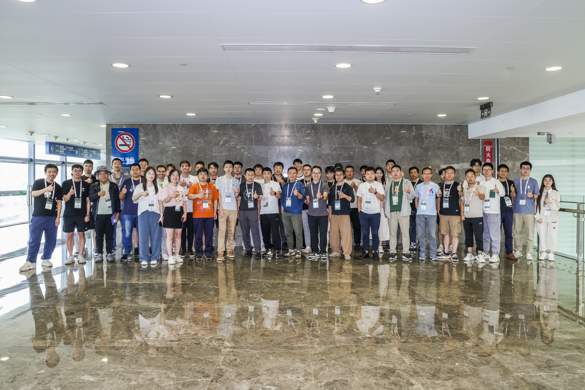

# A Look Back for Kubernetes Contributor Summits in Shanghai, China

Author: [Paco Xu](https://github.com/pacoxu) and [Michael Yao](https://github.com/windsonsea) (DaoCloud)

On September 26, 2023, the first day of KubeCon + CloudNativeCon + Open Source Summit China 2023,
nearly 50 community contributors gathered in Shanghai for the Kubernetes Contributor Summit.

This marked the first in-person offline gathering held in China after three years of the pandemic.

## Meetup

The event started with welcome speeches from [Kevin Wang](https://github.com/kevin-wangzefeng)
from Huawei Cloud, one of the co-chairs of KubeCon, and [Puja](https://github.com/puja108) from Gaint Swarm.

Following the opening remarks, the numerous contributors introduced themselves briefly.
The majority of attendees were from China, while some contributors made the journey from
Europe and the United States specifically for the conference. Among them were technical
experts from companies such as Microsoft, Intel, Huawei, as well as emerging forces like
DaoCloud. Laughter and cheerful voices filled the room, irrespective of whether English
was spoken with European or American accents or if conversations were carried out in
authentic Chinese language. It created an atmosphere of comfort, joy, respect, and
anticipation. Past contributions brought everyone closer, and mutual recognition and
accomplishments made this offline gathering possible.

The attending contributors were no longer mere GitHub IDs; they transformed into vivid faces.
From sitting together and capturing group photos to attempting to identify "Who is who,"
a loosely connected collective emerged. This team structure, although loosely knit and
free-spirited, was established to pursue shared dreams.

As the saying goes, "You reap what you sow." Each effort has been diligently documented
within the Kubernetes community contributions. Regardless of the passage of time, the
community will not erase those shining traces. Brilliance can be found in your PRs,
issues, or comments. It can also be seen in the smiling faces captured in meetup photos
or heard through stories passed down among contributors.

## Technical Sharing and Discussions

Next, there were three technical sharing sessions:

- [sig-multi-cluster](https://github.com/kubernetes/community/blob/master/sig-multicluster/README.md):
  [Hongcai Ren](https://github.com/RainbowMango), the owner of Karmada, provided an introduction to
  the responsibilities and roles of this SIG. Their focus is on designing, discussing, implementing,
  and maintaining APIs, tools, and documentation related to multi-cluster management.
  Cluster Federation, one of Karmada's core concepts, is also a part of their work.

- [helmfile](https://github.com/helmfile/helmfile): [yxxhero](https://github.com/yxxhero)
  from [GitLab](https://gitlab.cn/) presented how to deploy Kubernetes
  manifests declaratively, customize configurations, and leverage the latest features of Helm,
  including Helmfile.

- [sig-scheduling](https://github.com/kubernetes/community/blob/master/sig-scheduling/README.md):
  [william-wang](https://github.com/william-wang) from Huawei Cloud shared the recent updates and future plans of
  [SIG Scheduling](https://github.com/kubernetes/community/blob/master/sig-scheduling/README.md).
  This SIG is responsible for designing, developing, and testing components related to Pod scheduling.

Following the sessions, a video featuring a call for contributors by
[Sergey Kanzhelev](https://github.com/SergeyKanzhelev), the SIG-Node Chair,
was played. The purpose was to encourage more participants to join the Kubernetes community,
with a special emphasis on the popular SIG-Node direction.

Lastly, Kevin hosted an Unconference collective discussion session covering topics such as
multi-cluster management, scheduling, elasticity, AI, and more. For detailed minutes of
the Unconference meeting, please refer to <https://docs.qq.com/doc/DY3pLWklzQkhjWHNT>.

## China's Contributor Statistics

The contributor summit took place in Shanghai, with 90% of the attendees being Chinese.
Within the CNCF ecosystem, contributions from China have been steadily increasing. Currently:

- Chinese contributors account for 9% of the total.
- Contributions from China make up 11.7% of the overall volume.
- China ranks second globally in terms of contributions.

> The above data comes from Keynotes by Chris Aniszczyk, CTO, Cloud Native Computing Foundation.

The Kubernetes Contributor Summit is an inclusive meetup that welcomes all community contributors, including:

- New contributors
- Experienced contributors: in docs, code, and community management
- Subproject owners and members
- Members of Special Interest Group (SIG) or Working Group (WG)
- Active contributors
- Casual contributors

## Acknowledgments

We would like to express our gratitude to the organizers of this event:

- [Kevin Wang](https://github.com/kevin-wangzefeng), the co-chair of KubeCon and the lead
  of the contributor summit.
- [Paco Xu](https://github.com/pacoxu), who actively coordinated the venue, meals, invited
  contributors from both domestic and international sources, and established WeChat groups
  to collect agenda topics. They also shared details of the event before and after its
  occurrence through [pre and post announcements](https://github.com/kubernetes/community/issues/7510).
- [Mengjiao Liu](https://github.com/mengjiao-liu), who was responsible for organizing,
  coordinating, and facilitating various matters related to the summit.
