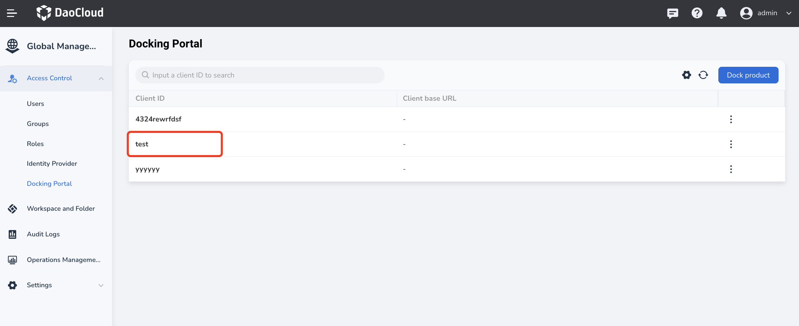
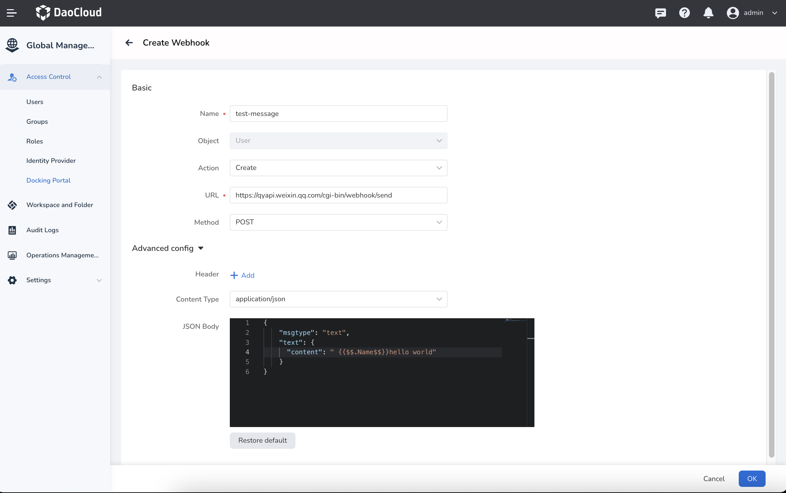
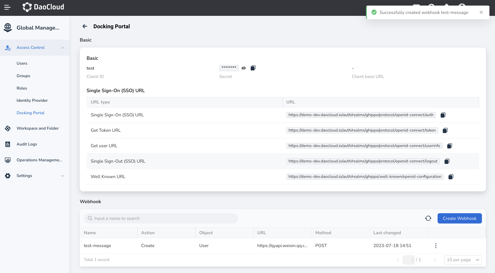
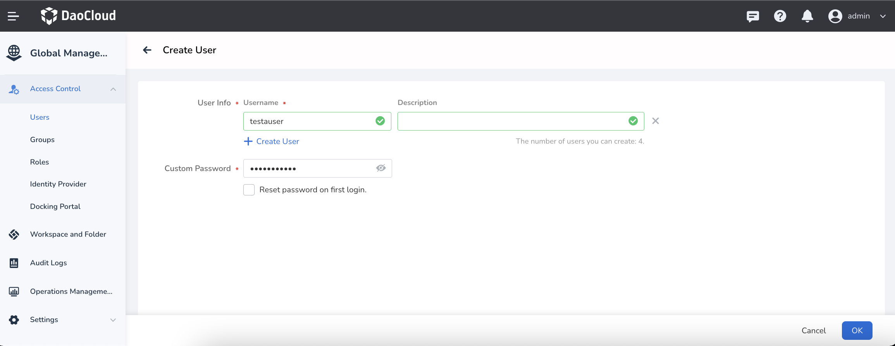

# Webhook Message Notification

With DCE 5.0 integrated into the client's system, you can create Webhooks to send message notifications when users are created, updated, deleted, logged in, or logged out.

Webhook is a mechanism for implementing real-time event notifications. It allows an application to push data or events to another application without the need for polling or continuous querying. By configuring Webhooks, you can specify that the target application receives and processes notifications when a certain event occurs.

The working principle of Webhook is as follows:

1. The source application (DCE 5.0) performs a specific operation or event.
2. The source application packages the relevant data and information into an HTTP request and sends it to the URL specified by the target application (e.g., enterprise WeChat group robot).
3. The target application receives the request and processes it based on the data and information provided.

By using Webhooks, you can achieve the following functionalities:

- Real-time notification: Notify other applications in a timely manner when a specific event occurs.
- Automation: The target application can automatically trigger predefined operations based on the received Webhook requests, eliminating the need for manual intervention.
- Data synchronization: Use Webhooks to pass data from one application to another, enabling synchronized updates.

Common use cases include:

- Version control systems (e.g., GitHub, GitLab): Automatically trigger build and deployment operations when code repositories change.
- E-commerce platforms: Send update notifications to logistics systems when order statuses change.
- Chatbot platforms: Push messages to target servers via Webhooks for processing when user messages are received.

## Configuration Steps

The steps to configure Webhooks in DCE 5.0 are as follows:

1. On the left nav, click `Global Management` -> `Access Control` -> `Docking Portal`, create a client ID.

    

2. Click a client ID to enter the details page, then click the `Create Webhook` button.

    

3. Fill in the field information in the popup window and click `OK`.

    - Object: Currently only supports the `User` object.
    - Action: Send Webhook messages when users are created/updated/deleted/logged in or out.
    - URL: The address to receive the messages.
    - Method: Choose the appropriate method as required, e.g., for enterprise WeChat, POST is recommended.
    - Advanced Configuration: You can write the message body in JSON format. For enterprise WeChat groups, refer to the [Group Robot configuration guide](https://developer.work.weixin.qq.com/document/path/91770).

    

4. A screen prompt indicates that the Webhook was created successfully.

    

5. Now try creating a user.

    

6. User creation succeeds, and you can see that an enterprise WeChat group received a message.

    

## Advanced Configuration Example

**Default Message Body**

DCE 5.0 predefines some variables that you can use in the message body based on your needs.

```json
{
  "id": "{{$$.ID$$}}",
  "email": "{{$$.Email$$}}",
  "username": "{{$$.Name$$}}",
  "last_name": "{{$$.LastName$$}}",
  "first_name": "{{$$.FirstName$$}}",
  "created_at": "{{$$.CreatedAt$$}}",
  "enabled": "{{$$.Enabled$$}}"
}
```

**Message Body for WeCom Group Robot**

```json
{
    "msgtype": "text",
    "text": {
      "content": "{{$$.Name$$}} hello world"
    }
}
```
