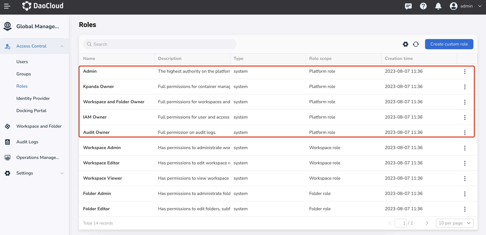
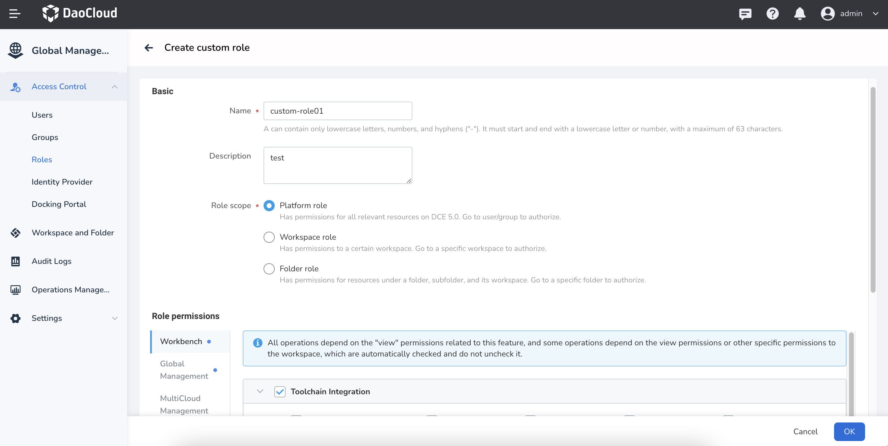
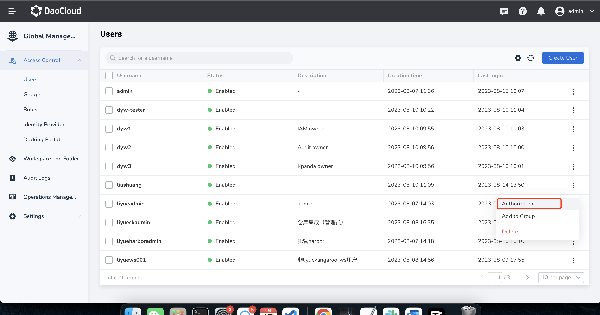
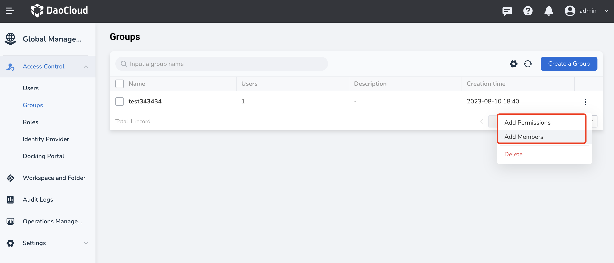
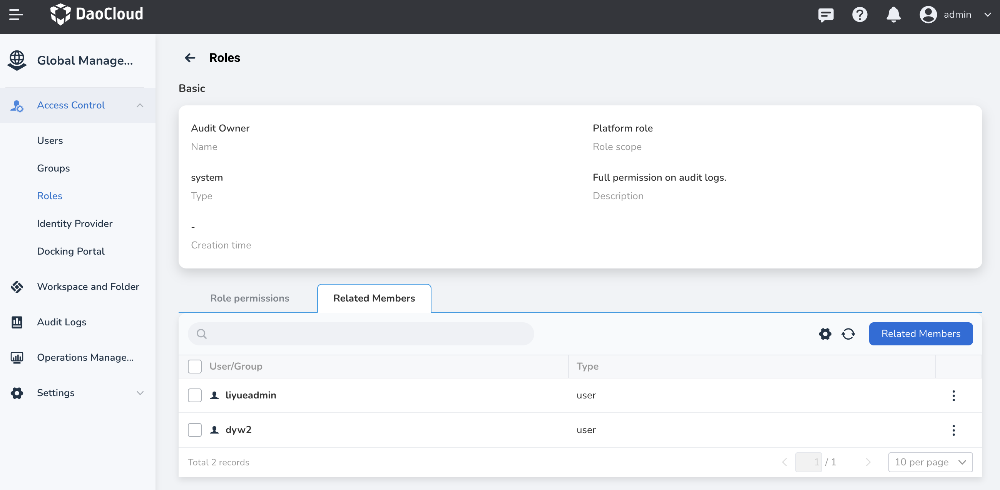
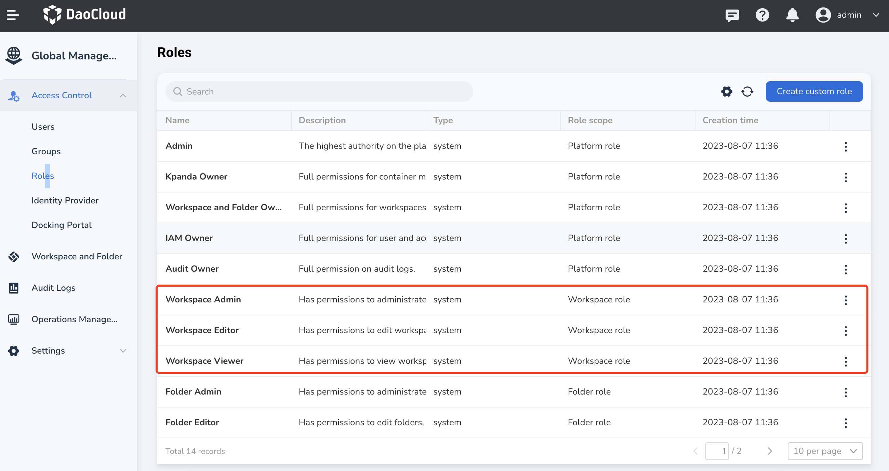
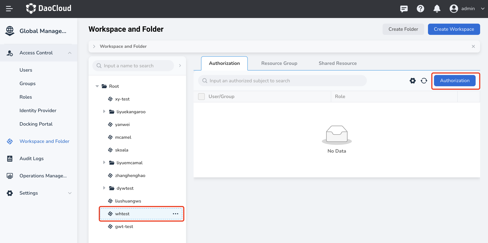
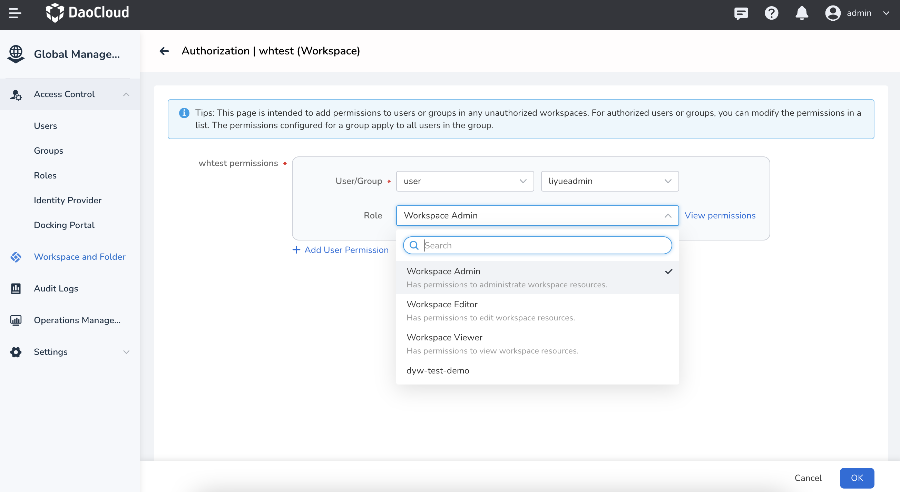
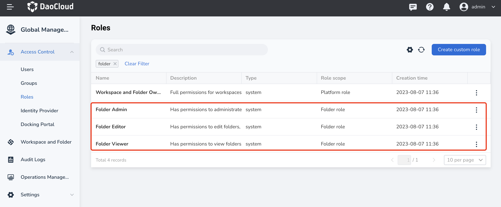
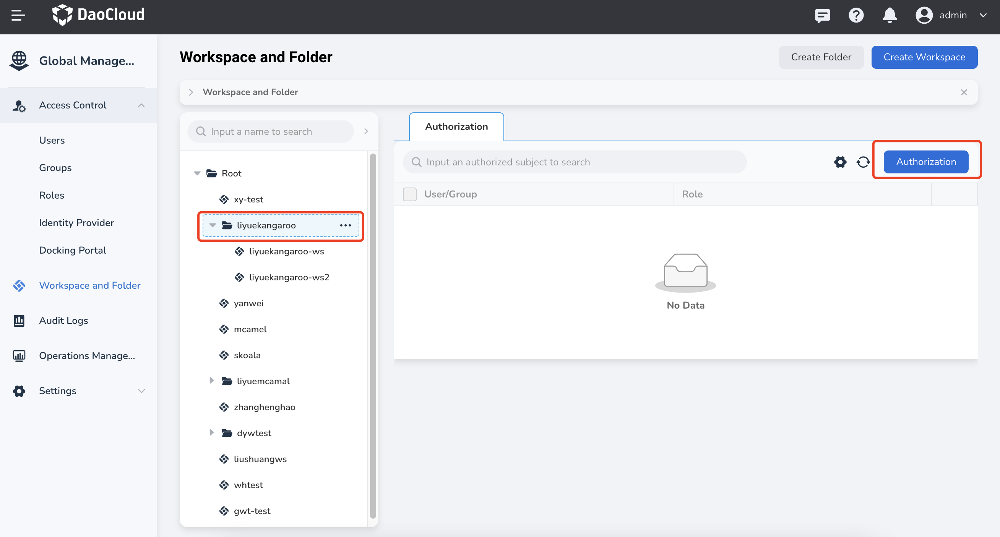

# Role and Permission Management

A role corresponds to a set of permissions that determine the actions that can be
performed on resources. Granting a user a role means granting all the permissions included in that role.

DCE 5.0 platform provides three levels of roles, which effectively solve your permission-related issues:

- [Platform Roles](#platform-roles)
- [Workspace Roles](#workspace-roles)
- [Folder Roles](#folder-roles)

## Platform Roles

Platform roles are coarse-grained permissions that grant corresponding permissions to
all relevant resources on the platform. By assigning platform roles, users can have
permissions to create, delete, modify, and view all clusters and workspaces, but not
specifically to a particular cluster or workspace. DCE 5.0 provides 5 pre-defined
platform roles that users can directly use:

- Admin
- Kpanda Owner
- Workspace and Folder Owner
- IAM Owner
- Audit Owner

Additionally, DCE 5.0 supports the creation of custom platform roles with customized content
as needed. For example, creating a platform role that includes all functional permissions in
the Workbench. Since the Workbench depends on workspaces, the platform will automatically
select the "view" permission for workspaces by default. Please do not manually deselect it.
If User A is granted this Workbench role, they will automatically have all functional permissions
related to the Workbench in all workspaces.

### Platform Role Authorization Methods

There are three ways to authorize platform roles:

- In the `Global Management` -> `Access Control` -> `Users` section, find the user
  in the user list, click `...`, select `Authorization`, and grant platform role permissions to the user.

    

- In the `Global Management` -> `Access Control` -> `Groups` section, create a group in the group list,
  add the user to the group, and grant authorization to the group
   (the specific operation is: find the group in the group list, click `...`, select `Add Permissions`, and grant platform roles to the group).

    

- In the `Global Management` -> `Access Control` -> `Roles` section, find the corresponding platform role
  in the role list, click the role name to access details, click the `Related Members` button, select the user or group, and click `OK`.

    

## Workspace Roles

Workspace roles are fine-grained roles that grant users management permissions, view permissions,
or Workbench-related permissions for a specific workspace. Users with these roles can only manage
the assigned workspace and cannot access other workspaces. DCE 5.0 provides 3 pre-defined workspace
roles that users can directly use:

- Workspace Admin
- Workspace Editor
- Workspace Viewer

Moreover, DCE 5.0 supports the creation of custom workspace roles with customized content as needed.
For example, creating a workspace role that includes all functional permissions in the Workbench.
Since the Workbench depends on workspaces, the platform will automatically select the "view" permission
for workspaces by default. Please do not manually deselect it. If User A is granted this role in
Workspace 01, they will have all functional permissions related to the Workbench in Workspace 01.

!!! note

    Unlike platform roles, workspace roles need to be used within the workspace. Once authorized,
    users will only have the functional permissions of that role within the assigned workspace.

### Workspace Role Authorization Methods

In the `Global Management` -> `Workspace and Folder` list, find the workspace,
click `Authorization`, and grant workspace role permissions to the user.

## Folder Roles

Folder roles have permissions granularity between platform roles and workspace roles.
They grant users management permissions and view permissions for a specific folder and its sub-folders,
as well as all workspaces within that folder. Folder roles are commonly used in departmental scenarios
in enterprises. For example, User B is a leader of a first-level department and usually has management
permissions over the first-level department, all second-level departments under it, and projects within
those departments. In this scenario, User B is granted admin permissions for the first-level folder,
which also grants corresponding permissions for the second-level folders and workspaces below them.
DCE 5.0 provides 3 pre-defined folder roles that users can directly use:

- Folder Admin
- Folder Editor
- Folder Viewer

Additionally, DCE 5.0 supports the creation of custom folder roles with customized content as needed.
For example, creating a folder role that includes all functional permissions in the Workbench.
If User A is granted this role in Folder 01, they will have all functional permissions related
to the Workbench in all workspaces within Folder 01.

!!! note

    The functionality of modules depends on workspaces, and folders provide further grouping mechanisms
    with permission inheritance capabilities. Therefore, folder permissions not only include the folder
    itself but also its sub-folders and workspaces.

### Folder Role Authorization Methods

In the `Global Management` -> `Workspace and Folder` list, find the folder,
click `Authorization`, and grant folder role permissions to the user.

