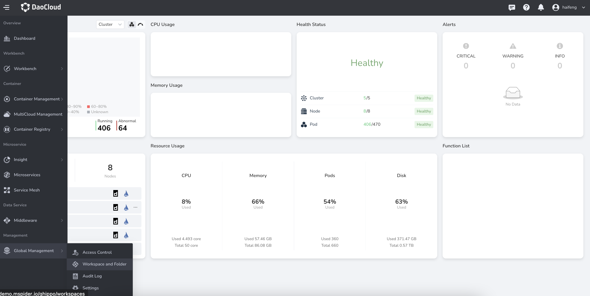
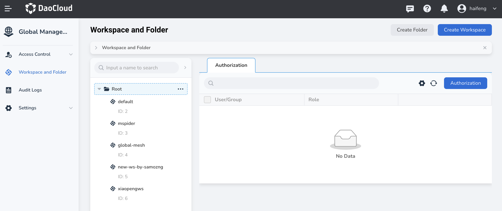
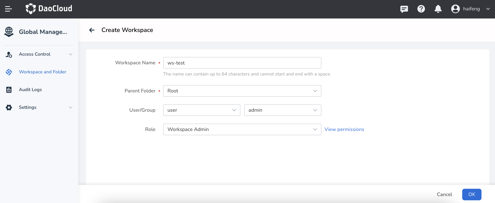
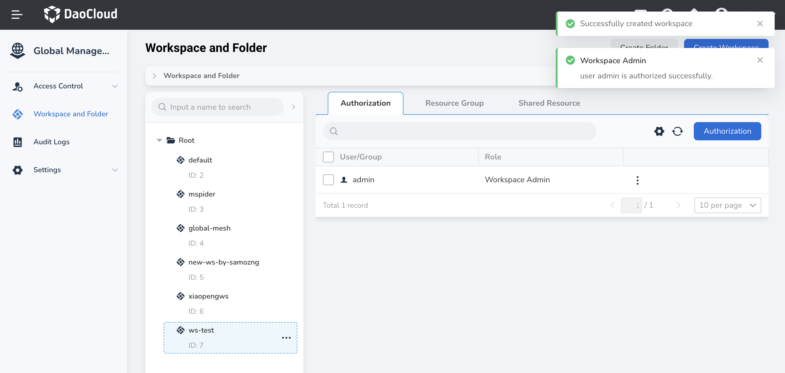

---
hide:
  - toc
---

# Creating/Deleting Workspaces

A workspace is a resource category that represents a hierarchical relationship of resources.
A workspace can contain resources such as clusters, namespaces, and registries. Typically,
each workspace corresponds to a project and different resources can be allocated, and
different users and user groups can be assigned to each workspace.

Follow the steps below to create a workspace:

1. Log in to DCE 5.0 with a user account having the admin/folder admin role.
   Click `Global Management` -> `Workspace and Folder` at the bottom of the left navigation bar.

    

3. Click the `Create Workspace` button in the top right corner.

    

4. Fill in the workspace name, folder assignment, and other information, then click `OK` to complete creating the workspace.

    

!!! tip

    After successful creation, the workspace name will be displayed in the left tree structure, represented by different icons for folders and workspaces.

    

!!! note

    To edit or delete a specific workspace or folder, select it and click `...` on the right side.

    - If there are resources bound to the resource group or shared resources within the workspace, the workspace cannot be deleted. All resources need to be unbound before deleting.

    - If there are registry resources accessed by the microservice engine module within the workspace, the workspace cannot be deleted. All access to the registry needs to be removed before deleting the workspace.
