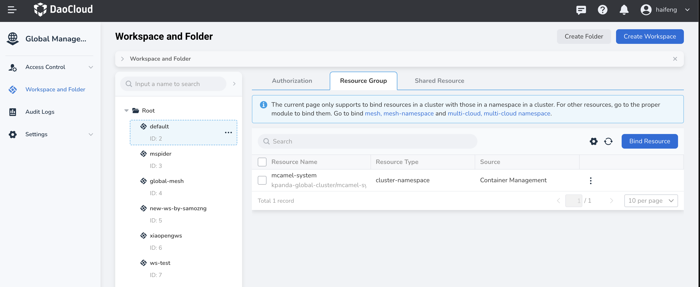

---
hide:
  - toc
---

# Workspace and Folder

Workspace and Folder is a feature that provides resource isolation and grouping, addressing issues
related to unified authorization, resource grouping, and resource quotas.

Workspace and Folder involves two concepts: workspaces and folders.

## Workspaces

Workspaces allow the management of resources through `Authorization`, `Resource Group`, and `Shared Resource`,
enabling users (and user groups) to share resources within the workspace.

- Resources

    Resources are at the lowest level of the hierarchy in the resource management module. They include clusters, namespaces, pipelines, gateways, and more. All these resources can only have workspaces as their parent level. Workspaces act as containers for grouping resources.

- Workspace

    A workspace usually refers to a project or environment, and the resources in each workspace are logically isolated from those in other workspaces.
    You can grant users (groups of users) different access rights to the same set of resources through authorization in the workspace.

    Workspaces are at the first level, counting from the bottom of the hierarchy, and contain resources.
    All resources except shared resources have one and only one parent. All workspaces also have one and only one parent folder.

    Resources are grouped by workspace, and there are two grouping modes in workspace, namely `Resource Group` and `Shared Resource`.

- Resource group

    A resource can only be added to one resource group, and resource groups correspond to workspaces one by one.
    After a resource is added to a resource group, Workspace Admin will obtain the management authority of the resource, which is equivalent to the owner of the resource.

- Share resource

    For shared resources, multiple workspaces can share one or more resources.
    Resource owners can choose to share their own resources with the workspace. Generally, when sharing, the resource owner will limit the amount of resources that can be used by the shared workspace.
    After resources are shared, Workspace Admin only has resource usage rights under the resource limit, and cannot manage resources or adjust the amount of resources that can be used by the workspace.

    At the same time, shared resources also have certain requirements for the resources themselves. Only Cluster (cluster) resources can be shared.
    Cluster Admin can share Cluster resources to different workspaces, and limit the use of workspaces on this Cluster.

    Workspace Admin can create multiple Namespaces within the resource quota, but the sum of the resource quotas of the Namespaces cannot exceed the resource quota of the Cluster in the workspace.
    For Kubernetes resources, the only resource type that can be shared currently is Cluster.

## Folder

Folders can be used to build enterprise business hierarchy relationships.

- Folders are a further grouping mechanism based on workspaces and have a hierarchical structure.
  A folder can contain workspaces, other folders, or a combination of both, forming a tree-like organizational relationship.

- Folders allow you to map your business hierarchy and group workspaces by department.
  Folders are not directly linked to resources, but indirectly achieve resource grouping through workspaces.

- A folder has one and only one parent folder, and the root folder is the highest level of the hierarchy.
  The root folder has no parent, and folders and workspaces are attached to the root folder.

In addition, users (groups) in folders can inherit permissions from their parents through a hierarchical structure.
The permissions of the user in the hierarchical structure come from the combination of the permissions of the current level and the permissions inherited from its parents. The permissions are additive and there is no mutual exclusion.
