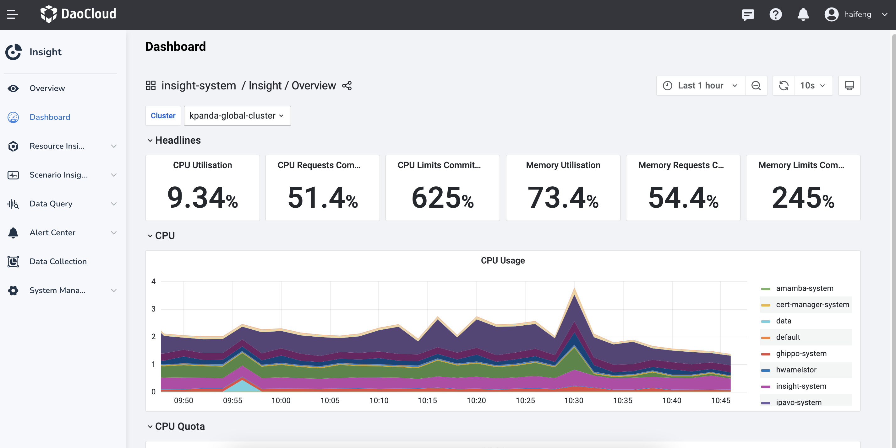
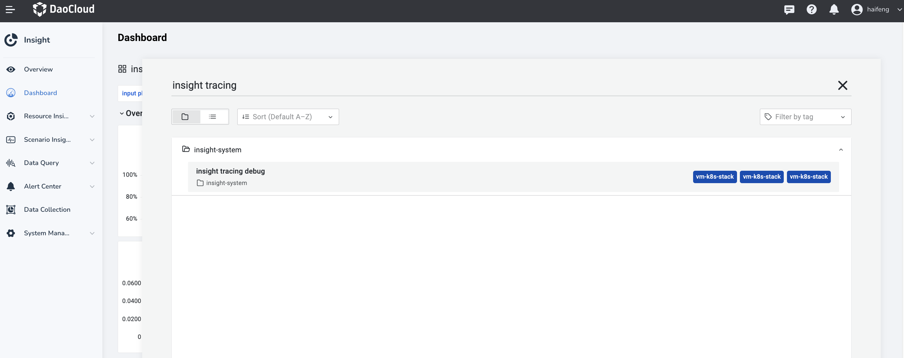
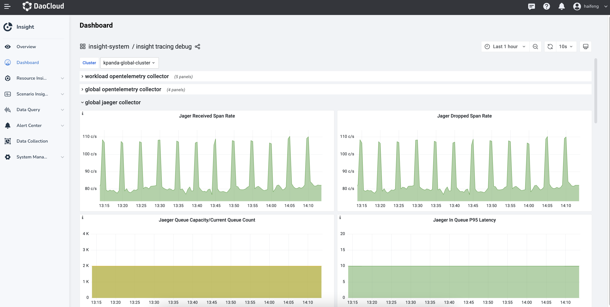
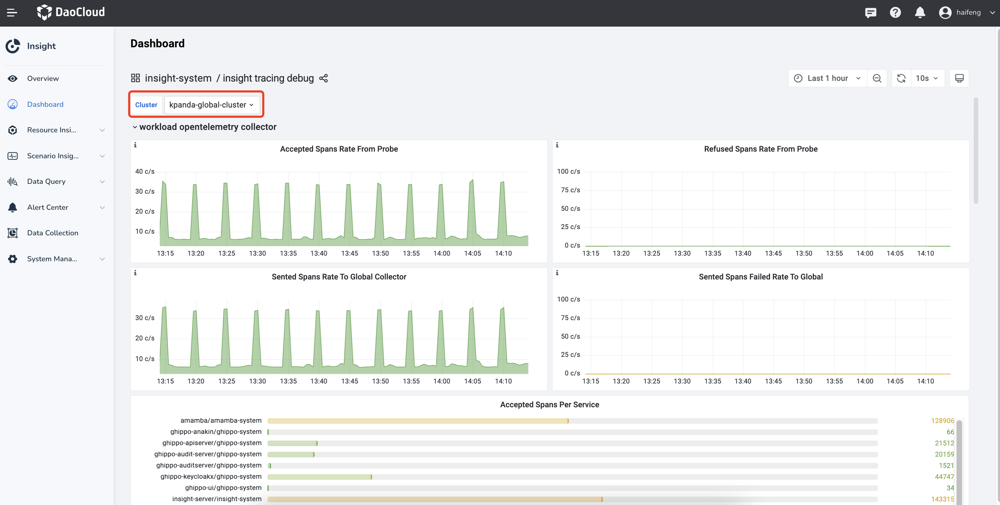
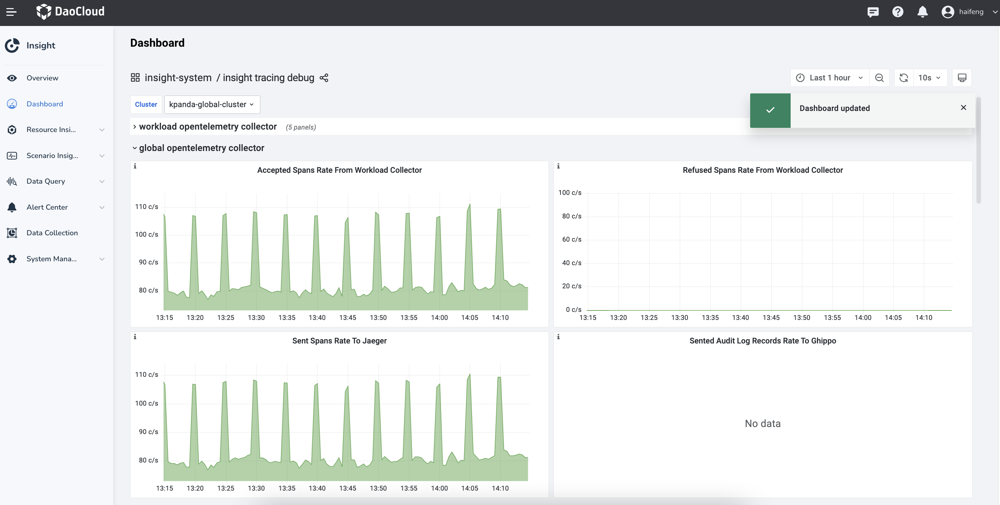

# Trace Collection Troubleshooting Guide

Before attempting to troubleshoot issues with trace data collection, you need to understand the transmission path of trace data. The following is a schematic diagram of the transmission of trace data:

```mermaid
graph TB

sdk[Language proble / SDK] --> workload[Workload cluster otel collector]
--> otel[Global cluster otel collector]
--> jaeger[Global cluster jaeger collector]
--> es[Elasticsearch cluster]

classDef plain fill:#ddd,stroke:#fff,stroke-width:1px,color:#000;
classDef k8s fill:#326ce5,stroke:#fff,stroke-width:1px,color:#fff;
classDef cluster fill:#fff,stroke:#bbb,stroke-width:1px,color:#326ce5;

class sdk,workload,otel,jaeger,es cluster
```

As shown in the above figure, any transmission failure at any step will result in the inability to query trace data. If you find that there is no trace data after completing the application trace enhancement, please perform the following steps:

1. Use DCE 5.0 platform, enter `Observability`, and select the `Dashboard` in the left navigation bar.

    

2. Click on the dashboard title `Overview`.

    

3. Switch to the `insight-system` -> `insight tracing debug` dashboard.

    

4. You can see that this dashboard is composed of three blocks, each responsible for monitoring the data transmission of different clusters and components. Check whether there are problems with trace data transmission through the generated time series chart.

    - workload opentelemetry collector
    - global opentelemetry collector
    - global jaeger collector

    

## Block Introduction

1. **workload opentelemetry collector**

    Display the `opentelemetry collector` in different working clusters receiving language probe/SDK trace data and sending aggregated trace data. You can select the cluster where it is located by the `Cluster` selection box in the upper left corner.

    

    !!! note

        Based on these four time series charts, you can determine whether the `opentelemetry collector` in this cluster is running normally.

2. **global opentelemetry collector**

    Display the `opentelemetry collector` in the `Global Service Cluster` receiving trace data from the `working cluster`'s `otel collector` and sending aggregated trace data.

    

    !!! note

        The `opentelemetry collector` in the `Global Management Cluster` is also responsible for sending audit logs of all working clusters' [global management module](../../ghippo/intro/what.md) and Kubernetes audit logs (not collected by default) to the `audit server` component of the global management module.

3. **global jaeger collector**

    Display the `jaeger collector` in the `Global Management Cluster` receiving data from the `otel collector` in the `Global Management Cluster` and sending trace data to the [ElasticSearch cluster](../../middleware/elasticsearch/intro/what.md).
