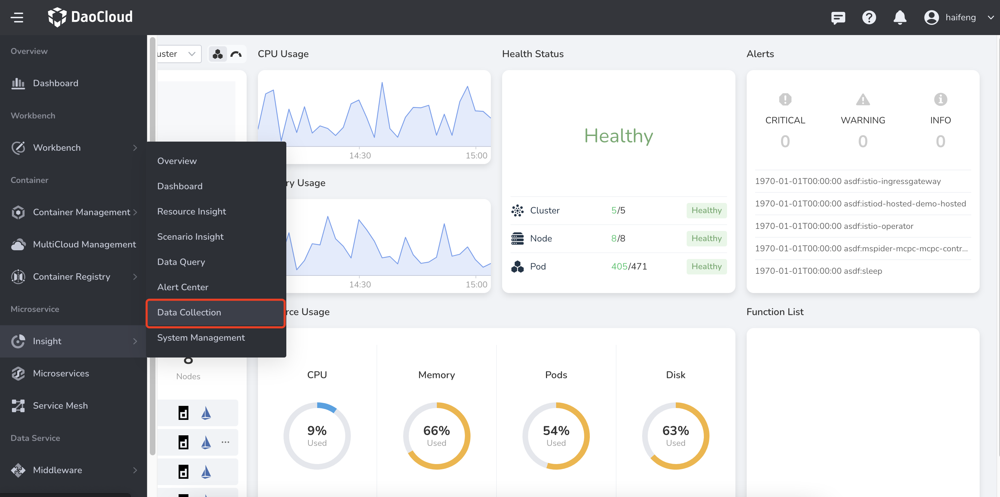
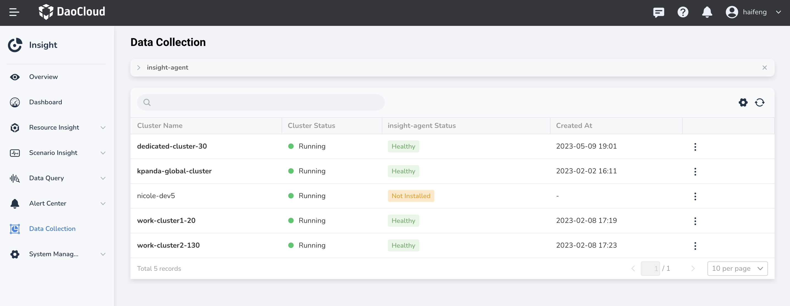

# Configure service discovery rules

Observable Insight supports the way of creating CRD ServiceMonitor through `container management` to meet your collection requirements for custom service discovery.
Users can use ServiceMonitor to define the scope of the Namespace discovered by the Pod and select the monitored Service through `matchLabel`.

## Prerequisites

The cluster has the Helm application `insight-agent` installed and in the `running` state.

## Steps

1. Select `Data Collection` on the left navigation bar to view the status of all cluster collection plug-ins.

    

2. Click a cluster name to enter the collection configuration details.

    

3. Click the link to jump to `Container Management` to create a Service Monitor.

    ```yaml
    apiVersion: monitoring.coreos.com/v1
    kind: ServiceMonitor
    metadata:
      name: micrometer-demo # (1)
      namespace: insight-system # (2)
        labels: 
         operator.insight.io/managed-by: insight
    spec:
      endpoints: # (3)
        - honorLabels: true
           interval: 15s
            path: /actuator/prometheus
            port: http
      namespaceSelector: # (4)
        matchNames:
          - insight-system  # The namespace where the application that needs to expose metrics is located.
      selector: # (5)
        matchLabels:
          micrometer-prometheus-discovery: "true"
    ```

    1. Specify the name of the ServiceMonitor.
    2. Specify the namespace of the ServiceMonitor.
    3. This is the service endpoint, which represents the address where Prometheus collects Metrics.
       `endpoints` is an array, and multiple `endpoints` can be created at the same time.
       Each `endpoint` contains three fields, and the meaning of each field is as follows:

        - `interval`: Specifies the collection cycle of Prometheus for the current `endpoint`.
          The unit is seconds, set to `15s` in this example.
        - `path`: Specifies the collection path of Prometheus.
          In this example, it is specified as `/actuator/prometheus`.
        - `port`: Specifies the port through which the collected data needs to pass.
          The set port is the `name` set by the port of the Service being collected.

    4. This is the scope of the Service that needs to be discovered.
       `namespaceSelector` contains two mutually exclusive fields, and the meaning of the fields is as follows:

        - `any`: Only one value `true`, when this field is set, it will listen to changes
          of all Services that meet the Selector filtering conditions.
        - `matchNames`: An array value that specifies the scope of `namespace` to be monitored.
          For example, if you only want to monitor the Services in two namespaces, default and
          insight-system, the `matchNames` are set as follows:

            ```yaml
            namespaceSelector:
              matchNames:
                - default
                - insight-system
            ```

    5. Used to select the Service.
