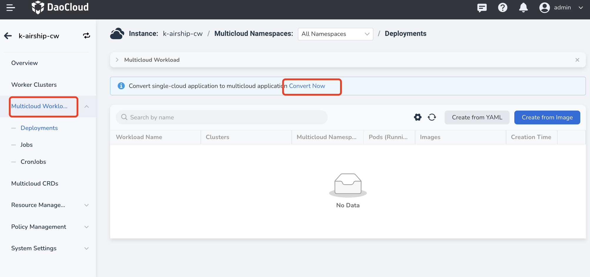
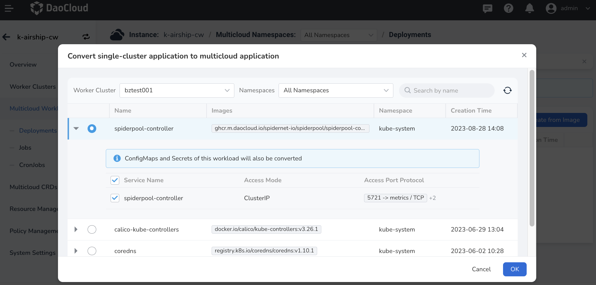

# One-Click Conversion to MultiCloud Workload

With the MultiCloud Orchestration module, you can easily convert a single-cloud workload into a multi-cloud workload with just one click. This operation greatly improves operational efficiency in multi-cloud environments.

Here are the specific steps:

1. Click on the name of the multi-cloud instance, then click on `Multicloud Workloads` on the left side and select `Convert Now` for the new feature.

    

2. Choose which application you want to convert.

    - You can filter applications by cluster and namespace or search directly by name.
    - When converting, choose whether to convert its associated configmaps and secrets. By default, they will be converted.
    - Only workloads in the clusters that have been added to the current multi-cloud instance will be displayed here. If there is no your target application, add the cluster where the target is deployed to the current multi-cloud instance and then try again.
    - Resources that have already been converted to multi-cloud applications cannot be converted again and will not appear in the list.
    - During the conversion, the system will automatically create corresponding deployment policies and manage the original sub-clusters.

        

3. Click `OK` in the lower-right corner of the dialog box to complete the conversion.

    After the application is converted into a multi-cloud application, it supports editing, updating, and other operations, just like native multi-cloud workloads.

## FAQs

- Will the workload be restarted after a successful conversion?

    No, there won't be a restart. The conversion is workload-unaware.

- After a successful conversion, if the original cluster is removed from the deployment policy, will the workload replica in that cluster be deleted as well?

    Yes, it will be deleted. Once the conversion is successful, the workload becomes a standard multi-cloud workload. If the deployment policy changes and the workload is no longer propagated to the original cluster, according to Karmada's design principle, the workload replica in that cluster will also be deleted to maintain consistency.

- Which Kubernetes resources can be converted?

    Currently, only Deployments can be explicitly converted into multi-cloud resources. If the Deployment is associated with configmaps and secrets, users can choose whether to convert them together. By default, they will be converted. This is to ensure that when the new multi-cloud workload is distributed to other clusters, its dependent resources are also in place; otherwise, it may cause startup issues for the workload.
