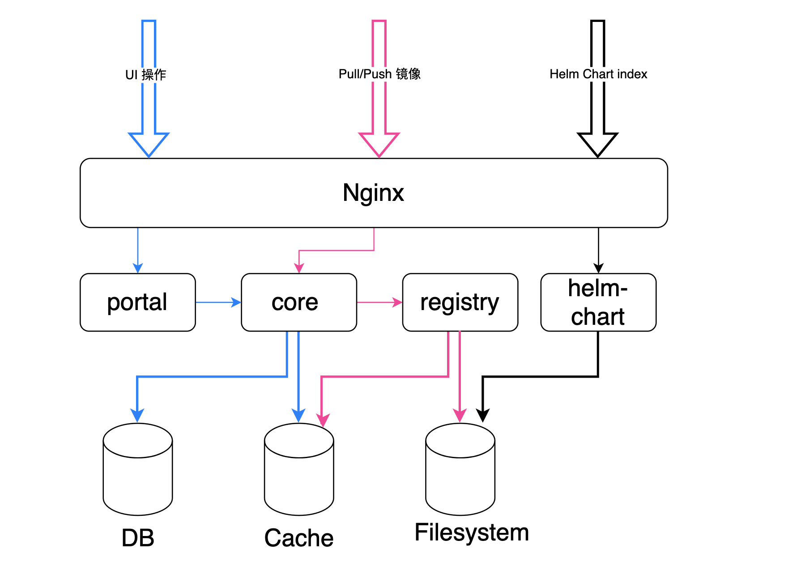
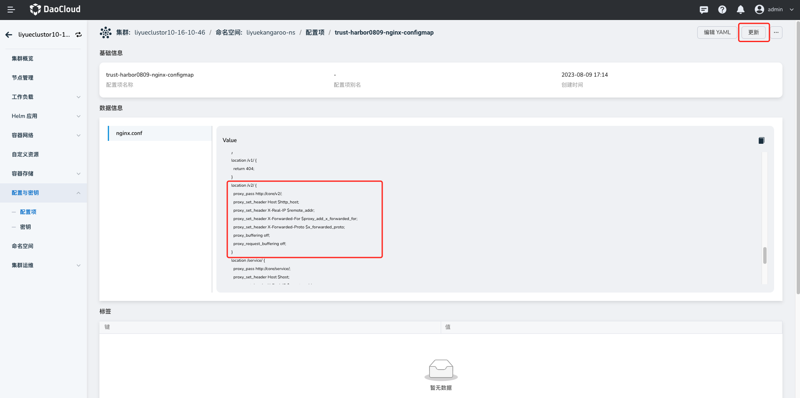
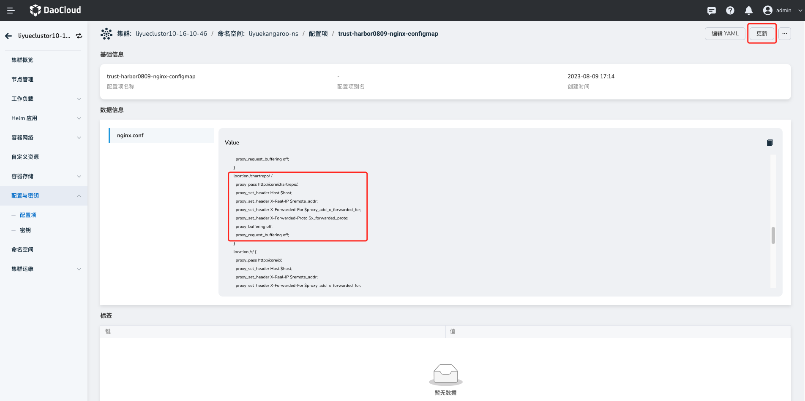

# Harbor Nginx Configuration Best Practices

Within Harbor, the portal and core services are exposed to the outside world,
with both control flow and data flow passing through the Nginx component.
If the Nginx configuration is not optimal, it can lead to image pull failures
or failures in adding or updating Helm repositories.



## Scenario 1: 504 Gateway Timeout Error

When timeouts occur, there are two possible causes: either the operation itself takes a long time
(e.g., pulling a large image), or the machine hosting the service is under high load, resulting in slow responses.

### Pull/Push Large Images

The default timeout for backend services behind the Nginx proxy is 60 seconds, and both image pulls and pushes
go through Nginx. If you encounter a large image (such as those used in machine learning) that takes a long time
to push or pull, it is likely to trigger the timeout. In such cases, the timeout needs to be adjusted based on
service performance and network conditions. You can modify the proxy timeout in the ConfigMap and then restart
the Pod. For example, you can increase the timeout to 15 minutes (900 seconds).

Here's an example:

1. In the scenario where Harbor is managed using Helm templates, deploy ingress-nginx.
   You can find the `nginx-config` in `Container Management` -> `Cluster Details` -> `ConfigMaps`.


2. Access the details and click the `Update` button to add the proxy configuration shown below, modifying the timeout to 900s (15 minutes). Save the changes and restart the Pod.

    

3. Proxy configuration demo:

    ```nginx
    location /v2/ {
        proxy_send_timeout 900;
        proxy_read_timeout 900;
    }
    ```

### High Load on the Machine Hosting the Service

It is necessary to investigate the cause of high load and take appropriate actions to address the issue.

## Scenario 2: Failed Helm Repo Operations

Cause: The Chartmuseum service has an `index-cache.yaml` file for each repository, which records information about all Helm Charts in that repository. If there are thousands of Helm Charts, the `index-cache.yaml` file can expand to several tens of megabytes. When executing `helm repo add/update`, failure to fetch this file due to its large size can result in the operation failing.

Solution:

- Increase the timeout and enable gzip compression.
- Set specific gzip_types to compress only certain types.
- Set gzip_min_length to avoid compressing files smaller than a specified length.

Here's an example:

1. In the scenario where Harbor is managed using Helm templates, deploy ingress-nginx.
   You can find the `nginx-config` in `Container Management` -> `Cluster Details` -> `ConfigMap`.


2. Access the details of the config and click the `Update` button to add the
   proxy configuration shown below. Save the changes and restart the Pod.

    

3. Proxy configuration demo:

    ```nginx
    location /chartrepo/ {
        proxy_send_timeout 900;
        proxy_read_timeout 900;
        gzip on;
        gzip_min_length 1000;
        gzip_proxied expired no-cache no-store private auth;
        gzip_types text/plain text/css application/json application/javascript application/x-javascript text/xml application/xml application/xml+rss text/javascript application/x-yaml text/x-yaml;
    }
    ```
