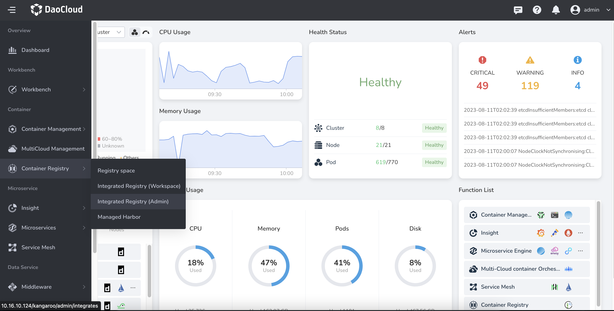

# Integrated Registry (Admin)

The Integrated Registry (Admin) is the entrance for central management of platform image repositories.
It supports integrating external image repositories such as Harbor Registry and Docker Registry,
as well as automatically integrating managed Harbors created by the platform. After integrated registry,
platform administrators can assign a private registry space to one or more workspaces (namespaces under workspaces)
by binding the registry space to the workspace, or set the registry space as public for all namespaces on the platform to use.

## Main Features

- Support integration with mainstream image repositories such as Harbor Registry and Docker Registry, helping you centrally manage platform-level image repositories.
- Supports quickly viewing registry addresses, number of registry spaces, storage usage data, etc. through the overview page.
- Supports creating and setting the registry space status as public or private. If the registry space status is public,
  its images can be used by all namespaces on the platform. If the registry space status is private, only namespaces under
  workspaces that have been bound to the registry space can use the private images, ensuring their security.
- Automatically integrate managed Harbors, which will be automatically integrated into the integration registry list
  after a managed Harbor instance is created, for unified management.

## Advantages

- Unified management entrance for unified management of integrated image repositories and managed Harbor instances.
- High security: private images can only be pulled when deployed by binding the registry space to the workspace.
- Convenient and efficient: Once a registry space is set as public, all namespaces within the platform can pull
  the public images under it when deploying applications.
- Supports main types of image repositories: Harbor Registry, Docker Registry.

## Operating Steps

Refer to [Video Tutorial](../../videos/kangaroo.md#_3) to familiarize yourself with the following operating steps:

1. Log in to DCE 5.0 as a user with the Admin role, click `Container Registry` -> `Integrated Registry (Admin)`
  from the left navigation bar.

    

1. Click the `Integrated Registry` button in the upper right corner.

    

1. Select the registry type, fill in the integration name, registry address, username, and password, and click `OK`.

    

    !!! note

        For a Harbor registry, an Admin-level username/password must be provided.

1. Return to the integrated registry list. The integrated repositories will have labels such as
  `Integrated`, `Healthy`, or `Unhealthy`. Hovering over a tile allows you to perform operations such as `Unbind` and `Edit`.

    

Next step: [Create registry space](registry-space.md)
