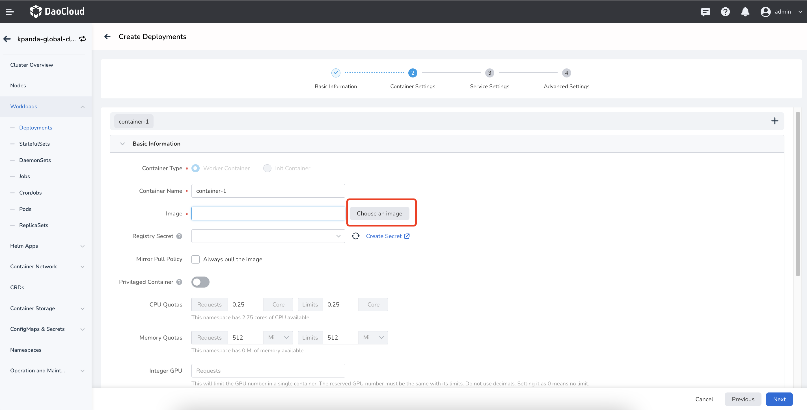

---
hide:
  - toc
---

# Using External Container Registries in Workspaces as a Workspace Admin

In DCE 5.0, Workspace Admin can integrate two external container registries, Harbor and Docker Registry, by associating registries. After integration, members of the workspace can see all images of the integrated repository in the image list and can select the image in the repository for deployment through the image selector when deploying the application in the namespace under the workspace.

Assuming that you have created an external Harbor or Docker Registry, follow the steps below to share the external Harbor or Docker Registry with workspace members:

## Prerequisites

1. You are a Workspace Admin, and some namespaces are bound under this workspace.
2. You have one or more external container registries (Harbor or Docker Registry).

## Steps

```mermaid
graph TB

integrate[Associating Registry] --> push[Pushing Image] --> deploy[Deploying App]

classDef plain fill:#ddd,stroke:#fff,stroke-width:1px,color:#000;
classDef k8s fill:#326ce5,stroke:#fff,stroke-width:1px,color:#fff;
classDef cluster fill:#fff,stroke:#bbb,stroke-width:1px,color:#326ce5;

class integrate,push,deploy cluster;

click integrate "https://docs.daocloud.io/en/kangaroo/related-registry/"
click push "https://docs.daocloud.io/en/kangaroo/quickstart/push/"
click deploy "https://docs.daocloud.io/en/kpanda/user-guide/workloads/create-deployment/"
```

The expected result is that when deploying an application in the namespace under this workspace, you can use the image selector to choose the image under this registry space to deploy the application.

