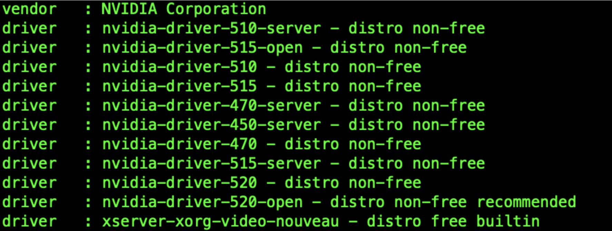

# Nvidia GPU Driver Installation

> Two installation methods are provided: manual installation and using gpu-operator.
> Using gpu-operator for installation simplifies the process, and it is recommended.

Using GPUs on K8s requires the installation of relevant drivers and programs, which involves the following steps:

- [ ] Install the GPU physical device driver
- [ ] Install the CUDA toolkit
- [ ] Modify the container runtime
- [ ] Install the device plugin

### Manual Installation

1. Install the physical device driver

    - Add the PPA repository source

        ```shell
        add-apt-repository ppa:graphics-drivers/ppa
        apt-get update
        ```

    - Check the available driver versions

        ```shell
        ubuntu-drivers devices
        ```

        

    - Choose the appropriate version to install

    - Recommended installation:

        ```shell
        ubuntu-drivers autoinstall
        ```

    - Install a specific version:

        ```shell
        apt-get install nvidia-driver-XXX
        ```

    - Install CUDA

        ```shell
        # https://docs.nvidia.com/cuda/cuda-installation-guide-linux/index.html#ubuntu
        $ apt-get install cuda
        ```

    - After installation, restart the system

        ```shell
        nvidia-smi
        nvcc -V
        ```

    - Check the driver version

        ```shell
        $ cat /proc/driver/nvidia/version
        NVRM version: NVIDIA UNIX x86_64 Kernel Module  525.105.17  Tue Mar 28 18:02:59 UTC 2023
        ```

2. Install the `cuda toolkit`

    - https://github.com/NVIDIA/nvidia-container-toolkit
    - https://docs.nvidia.com/datacenter/cloud-native/container-toolkit/latest/install-guide.html

    - The conditions for running `nvidia-container-toolkit` are:
        - Kernel version > 3.10
        - Docker >= 19.03 or use Containerd.
        - NVIDIA GPU architecture is above version 3.0
        - NVIDIA Linux drivers >= 418.81.07
    - Below is an example of installing with containerd:

        - Add nvidia-container-runtime to the /etc/containerd/config.toml configuration file and then restart

            ```toml title="/etc/containerd/config.toml"
                [plugins."io.containerd.grpc.v1.cri".containerd]
                default_runtime_name = "nvidia"
                [plugins."io.containerd.grpc.v1.cri".containerd.runtimes]
                [plugins."io.containerd.grpc.v1.cri".containerd.runtimes.runc.options]
                        SystemdCgroup = true
                [plugins."io.containerd.grpc.v1.cri".containerd.runtimes.nvidia]
                    privileged_without_host_devices = false
                    runtime_engine = ""
                    runtime_root = ""
                    runtime_type = "io.containerd.runc.v1"
                    [plugins."io.containerd.grpc.v1.cri".containerd.runtimes.nvidia.options]
                        BinaryName = "/usr/bin/nvidia-container-runtime"
                        SystemdCgroup = true
            ```

        - Set up the package repository for nvidia-container-toolkit

            ```shell
            $ distribution=$(. /etc/os-release;echo $ID$VERSION_ID) && curl -s -L https://nvidia.github.io/libnvidia-container/gpgkey | sudo apt-key add - && curl -s -L https://nvidia.github.io/libnvidia-container/$distribution/libnvidia-container.list | sudo tee /etc/apt/sources.list.d/nvidia-container-toolkit.list
            ```

        - Install:

            ```shell
            sudo apt-get update && sudo apt-get install -y nvidia-container-toolkit
            ```

3. Install the device plugin

    ```shell
    kubectl create -f https://raw.githubusercontent.com/NVIDIA/k8s-device-plugin/v0.14.0/nvidia-device-plugin.yml
    ```

### Installation using gpu-operator


GPU Operator can perform operations on GPU-related underlying dependencies on top of K8s. This includes GPU drivers, Container ToolKit, automatic reporting of Device Plugin resources, and more. You no longer need to worry about driver installation and other troublesome tasks. In theory, as long as the GPU card is installed, K8s is installed, and then you can use all the capabilities through GPU Operator.

- Check if the GPU card is mounted correctly

    ```shell
    $ lspci | grep -i nvidia
    1b:00.0 VGA compatible controller: NVIDIA Corporation GP102 [TITAN Xp] (reva1)
    ```

- Determine the kernel version (This step is important, as the NVIDIA driver image version needs to match the node's kernel version exactly, including the minor version number)

    > To check if the corresponding driver version exists for a specific kernel version, please visit the following website:
    > <https://catalog.ngc.nvidia.com/orgs/nvidia/containers/driver/tags>

    ```shell
    $ hostnamectl | grep Kernel
    Kernel: Linux 5.15.0-75-generic
    ```

- Install GPU Operator

    ```shell
    $ helm repo add nvidia https://helm.ngc.nvidia.com/nvidia && helm repo update
    $ helm install --wait --generate-name \
        -n gpu-operator --create-namespace \
        nvidia/gpu-operator \
        --set driver.version=525-5.15.0-69-generic
    ```

## Install vGPU Driver

After installing either of the above two methods, the pods can only use the full GPU resources and cannot utilize the vGPU functionality. If you need to use vGPU, you can find the "nvidia-vgpu" module in the Helm Repository of DCE 5.0 Container Management and install it.


