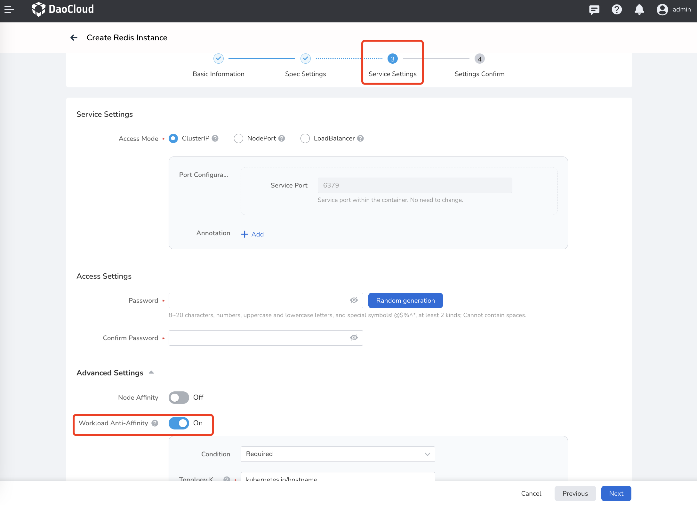

# Workload Anti-Affinity

When creating instances of [Elasticsearch search service](../elasticsearch/intro/index.md), [Kafka message queue](../kafka/intro/index.md), [MinIO object storage](../minio/intro/index.md), [MySQL database](../mysql/intro/index.md), [RabbitMQ message queue](../rabbitmq/intro/index.md), [PostgreSQL database](../postgresql/intro/index.md), [Redis cache service](../redis/intro/index.md), or [MongoDB database](../mongodb/intro/index.md), you can configure workload anti-affinity in the service settings page.

The principle of workload anti-affinity is that within a certain topology domain (scope), if it detects that there is already a workload with a label added in the anti-affinity configuration, the newly created workload will not be deployed to that topology domain. The benefits of this approach are:

- Performance Optimization: By using workload anti-affinity, multiple replicas of the instance can be deployed to different nodes/availability zones/regions, avoiding resource contention between replicas and ensuring that each replica has sufficient available resources, thereby improving application performance and reliability.

- Fault Isolation: The replicas of the instance are distributed across different nodes/availability zones/regions, effectively avoiding single point of failure. When a replica in one environment fails, the replicas in other environments are not affected, thereby ensuring the overall availability of the service.

## Steps

Take `Redis` as an example to demonstrate how to configure "Workload Anti-Affinity".

!!! note

    This article focuses on how to configure "Workload Anti-Affinity". For detailed instructions on how to create a `Redis` instance, please refer to [Create Instance](../redis/user-guide/create.md).

1. During the creation process of a `Redis` instance, enable "Workload Anti-Affinity" in "Service Settings" -> "Advanced Settings".

    

2. Fill in the configuration for "Workload Anti-Affinity" according to the following instructions.

    - Condition: There are two types, "Preferred" and "Required".
        - Preferred: Try to satisfy the anti-affinity requirement, but the final deployment result may not meet the anti-affinity requirement.
        - Required: Must satisfy the anti-affinity requirement. If no schedulable node/availability zone/region is found, the Pod will remain in the Pending state.
    - Weight: When the condition is set to "Must Satisfy", there is no need to set the weight. When the condition is set to "Try to Satisfy", set a weight value for the anti-affinity rule, and rules with higher weights are given priority.
    - Topology Domain: The topology domain defines the scope of the anti-affinity. It can be a node label, zone label, region label, or user-defined label.
    - Pod Selector: Set the Pod labels. **Within the same topology domain, there can only be one Pod with this label**.
    - For more details about anti-affinity and various operators, please refer to [Operators](../../kpanda/user-guide/workloads/pod-config/scheduling-policy.md#_4).

    

    !!! note

        The configuration in the above image means that there can only be one Pod with the `app.kubernetes.io/name` label and the value of `redis-test` on the same node. If there is no node that meets the criteria, the Pod will remain in the Pending state.

3. Follow the steps in [Create Instance](../redis/user-guide/create.md) to complete the remaining operations.

## Verification

After configuring workload anti-affinity and successfully creating the instance, go to the Container Management module to view the Pod scheduling information.

<!---->

You can see that there are a total of 3 Pods, with two of them running normally and distributed on different nodes.

The third Pod is in the waiting state. Click the Pod name to view the details, and it is found that it cannot be deployed due to taints and the anti-affinity rule.

<!---->

This indicates that the previously configured workload anti-affinity is effective, which means that there can only be one Pod with the `app.kubernetes.io/name` label and the value of `redis-test` on a node. If there is no node that meets the criteria, the Pod will remain in the Pending state.
