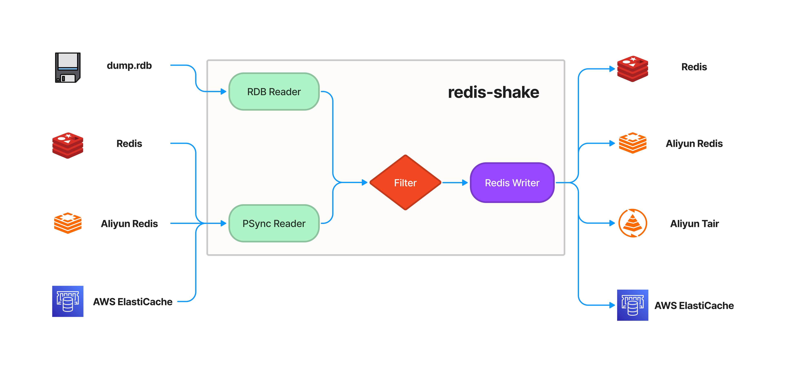

# Redis Disaster Recovery Deployment Solution

Redis, as an open-source in-memory data storage system, boasts excellent performance, high availability, and real-time processing capabilities, which can meet the needs of applications and services for large-scale access requests and data storage. However, due to the lack of built-in data security protection functions, it is necessary to adopt disaster recovery technology to ensure the reliability of Redis data in practical applications.

Disaster recovery technology is mainly achieved through means such as data replication and data backup to provide cold and hot backup methods. In cases where network, server, or database failures result in data loss, business continuity and data security can be ensured through methods such as primary-secondary switchover and data recovery.

## Solution 1: Redis-Shake Synchronization Mode

Redis-Shake is a tool for merging, filtering, and migrating Redis data. It supports three data migration modes: sync, restore, and scan.

This plan will use Redis-Shake to implement cross-cluster data synchronization for Redis instances.



Github repo: <https://github.com/tair-opensource/RedisShake>

### What are Synchronization Modes

=== "Sentinel Mode"
  
    1. Create a `NodePort` service on the `master` node in the source instance.

    2. Edit the synchronization configuration file for Redis-Shake, using the configuration method of the destination instance for the source instance.

        

=== "Cluster Mode"
 
    1. Create a `NodePort` service for each node in the source instance.

    2. Configure multiple Redis-Shake instances, and use the configuration method of each main node in the destination instance for the corresponding source cluster instance.

        

### Steps

#### Source Cluster

1. Create a Redis middleware instance in DCE 5.0.

2. Go to "Container Management" and create a service for the master node.

    And configure relevant label selectors:

    ```shell
    app.kubernetes.io/component: redis
    app.kubernetes.io/managed-by: redis-operator
    app.kubernetes.io/name: test-li-redis
    app.kubernetes.io/part-of: redis-failover
    redisfailovers-role: master
    redisfailovers.databases.spotahome.com/name: test-li-redis
    ```

#### Target Cluster

Deploy Redis-Shake and the destination cluster on the same host and perform operations according to the following configuration:

```shell
wget https://github.com/tair-opensource/RedisShake/releases/download/v3.1.11/redis-shake-linux-amd64.tar.gz
mkdir redisShake
cd redisShake
cp ../redis-shake-linux-amd64.tar.gz .
tar -xzvf redis-shake-linux-amd64.tar.gz
vi sync.toml
./redis-shake sync.toml
```

Edit `sync.toml`:

```yaml
type = "sync"
 
[source]
version = 6.0 # redis version, such as 2.8, 4.0, 5.0, 6.0, 6.2, 7.0, ...
address = "10.233.109.145:6379"
username = "" # keep empty if not using ACL
password = "3wPxzWffdn" # keep empty if no authentication is required
tls = false
elasticache_psync = "" # using when source is ElastiCache. ref: https://github.com/alibaba/RedisShake/issues/373
 
[target]
type = "standalone" # "standalone" or "cluster"
version = 6.0 # redis version, such as 2.8, 4.0, 5.0, 6.0, 6.2, 7.0, ...
# When the target is a cluster, write the address of one of the nodes.
# redis-shake will obtain other nodes through the `cluster nodes` command.
address = "10.233.103.2:6379"
username = "" # keep empty if not using ACL
password = "Aa123456" # keep empty if no authentication is required
tls = false
 
[advanced]
dir = "data"
 
# runtime.GOMAXPROCS, 0 means use runtime.NumCPU() cpu cores
ncpu = 4
 
# pprof port, 0 means disable
pprof_port = 0
 
# metric port, 0 means disable
metrics_port = 0
 
# log
log_file = "redis-shake.log"
log_level = "info" # debug, info or warn
log_interval = 5 # in seconds
 
# redis-shake gets key and value from rdb file, and uses RESTORE command to
# create the key in target redis. Redis RESTORE will return a "Target key name
# is busy" error when key already exists. You can use this configuration item
# to change the default behavior of restore:
# panic:   redis-shake will stop when meet "Target key name is busy" error.
# rewrite: redis-shake will replace the key with new value.
# ignore:  redis-shake will skip restore the key when meet "Target key name is busy" error.
rdb_restore_command_behavior = "rewrite" # panic, rewrite or skip
 
# pipeline
pipeline_count_limit = 1024
 
# Client query buffers accumulate new commands. They are limited to a fixed
# amount by default. This amount is normally 1gb.
target_redis_client_max_querybuf_len = 1024_000_000
 
# In the Redis protocol, bulk requests, that are, elements representing single
# strings, are normally limited to 512 mb.
target_redis_proto_max_bulk_len = 512_000_000
```

> More solutions are in preparation ...
