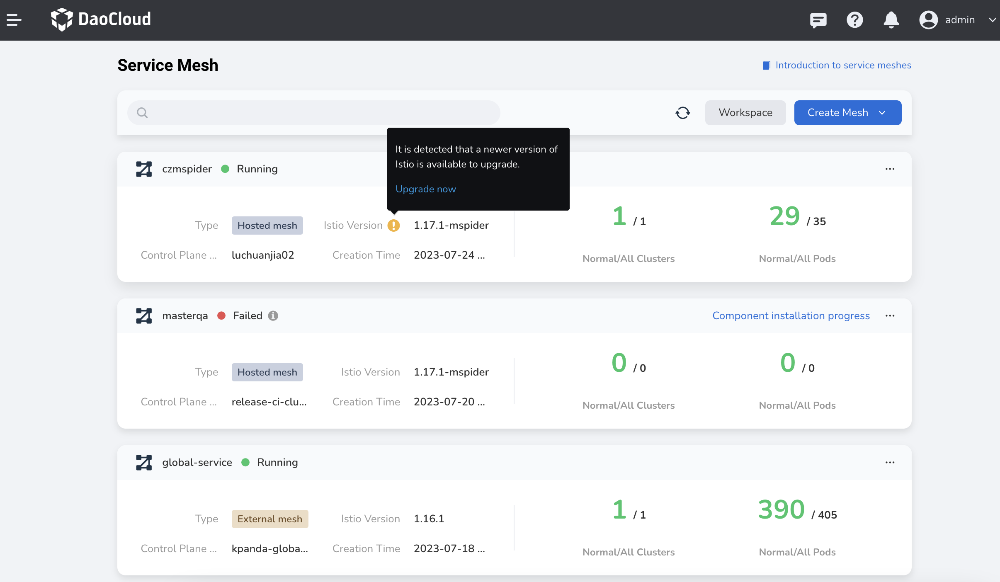
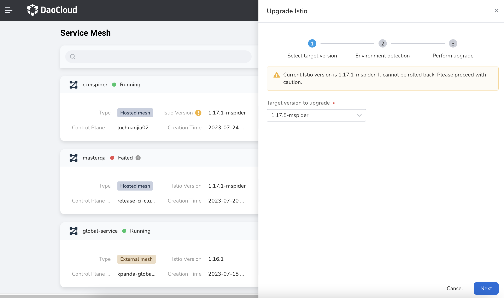
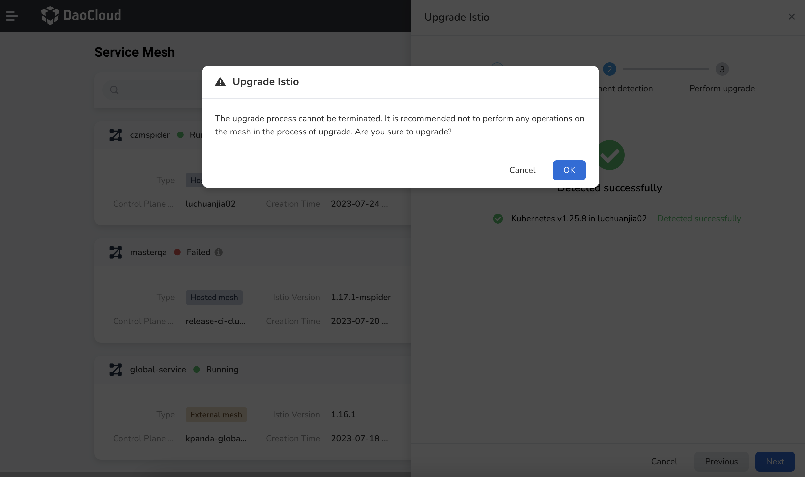
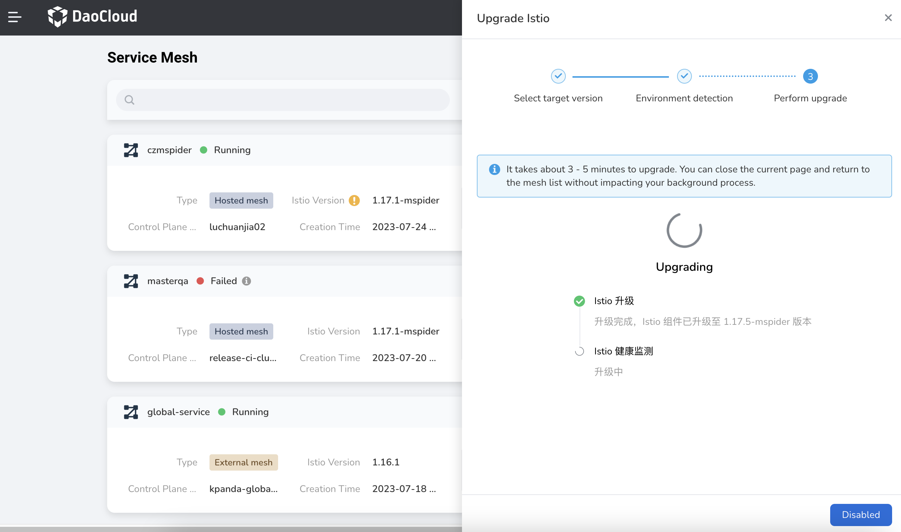

---
hide:
  - toc
---

# Istio Version Upgrade

!!! warning "Update Reminder"

    Try to avoid making configuration or related changes during the mesh update. Please plan your upgrade carefully.

The Istio version of the mesh can be upgraded continuously. DaoCloud provides two types of upgrade versions: native and customized.

- Native version: The community-native Istio without any customization.
- Customized version: Based on Istio, it has been customized with certain functionalities (suffix: -mspider).
  For example, integration with [Merbridge](../../community/merbridge.md) to improve mesh communication performance,
  support for intelligent recognition of traditional microservices such as SpringCloud and Dubbo,
  and support for sidecar hot-upgrade capability.

The upgrade process is the same for both types of versions, but mixed upgrades of different types are not supported.
Therefore, please confirm the required version when creating a mesh instance.

DaoCloud will continue to provide adaptation work for new Istio versions. When a new Istio version is detected by the system,
the `Mesh List` will prompt for upgradable mesh instances (a card with an exclamation mark icon will appear).
Check the content of the icon and click the `Upgrade Now` button to enter the upgrade wizard.

The Istio upgrade wizard includes three steps: `Select target version`, `Environment detection`, and `Perform upgrade`.
After the upgrade is completed, the mesh can be immediately deployed and run online. The specific steps are as follows:

1. **Select target version**: Select the desired version to upgrade from the list. After the upgrade,
   rolling back to a lower version will not be possible, so choose carefully.

    

2. **Environment detection**: The system will detect whether the versions of each cluster (k8s) under the mesh meet
   the upgrade requirements based on the selected target version. If they meet the requirements, the `Next` button
   will be activated; otherwise, the user needs to address any environment issues.

    

	- If the cluster (k8s) version is too low, you can upgrade the cluster (k8s) version first in the
      container management and then click the `Redetect` button.

	- If the cluster (k8s) version is too high, it is recommended to go back and select a higher version of Istio
      in the "Select target version" step.

3. **Perform upgrade**: After passing the environment detection, you will enter the upgrade phase,
   which includes two stages: `Upgrade` and `Health Check`.

	- Istio Upgrade: Pulling Istio images and upgrading control plane components.

	- Istio Health Check: Checking the running status of Istio control plane components.

	

After the upgrade is completed, go back to the mesh list page, and you will see that the Istio version of the mesh has been changed.

!!! note

    - Once the upgrade process starts, it cannot be terminated.
      It is recommended not to perform any configuration operations on the mesh during the upgrade.
    - For a more intuitive demonstration of the process, please refer to the [video tutorial](../../videos/mspider.md).
