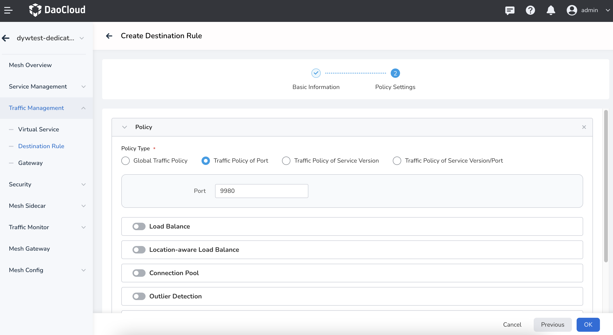
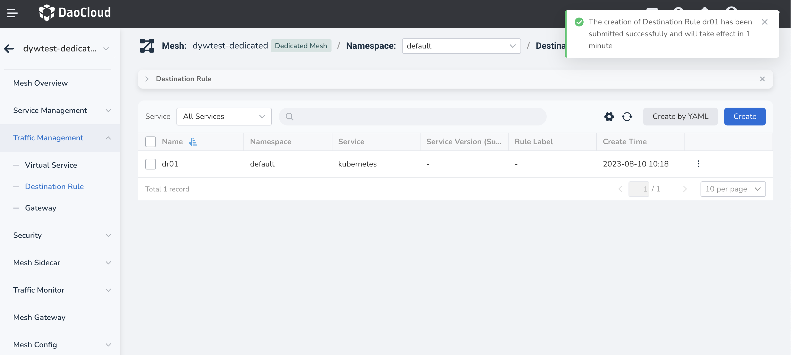
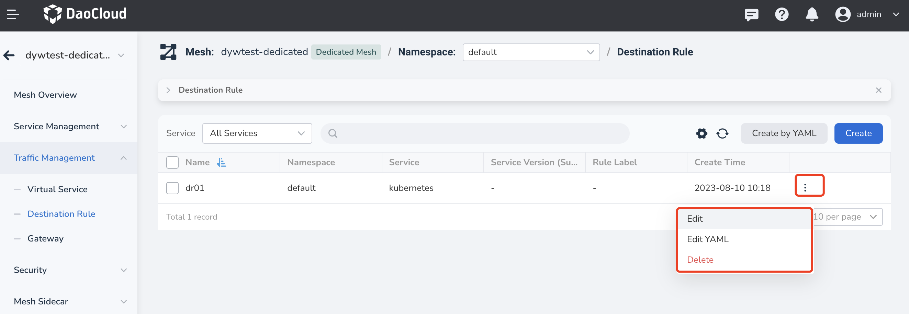

# Destination Rule

Destination Rule is also an important component in service governance. It partitions request traffic based on ports, service versions, etc., and customizes Envoy traffic policies for each request stream. The applied policies include not only load balancing but also features like minimum connection count and outlier detection.

## Concepts and Fields

Here are several important fields:

- Host

    Uses the short name of the Kubernetes Service. It has the same meaning as the `host` field
    in the `destination` section of VirtualService. The service must exist in the corresponding
    service registry; otherwise, it will be ignored.

- LoadBalancer

    By default, Istio uses round-robin load balancing strategy, where each instance in the pool
    gets requests in turn. Istio also supports the following load balancing models, which can be
    specified in DestinationRule for the traffic flowing to a specific service or service subset:

    - Random: Requests are distributed randomly among instances in the pool.
    - Weighted: Requests are routed to instances based on specified percentage.
    - Least Request: Requests are routed to the least accessed instances.

- Subsets

    `subsets` represent a collection of service endpoints, which can be used for A/B testing or
    version-based routing, among other scenarios. The traffic of a service can be split into
    N subsets for different client scenarios. The `name` field is primarily used by `destination`
    in VirtualService. Each subset is defined based on one or more `labels` attached to objects
    like Pods in Kubernetes. These labels are applied to the Deployment of the Kubernetes service
    and serve as metadata to identify different versions.

- OutlierDetection

    Outlier detection is a design pattern to reduce service anomalies and lower service latency.
    It handles service anomalies seamlessly and ensures there won't be cascading failures or avalanches.
    If the accumulated error count of a service exceeds a predefined threshold within a certain time frame,
    the erroneous service will be removed from the load balancing pool. Its health status will be continuously
    monitored, and once it recovers, it will be added back to the load balancing pool.

## Destination Rule List Introduction

The Destination Rule List displays information about the Destination Rule CRDs (Custom Resource Definitions)
in the service mesh and provides management capabilities for the lifecycle of Destination Rules. Users can
filter CRDs based on rule names or rule tags. The rule tags include:

- Service version
- Load balancing
- Locality load balancing
- HTTP connection pool
- TCP connection pool
- Client TLS
- Outlier detection


## Operation Steps

Service Mesh provides two ways to create Destination Rules: using a graphical wizard and using YAML.
Here are the specific steps for creating a Destination Rule through the graphical wizard:

1. Click `Traffic Management` -> `Destination Rule` in the left navigation bar,
   then click the `Create` button in the upper right corner.

    

2. In the `Create Destination` page, configure the basic settings and click `Next`.

    

3. Follow the on-screen prompts to select the policy type and configure the corresponding governance policy, then click `OK`.

    

4. Return to the Destination Rule list, and you will see a prompt indicating successful creation.

    

5. On the right side of the list, click the `⋮` in the operation column to access more options from the popup menu.

    

The YAML creation method is similar to [Virtual Service](./virtual-service.md).
You can directly create a YAML file using the built-in templates, as shown in the following figure:


Here is a YAML sample for destination rule:

```yaml
apiVersion: networking.istio.io/v1beta1
kind: DestinationRule
metadata:
  annotations:
    ckube.daocloud.io/cluster: dywtest3
    ckube.daocloud.io/indexes: '{"activePolices":"","cluster":"dywtest3","createdAt":"2023-08-10T02:18:04Z","host":"kubernetes","is_deleted":"false","labels":"","name":"dr01","namespace":"default"}'
  creationTimestamp: "2023-08-10T02:18:04Z"
  generation: 1
  managedFields:
    - apiVersion: networking.istio.io/v1beta1
      fieldsType: FieldsV1
      fieldsV1:
        f:spec:
          .: {}
          f:host: {}
          f:trafficPolicy:
            .: {}
            f:portLevelSettings: {}
      manager: cacheproxy
      operation: Update
      time: "2023-08-10T02:18:04Z"
  name: dr01
  namespace: default
  resourceVersion: "708763"
  uid: ff95ba70-7b92-4998-b6ba-9348d355d44c
spec:
  host: kubernetes
  trafficPolicy:
    portLevelSettings:
      - port:
          number: 9980
status: {}
```

## Policies

### Locality Load Balancing

Locality load balancing is a traffic forwarding optimization strategy supported by Istio based on
the geographical labels of workload deployments on Kubernetes cluster worker nodes. Configuration
includes traffic distribution rules (weight distribution) and traffic shifting rules (fault tolerance):

- Traffic Distribution Rules: Mainly configure the weight distribution of traffic between
  source workload location and destination workload location in different regions.
- Traffic Shifting Rules: Traffic fault tolerance usually requires the use of
  outlier detection functionality to detect workload failures and shift traffic promptly.

Note that the geographical labels are the labels on the worker nodes in the mesh member cluster.
Make sure to check the label configuration of the nodes:

- Region: `topology.kubernetes.io/region`
- Zone: `topology.kubernetes.io/zone`
- Subzone: `topology.istio.io/subzone`. Subzone is a specific configuration for Istio to achieve finer-grained partitioning.

Furthermore, regions are matched and arranged based on the hierarchical order. Different regions have different zones.

For more details, please refer to the official Istio documentation:
<https://istio.io/latest/docs/tasks/traffic-management/locality-load-balancing/>
