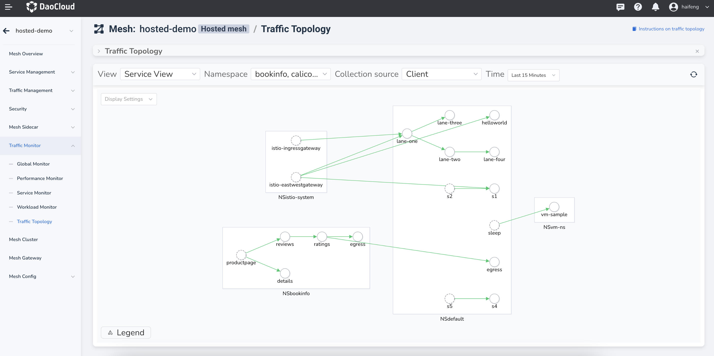
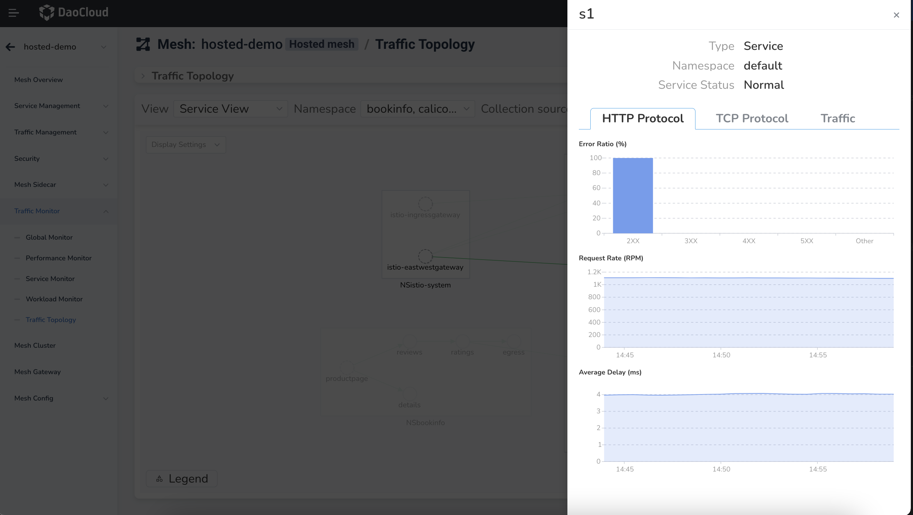

# Traffic Topology

DCE 5.0 Service Mesh provides a dynamic flow visualization feature called Traffic Topology.

In the left navigation menu, click on `Traffic Monitoring` -> `Traffic Topology`.
Here, you can choose the `View`, `Namespace`, `Collection source`, and `Time` to view the service topology.

## Display Settings

There are three options available:

- Namespace Boundary: Displays services partitioned by namespaces.
- Show Idle Nodes
- Enable Animation: Shows the dynamic flow direction of traffic.

The service topology graph supports operations like panning and zooming.

## Legend

Click on the `Legend` button in the bottom-left corner to see the meaning of the current lines, circles, and colors.

Services are represented by circles, and the color of the circle indicates the health status of the service:

- Healthy (Gray): Error rate = 0 and latency does not exceed 100 ms.
- Warning (Orange): 0 < Error rate <= 5% or 100 ms < Latency <= 200 ms.
- Critical (Red): Error rate > 5% or latency > 200 ms.
- Unknown (Dotted Line): No metric data available.

## Service Metrics Information

Click on any service to open a sidebar that displays relevant metrics based on the protocol type:

- HTTP Protocol: Error Rate (%), Request Rate (RPM), Average Latency (ms)
- TCP Protocol: Connection Count, Receive Throughput (B/s), Send Throughput (B/s)
- Governance Information: View virtual services, destination services, gateways, etc.

