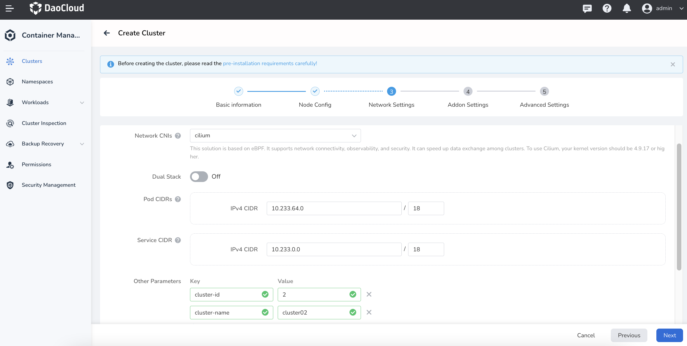
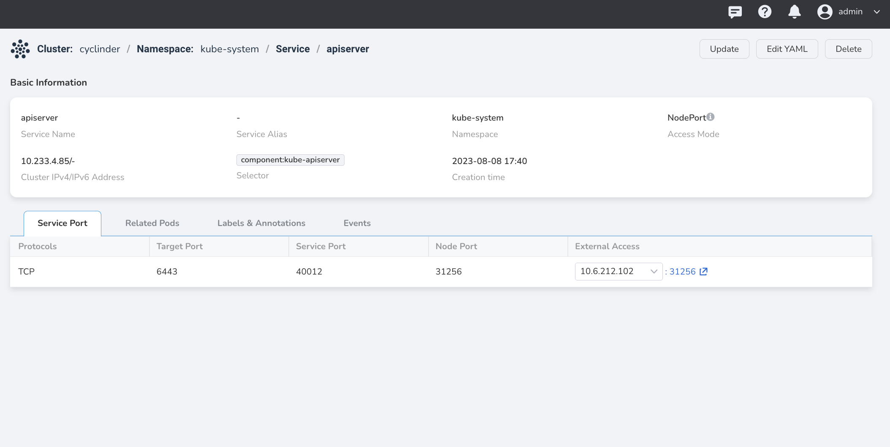
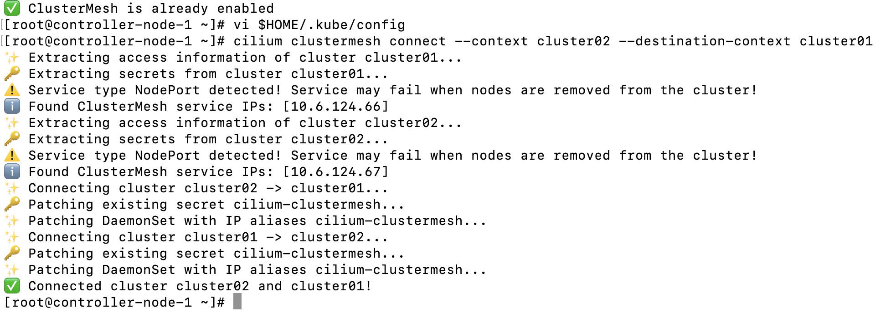
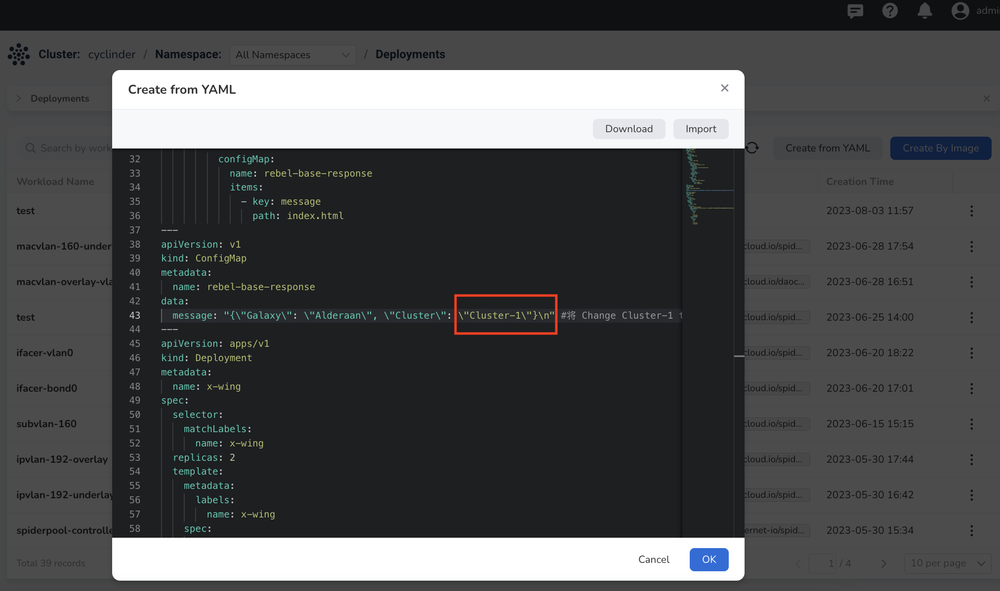

# Cross-Cluster Application Communication

## Introduction

As microservices processes evolve, many enterprises choose to deploy multiple Kubernetes (K8s) clusters in order to meet the needs of application isolation, high availability/disaster tolerance, and operations management. However, such multi-cluster deployments pose a problem: some applications depend on microservices in other K8s clusters and need to implement cross-cluster communication. Specifically, a Pod in one cluster needs to access a Pod or Service in another cluster.

## Prerequisites

Please make sure the Linux Kernel version >= 4.9.17 with 5.10+ recommended. To view and install the latest version, you can do the following:

1. To view the current kernel version:

    ```bash
    uname -r
    ```

2. Install the ELRepo repository, which provides the latest Linux kernel version:

    ```bash
    rpm --import https://www.elrepo.org/RPM-GPG-KEY-elrepo.org
    rpm -Uvh https://www.elrepo.org/elrepo-release-7.el7.elrepo.noarch.rpm
    ```

3. Install the latest Linux kernel version:

    ```bash
    yum --enablerepo=elrepo-kernel install kernel-ml
    ```

    > `kernel-ml` is the latest documented version of the kernel. You can also choose another version.

4. Update the GRUB configuration to use the new kernel version at boot time:

    ```bash
    grub2-mkconfig -o /boot/grub2/grub.cfg
    ```

## Create Clusters

> For more information on creating clusters, see [Creating Clusters](../../../kpanda/user-guide/clusters/create-cluster.md).

1. Create two clusters with different names, cluster01 and cluster02.

    

    - Choose cilium as the CNI plugin for cluster01.
    - Add two parameters, `cluster-id` and `cluster-name`.
    - Use the default configuration for other items.

2. Follow the same steps to create cluster02.

    

    > The container and service segments used by the two clusters must not overlap. The values of the two parameters must not conflict to identify the clusters uniquely and avoid conflicts for cross-cluster communication.

## Create a Service for API Server

1. After the cluster is created, create a Service on each of the two clusters to expose API server for that cluster.

    

    

    - Choose NodePort as the access type for external access for cluster01.
    - Choose `kube-system` as the namespace of API Server.
    - Label selector filters API Server and returns a selector to view API Server.
    - Configure the access port of the Service, and the container port is 6443.
    - Get the external access link for the Service.

2. Create a Service for API Server on cluster02 in the same way.

    

    

## Modify cluster configuration

Edit the `kubeconfig` files for cluster01 and cluster02 through the `vi` command.

```bash
vi $HOME/.kube/config
```

1. Add new `cluster`, `context`, and `user` information to both cluster01 and cluster02.

    - Under `clusters`, add new `cluster` information: the original CA issuer for both clusters remains unchanged; the new `server` address is changed to the address of the API Server Service that you have created above; and the `name` is changed to the names of the two clusters themselves, namely cluster01 and cluster02.

        > The address of the API Server Service can be found or copied from the DCE5.0 page, which requires the use of the https protocol.

    - Add new `context` information to `contexts`: change the values of the `name`, `user`, and `cluster` fields for the clusters in `context` to the names of the two clusters themselves: cluster01 and cluster02.

    - Add new `user` information to `users`: the two clusters copy their original credentials and change the name to the names of the two clusters: cluster01 and cluster02.

2. Add the `cluster`, `context`, and `user` information to each other's clusters.

    The following is a yaml example of how to do this:

    ```yaml
    clusters:
    - cluster: #Add the cluster01's `cluster` information
        certificate-authority-data: {{cluster01}}
        server: https://{{https://10.6.124.66:31936}}
      name: {{cluster01 }}
    - cluster: #Add the cluster02's `cluster` information
        certificate-authority-data: {{cluster02}}
        server: https://{{https://10.6.124.67:31466}}
      name: {{cluster02}}
    ```

    ```yaml
    contexts:
    - context: #Add the cluster01's `context` information
        cluster: {{cluster01 name}}
        user: {{cluster01 name}}
      name: {{cluster01 name}}
    - context: #Add the cluster02's `context` information
        cluster: {{cluster02 name}}
        user: {{cluster02 name}}
      name: {{cluster02 name}}
    current-context: kubernetes-admin@cluster.local
    ```

    ```yaml
    users:
    - name: {{cluster01}} #Add the cluster01's `user` information
      user:
        client-certificate-data: {{cluster01 certificate-data}}
        client-key-data: {{cluster01 key-data}}
    - name: {{cluster02}} #Add the cluster02's `user` information
      user:
        client-certificate-data: {{cluster02 certificate-data}}
        client-key-data: {{cluster02 key-data}}
    ```

## Configure cluster connectivity

Run the following commands to verify cluster connectivity:

1. Run the following commands on cluster01:

    ```bash
    cilium clustermesh enable --create-ca --context cluster01 --service-type NodePort
    ```

2. Run the following command to enable `clustermesh` on cluster02:

    ```bash
    cilium clustermesh enable --create-ca --context cluster02 --service-type NodePort
    ```

3. Establish connectivity on cluster01:

    ```bash
    cilium clustermesh connect --context cluster01 --destination-context cluster02
    ```

4. The presence of both `connected cluster1 and cluster2!` on cluster01, and `ClusterMesh enabled!` on cluster02 indicate that both clusters are connected.

    

    

## Create a demo application

1. Use the [rebel-base](https://github.com/cilium/cilium/blob/main/examples/kubernetes/clustermesh/global-service-example/cluster1.yaml) application provided in the cilium docs, and copy the following yaml file:

    ```yaml
    apiVersion: apps/v1
    kind: Deployment
    metadata:
      name: rebel-base
    spec:
      selector:
        matchLabels:
          name: rebel-base
      replicas: 2
      template:
        metadata:
          labels:
            name: rebel-base
        spec:
          containers:
          - name: rebel-base
            image: docker.io/nginx:1.15.8
            volumeMounts:
              - name: html
                mountPath: /usr/share/nginx/html/
            livenessProbe:
              httpGet:
                path: /
                port: 80
              periodSeconds: 1
            readinessProbe:
              httpGet:
                path: /
                port: 80
          volumes:
            - name: html
              configMap:
                name: rebel-base-response
                items:
                  - key: message
                    path: index.html
    ---
    apiVersion: v1
    kind: ConfigMap
    metadata:
      name: rebel-base-response
    data:
      message: "{\"Galaxy\": \"Alderaan\", \"Cluster\": \"Cluster-1\"}\n" # Change Cluster-1 to the name of Cluster01
    ---
    apiVersion: apps/v1
    kind: Deployment
    metadata:
      name: x-wing
    spec:
      selector:
        matchLabels:
          name: x-wing
      replicas: 2
      template:
        metadata:
          labels:
            name: x-wing
        spec:
          containers:
          - name: x-wing-container
            image: quay.io/cilium/json-mock:v1.3.3@sha256:f26044a2b8085fcaa8146b6b8bb73556134d7ec3d5782c6a04a058c945924ca0
            livenessProbe:
              exec:
                command:
                - curl
                - -sS
                - -o
                - /dev/null
                - localhost
            readinessProbe:
              exec:
                command:
                - curl
                - -sS
                - -o
                - /dev/null
                - localhost
    ```

2. Quickly create two applications for cluster01 and cluster02 in DCE 5.0 using yaml file.

    

    Modify the contents of `ConfigMap` so that the data returned is labeled with the names of cluster01 and cluster02, respectively when you access a Service in cluster01 and cluster02. The Pod labels can be found in the `rebel-base` application.

3. Create a Service for a global service video in each of the two clusters, which points to the created `rebel-base` application.

    

    

    - Service type is ClusterIP
    - Add the application's Pod labels to filter the corresponding application
    - Configure the port
    - Add an annotation to make the current Service effective globally.

    > When creating a service for cluster02, the service name must be the same for both clusters. And the two clusters must locate in the same namespace, have the same port name and global annotation.

## Cross-cluster communication

1. Check the Pod IP of the application in cluster02.

2. On the page of cluster01 details, click the Pod console of `rebel-base` , and then `curl` the Pod IP of cluster02's `rebel-base`. Successfully returning cluster02 information means the Pods in two clusters can communicate with each other.

3. Check the service name of cluster01. On the console of the Pod `rebel-base` in cluster02, `curl` the corresponding service name of cluster01. Some of the returned content is from cluster01, which means that the Pods and Services in the two clusters can also communicate with each other.
