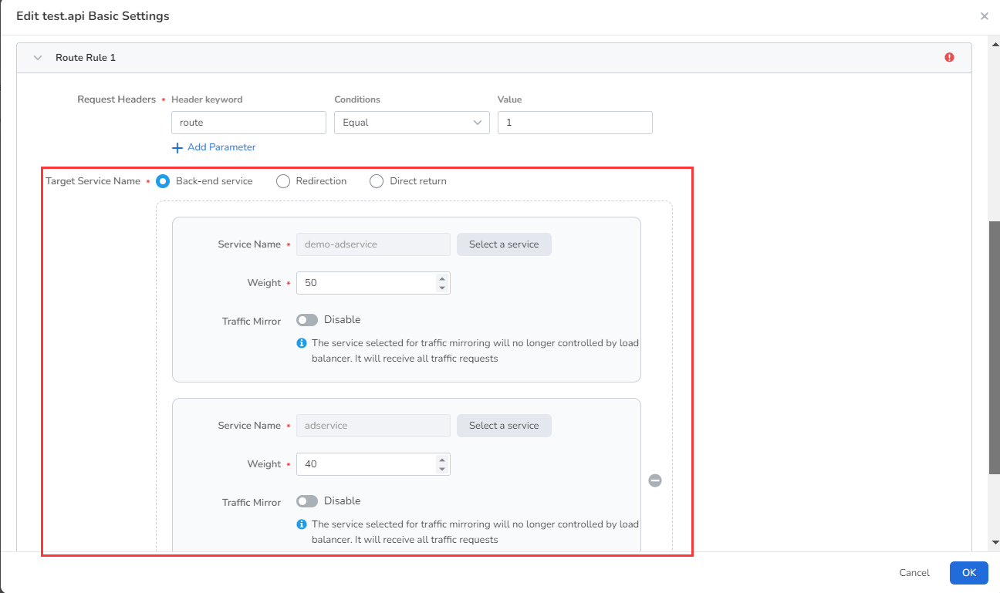
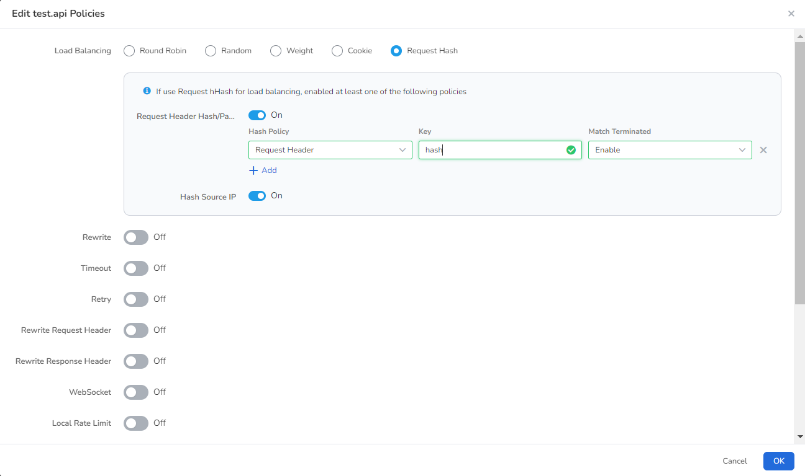
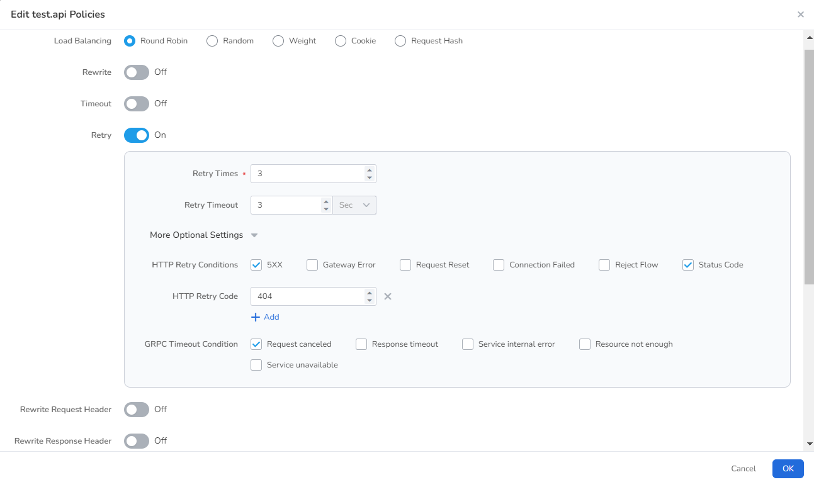
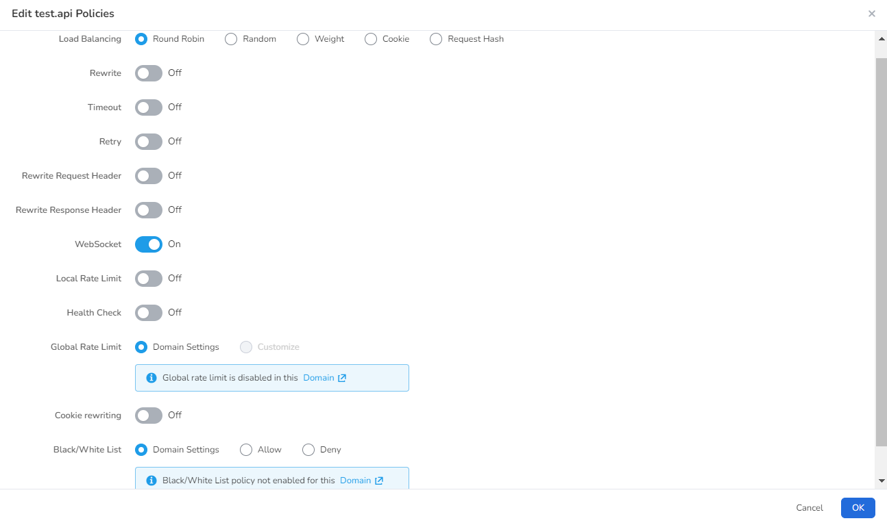
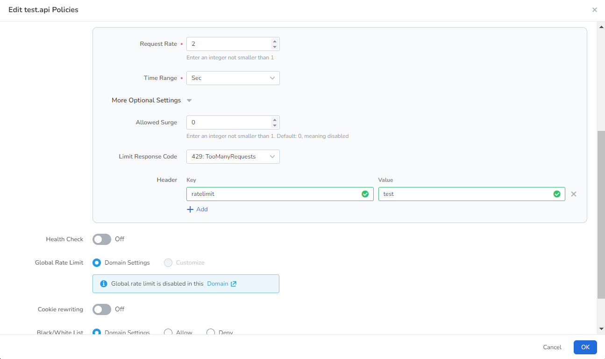
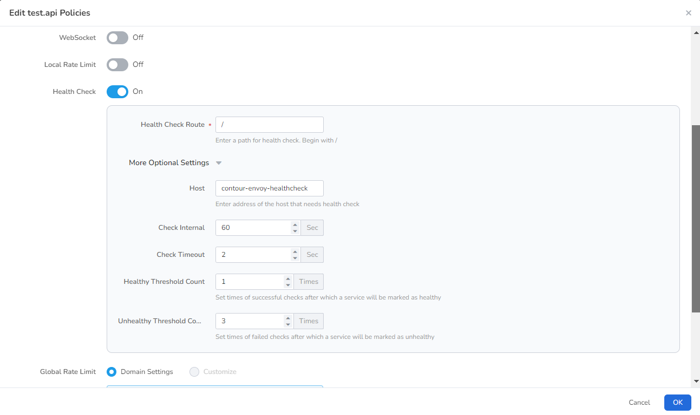

# Configuring API policies

DCE 5.0 Microservice gateway supports twelve API policies: load balancing, path rewriting, timeout configuration, retry mechanism, request header rewriting, response header rewriting, WebSocket, local traffic limit, health check, global rate limit, cookie rewriting, and black/white list. You can use a single policy or a combination of policies to achieve best practices.
<!-- For combination configuration of API policies, see [ API policy configuration Best practices ]() -->

There are two ways to configure API policies:

- To set policies during API creation, see [Add API](index.md).
- Adjust by [ Update the API policy configuration ](update-api.md) after the API is created.

** Video tutorial: **

- [Advanced Configuration of API Policy (1)](../../../videos/skoala.md#api-1)
- [Advanced Configuration of API Policy (2)](../../../videos/skoala.md#api-2)

** The configuration of each policy is described as follows: **

## Load balancing

When the target back-end service of an API serves multiple instances, you can use load balancing policies to control traffic distribution and adjust the traffic received by instances of different services based on service use cases.

- random
  
    Default load balancing policy. When a random rule is selected, the gateway randomly distributes the request to any instance of the back-end service. Some back-end services may be overloaded when the traffic is low. The effect is shown in the following figure:

    

- polling
  
    All instances of the back-end service distribute requests in turn, and each service instance receives roughly the same number of requests. This rule ensures equal distribution of traffic when the traffic volume is small. The effect is shown in the following figure:

    

- weight
  
    Traffic is distributed based on the weight of the API target back-end service. A larger weight indicates a higher priority and more traffic is borne. See the following figure for the service weight configuration entry:

    

- Cookie
  
    Traffic belonging to the same Cookie in the source request header is distributed to a fixed back-end service instance, provided that the back-end service can respond differently based on the Cookie.

- Request Hash
  
    When you select request Hash, you can use some advanced policies to implement load balancing. Currently, the supported Hash policies are IP and request parameters.

    

## Path rewriting

If the exposed API path is inconsistent with the path provided by the back-end service, you can change the API path to be consistent with the path of the back-end service to ensure normal service access. After path rewriting is enabled, the gateway forwards external request traffic to the rewritten path.

Note: ** You need to make sure that the overwritten path is real and that the path is correct, starting with a "/". **

## Timeout configuration

This section describes how to set the maximum response duration. If the maximum response duration is exceeded, the request fails. The timeout period can be an integer whose type is >=1, and the unit of time is seconds (s).

The timeout configuration is disabled by default. After it is enabled, you must set a timeout period. Enabling the timeout configuration helps reduce congestion caused by exception handling.

## Retry mechanism

The API of the microservice gateway supports a very rich configuration of retry mechanisms. After the retry mechanism is enabled, the gateway automatically retries the access if the request fails. After the retry timeout period is reached, retry is automatically triggered. When the number of retries reaches the upper limit, retry is stopped. The retry mechanism is disabled by default. After it is enabled, you must set the retry times and retry timeout period.

You can customize retry conditions and retry status codes.

### HTTP retry

- 5XX Response error: Try again when HTTP status_code of the back-end service response is greater than 500.
- Gateway error: Automatically retry when the response is a gateway error message.
- Request reset: Automatically retries when the response is a request reset message.
- Connection failure: Automatically retry when the response is a network connection failure.
- Denial flow: Automatically retry when the response results in the back-end service marking the request as rejected for processing.
- Specify status code: Automatically retries when HTTP status_code is specified in the response of the back-end service. You can configure a specific status code.

### GRPC retry

- Request cancelled: The request is automatically retried when the back-end service cancels the request.
- Response timeout: When the back-end service response times out, the system automatically tries again.
- Internal service error: Automatically retries when the response is an internal service error.
- Insufficient resources: Automatically retry when the response is insufficient resources.
- When the service is unavailable: Automatically retry when the response is unavailable at the back end.

    

## Request header/response header rewriting

Support for adding, modifying, and deleting request and response headers and their corresponding values.
  
- Add request header/response header: Use the `Settings` action to fill in the new keyword and new value.
- Modify the request header/response header: Use the `Settings` action to fill in the existing keywords and assign a new value.
- To remove the request header or response header, run the `Remove` action and enter only the keyword to be removed.

    

## Websocket

WebSocket is a protocol for full-duplex communication over a single TCP connection. Websockets make it easier to exchange data between the client and server, allowing the server to actively push data to the client. In the WebSocket API, the browser and server only need to complete a handshake to create a persistent connection and two-way data transfer.

After Websocket is enabled, you can use Websocket to access API back-end services.

## Local current limiting

The microservice gateway supports abundant traffic limiting capabilities, including enabling local traffic limiting capabilities at the API level.

- Request rate: Specifies the maximum request rate allowed in the time window (seconds/minutes/hours), for example, a maximum of three requests per minute. An integer >=1 is supported.
- Overflow rate: Allows some additional requests to be processed when the preset request rate is reached. This parameter is applicable to traffic surges during peak hours. An integer >=1 is supported.
- Restricted return code: The default return code is 429, indicating too many requests. Refer to the envoy official documentation [Status Code](https://github.com/envoyproxy/envoy/blob/v1.23.1/api/envoy/type/v3/http_status.proto#L137).
- Header keyword: This parameter is null by default. You can set this parameter based on requirements.

The configuration shown in the following figure indicates that a maximum of 8 requests are allowed per minute (3+5). The 9th access will return a 429 status code indicating that the number of requests is too many. The response content returned after each successful request will have a `ratelimit：8` response header.

## Health examination

By setting the health check address, you can ensure that the gateway automatically adjusts the load balancing when the back-end service is abnormal. Flag an unhealthy back-end service and stop distributing traffic to it. After the back-end service recovers and passes the specified health check conditions, traffic distribution is automatically resumed.

- Health check path: Start with a slash (/), and all instances of all back-end services should provide the same health check interface.
- Specific health check host: After a host address is configured, only the health check is performed on the host.
- Check interval: Indicates the interval of a health check. The unit is seconds. For example, a health check is performed every 10 seconds.
- Check timeout period: specifies the maximum timeout period for a health check. If the health check exceeds the specified timeout period, the health check fails.
- Marking the number of health checks: The service instance is marked as healthy only when the check result is healthy for N consecutive times. When a service instance is marked as healthy, request traffic is automatically distributed to the service instance.
- Marking the number of unhealthy checks: If the service instance is checked for N consecutive times and the result is unhealthy each time, the service instance is marked as unhealthy. When the service instance is marked as unhealthy, the request traffic to the instance is stopped.

    

## Cookie rewriting

Configure the cookie rewriting policy by referring to the following instructions:

- Name: You must enter an existing cookie name
- Domain name: Specifies the domain name of the cookie to be redefined
- Path: Redefines the path of the cookie
- Secure: `Enable` Indicates that the secure mode is enabled, and `Disable` indicates that the secure mode is disabled. In secure mode, the request must be a secure connection (HTTPS) for the cookie to be saved. If HTTP is used, cookies are invalid
- Samesite: Whether to send cookies across domains

    - Strict: The cookies of this website are strictly prohibited for cross-domain requests
    - Lax: Banned in most cases, except for Get requests that navigate to the target URL.
    - None: Cross-domain requests are allowed to carry cookies of this site, provided that Secure is set to `Enable`, that is, it can only be used under HTTPS

## Access blacklist and whitelist

After `Black List` is enabled, only IP requests in the whitelist are allowed to pass through the gateway and requests from other sources are denied. Or deny blacklisted IP requests through the gateway and allow requests from all other sources.

- Number of proxy layers before the gateway: Several proxy endpoints must pass through the request from the client to the gateway. For example, `**Client-Nginx-Gateway**` has one proxy level because only one Nginx proxy endpoint passes between them.

    > When creating or updating a gateway, you can set the number of proxy layers in `Advanced Settings` of the gateway as required.

- Remote: If the IP source is Remote, whether the whitelist takes effect depends on the number of proxy layers before the gateway. When the number of proxy layers is n, the IP address of the n+1 endpoints from the gateway takes effect. For example, `**Client-Nginx-Gateway**` If the number of proxy layers before the gateway is 1, this parameter takes effect only for the IP address of the second endpoint before the gateway, that is, the IP address of the client. If you fill in the IP address of Nginx, the whitelist will not take effect.

    <!--  待补充-->

- Peer: If the IP source is Peer, the whitelist is valid only for the **direct** peer IP address of the gateway, regardless of the number of proxy layers before the gateway. For example `Client-...-Nginx-Gateway`, no matter how many proxy endpoints there are between the client and Nginx, the whitelist is only valid for the IP of the last Nginx.

    