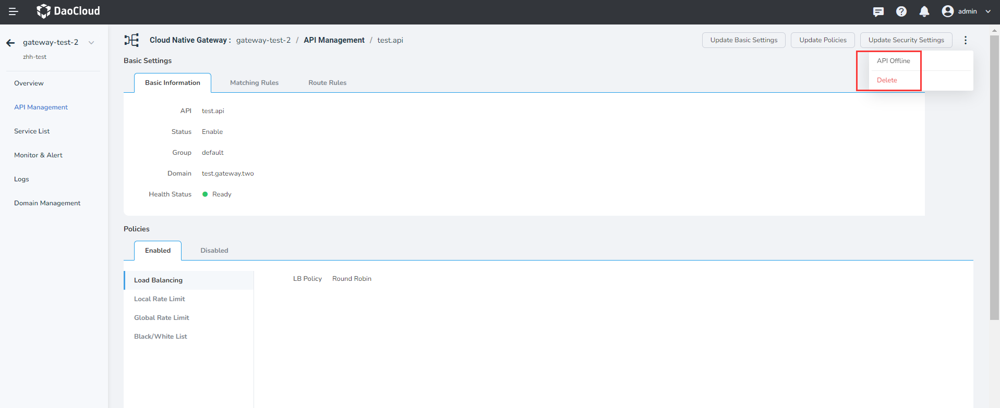

# Update/Delete API

The microservice gateway supports the full lifecycle management of the API of the gateway instance, including adding, updating, and deleting the API. 

## Update API

You can update the base configuration, policy configuration, and security configuration of the API in two ways.

- In the `API Management` page to find the need to update the API, on the API right click `ⵗ` choose `Update Basic Settings`, `Update Policy Settings`, or `Update Security Settings`.

    

- Click the API name to enter the API details page. In the upper right corner of the page, `Update Basic Settings`, `Update Policy Settings` or `Update Security Settings`.

    

## Delete API

The microservice gateway supports the full lifecycle management of the API of the gateway
instance, including adding, updating, and removing the API. This page explains how to
remove an API.

You can remove an API in two ways.

!!! danger

    The deletion operation is irreversible. Regardless of whether the API is in an online
    state or not, once deleted, it will immediately become inactive and cannot be recovered.

- In the `API Management` page to find the need to delete the API, on the API right click `ⵗ` and select `Remove`.

    

- Click the API names into the API details page, at the upper right corner of the page by clicking on the `ⵗ` hold and select `Remove`.

    
