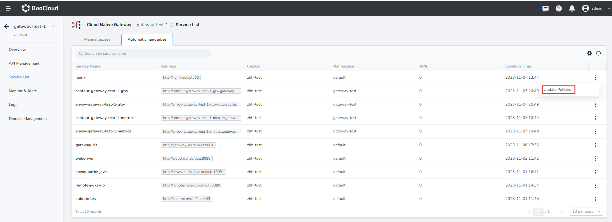

# Automatic management service

The services that are successfully added will be displayed on the service list page. You can also select the services in the list as the target back-end services when adding apis. The microservice gateway supports manual access and automatic management to add services. This page describes how to automatically manage services.

After [created a gateway](../create-gateway.md) succeeds, the services in the service source are automatically added to the service list of the gateway instance without manual addition.

## View automatic managed services

1. In the `Gateway List` page click the name of the target gateway, enter the gateway overview page, in the left navigation bar click `Add Service` -- > `Service List`.

    

2. On the `Service List` page click `Auto Add`.

    

## Configure service policy

1. In the `Service List` -- > `Auto Add` page to find the target service, on the right side click ** `ⵗ` ** choose `Policy Settings`.

    

2. To adjust the service policy configuration as required, click `OK` in the lower right corner of the pop-up box.

    - HTTPS certificate verification: After HTTPS is enabled, you must pass certificate verification to access the service successfully.
    - Service circuit breaker: When the maximum number of connections, processing connections, parallel requests, and parallel retries ** Any one ** reaches the threshold, service calls are automatically cut off to protect the overall system availability. When the metric drops to a set threshold, calls to the service are automatically resumed.

        

## Viewing service details

1. Locate the target service on the `Service List` -> `Auto Add` page and click the service name.

    

2. View information such as the service name, source, and associated API. Supports sorting by installing `Last Update`.

    

!!! info
    
    For automatically managed services, only the preceding operations are supported. Update or delete services are not supported
