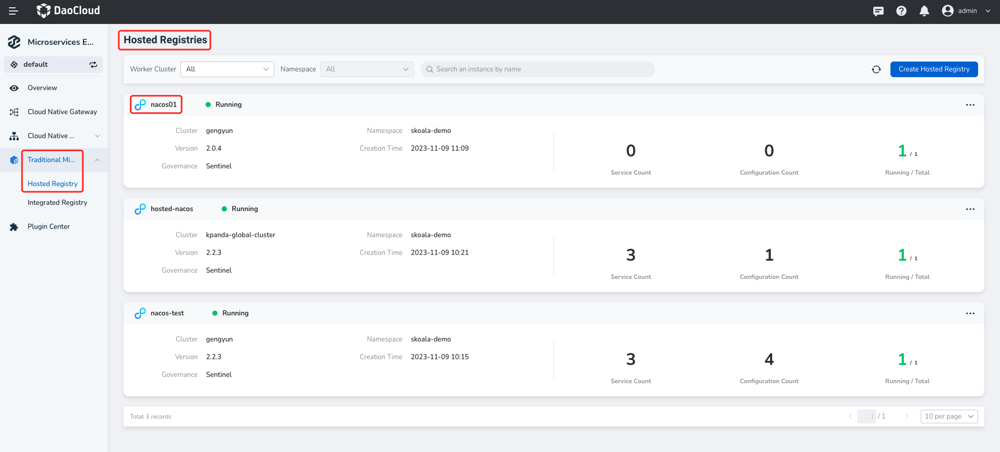

# Microservice namespace

Microservice namespaces can be used to isolate services, configuration, and other resources in different environments, such as production, development, and testing. The namespace in the microservice engine module refers to the microservice namespace, that is, the namespace in the [Nacos](https://nacos.io/docs/what-is-nacos.html) context, not in the Kubernetes scenario.

!!! note

    - When you create a managed registry instance, the system automatically creates a default namespace named ** public **. The namespace cannot be edited or deleted. It belongs to the reserved namespace of the system.
    - Services and configurations in different namespaces are strictly isolated and cannot reference each other. For example, A service in namespace A cannot reference a configuration in namespace B.

## Create the microservice namespace

1. Enter `Microservices` -- > `Traditional Microservices` -- > `Hosted Registry` module, click the name of the target registry.

   

2. Click `Microservice Namespace` in the left navigation bar, then click `Create` in the upper right corner.

   

3. Enter the ID, and name and click `OK` in the lower right corner of the page.

    If you do not enter an ID, the system automatically generates an ID. ** The namespace ID cannot be changed after creation **

   

## Update the microservice namespace

1. In the right operation bar of the corresponding namespace, click `Edit` to enter the update page.

   

2. To modify the namespace name, click `OK`.

   

## Delete the microservice namespace

Click `Delete` in the right operation bar of the corresponding namespace, and then click `Delete Now` in the pop-up box.

!!! note

