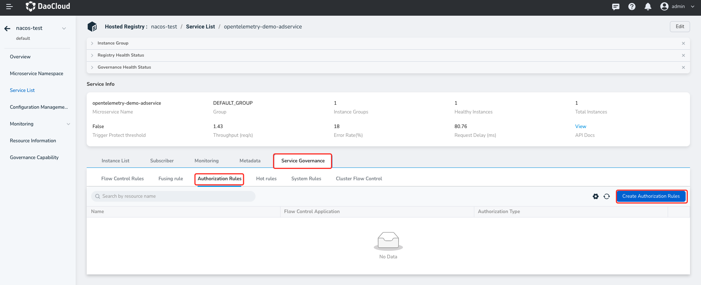
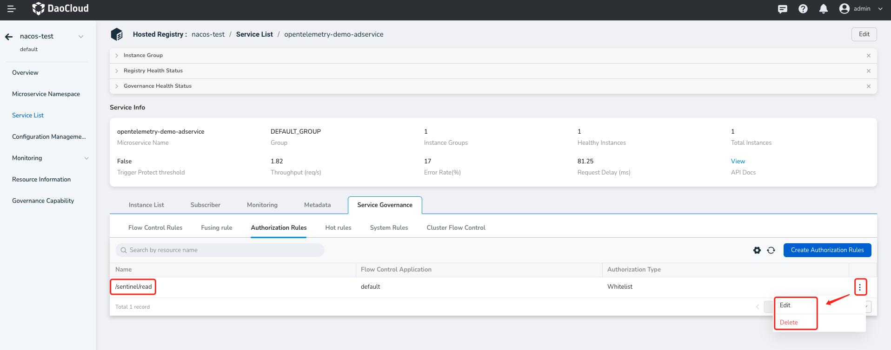

---
hide:
  -toc
---

# Create Authorization Rules

Authorization rules are used to restrict the access of resources based on the source of the requests. If a whitelist is configured, only requests from sources within the whitelist are allowed. If a blacklist is configured, requests from sources within the blacklist are not allowed, while all other requests are allowed.

Follow the steps below to create an authorization rule:

1. Click the name of the target managed registry, then click `Microservices` in the left sidebar and click the `Governance` option on the right side.

    > Note that the microservice you want to govern should have the "Can be governed" status set to "Yes" in order to proceed with the following steps.

    

2. Select `Authorization Rules`, then click `Create Authorization Rule` on the right side.

    

3. Fill in the rule configuration based on the instructions below and click `OK` in the bottom right corner.

    - Resource Name: Specify the resource for which you want to control the traffic, such as a specific API endpoint, function, or variable within the current service.
    - Flow Control Application: Specify the source(s) of the requests for the resource. Separate multiple sources with commas, e.g., `appA, appB`.
    - Authorization Type - Whitelist: Only requests from sources within the whitelist are allowed to access the resource.
    - Authorization Type - Blacklist: Requests from sources within the blacklist are denied access to the resource. Requests from sources not on the blacklist are not restricted.

    
   
4. After creating the rule, you can view it in the list of authorization rules. Click the more options button on the right side to update or delete the rule.

    
