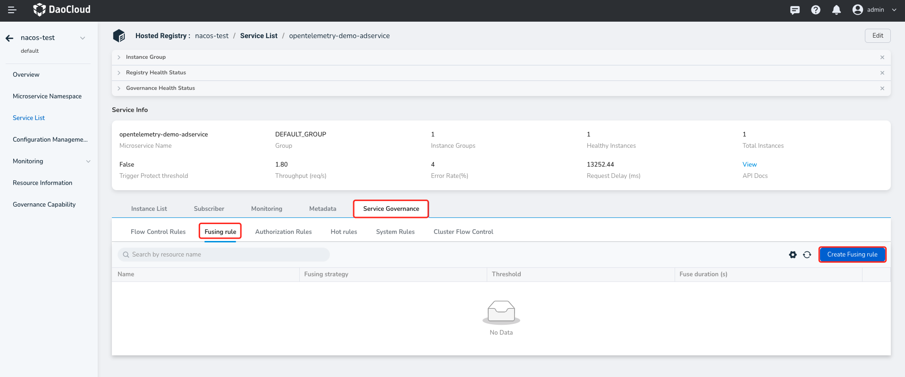
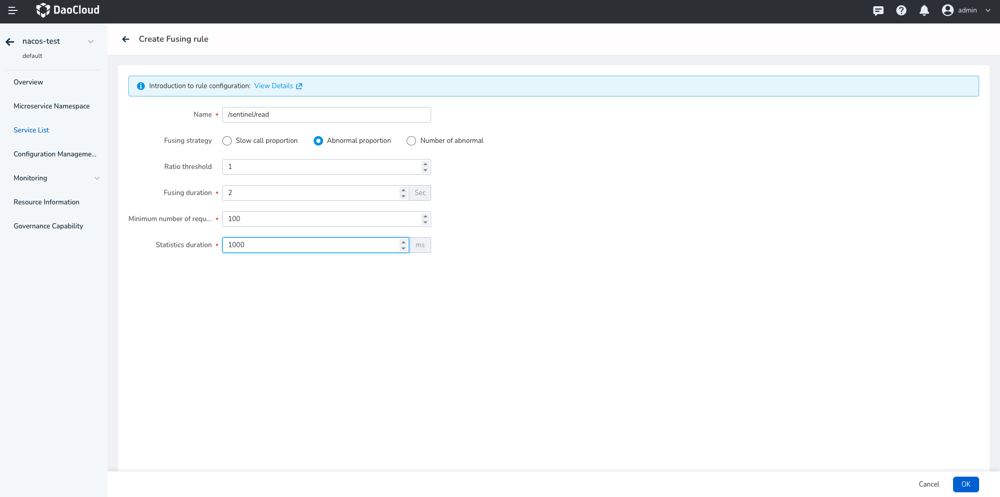
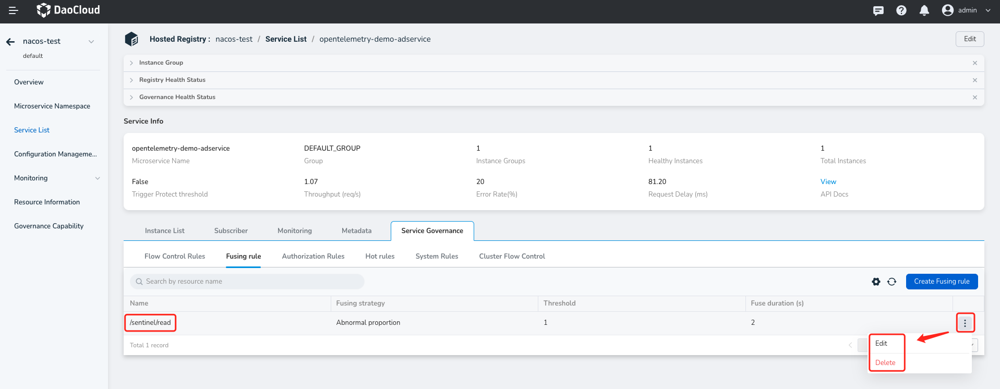

---
hide:
  -toc
---

# Create Circuit Breaking Rules

Circuit breaking rules can monitor the response time or exception ratio of internal or downstream services in an application. When a specified threshold is reached, the priority of the downstream dependencies is reduced, and lower-priority unstable resources are not called within a specified time range. This helps prevent the application from being affected, ensuring high availability. After a circuit breaker's duration ends, it enters a probing recovery state: if the response time of the next request is less than the set slow call maximum response time, the circuit is closed; otherwise, the resource will be circuit broken again.

Follow the steps below to create a circuit breaking rule:

1. Click the name of the target managed registry, then click `Microservices` in the left sidebar and click the `Governance` option on the right side.

    > Note that the microservice you want to govern should have the "Can be governed" status set to "Yes" in order to proceed with the following steps.

    
   
2. Select `Fusing rule`, then click `Create Fusing Rule` on the right side.

    

3. Fill in the rule configuration based on the instructions below and click `OK` in the bottom right corner.

    - Resource Name: Specify the resource for which you want to control the traffic, such as a specific API endpoint, function, or variable within the current service.
    - Slow Call Ratio: If the ratio of slow calls within a unit statistical period exceeds the set threshold, the resource will be circuit broken for the remaining time within the circuit breaker's duration.
    - Exception Ratio: If the ratio of exception requests within a unit statistical period exceeds the threshold, the resource will be circuit broken for the remaining time.
    - Exception Count: If the number of exception requests received within a unit statistical period exceeds the set threshold, the resource will be circuit broken for the remaining time.
    - Maximum RT: The maximum response time of a request, in milliseconds. Requests with a response time greater than this value are considered slow calls.
    - Threshold: The ratio of slow calls (for slow call ratio strategy) / exception requests (for exception ratio strategy) to all requests within a statistical period. The threshold range is [0.0, 1.0], representing 0% - 100%.
    - Circuit Duration: The duration of the circuit breaker, in seconds. During this duration, all requests will fail fast.
    - Minimum Request Count: The minimum number of requests required to trigger the circuit breaker within a statistical period. **Even if the circuit-breaking conditions are met, the circuit breaker will not be triggered if the current number of requests within the statistical period is less than this value**.
    - Statistical Period: The length of the statistical time window, in milliseconds. Valid values range from 1 second to 120 minutes.

    

4. After creating the rule, you can view it in the list of circuit breaking rules. Click the more options button on the right side to update or delete the rule.

   
