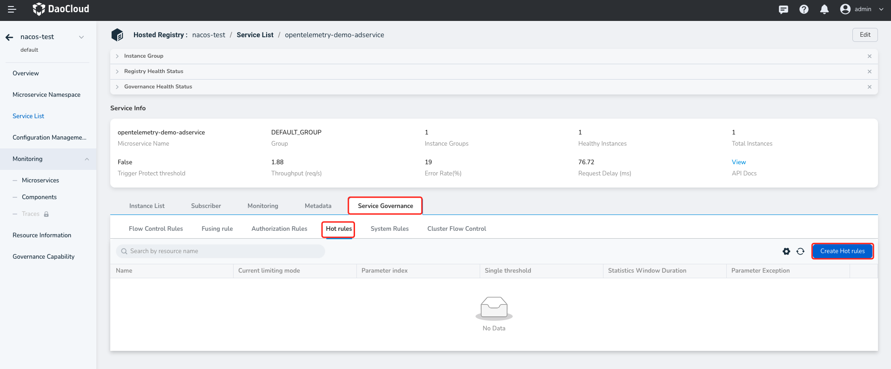
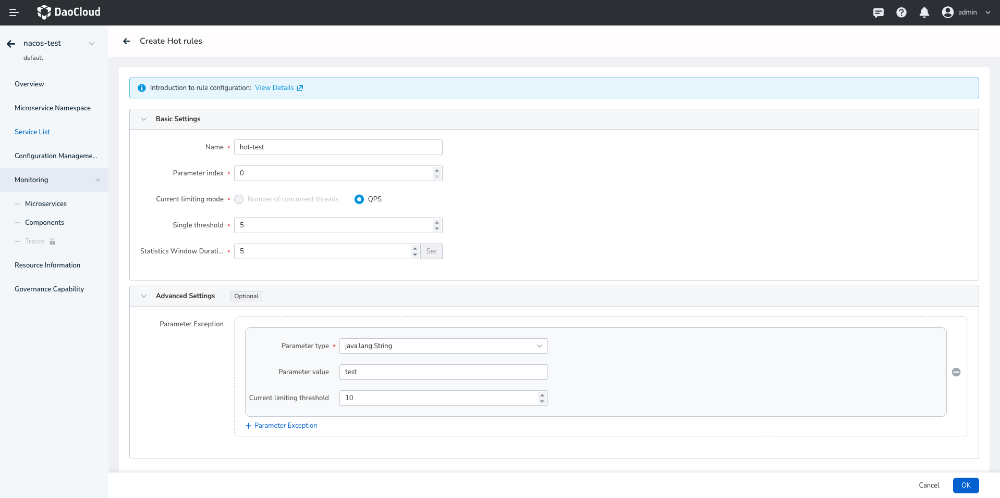
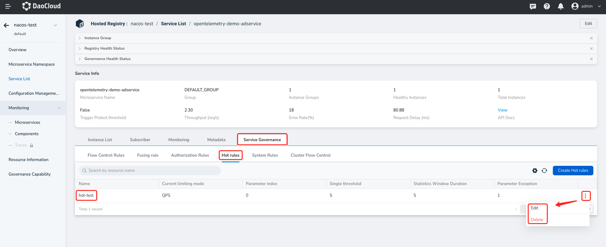

---
hide:
  -toc
---

# Create Hotspot Rules

Hotspot refers to frequently accessed data. Hotspot rules are used to control the traffic of highly accessed resources to prevent excessive traffic within a short period of time, which can affect system stability. For example, in the following scenarios, it is necessary to track the most frequently accessed data in a hotspot and control its traffic:

- Restricting the purchase of the most frequent product IDs in a certain period of time to prevent cache penetration and excessive requests to the database.
- Restricting frequent access to user IDs within a certain period of time to prevent malicious activities.

**In DCE 5.0, when a hotspot rule is triggered, the flow control effect is direct failure. This means that when the set threshold is reached, subsequent requests for the resource will fail directly instead of being queued.**

Follow the steps below to create a hotspot rule:

1. Click the name of the target managed registry, then click `Microservices` in the left sidebar and click the `Governance` option on the right side.

    > Note that the microservice you want to govern should have the "Can be governed" status set to "Yes" in order to proceed with the following steps.

    

2. Select `Hotspot Rules`, then click `Create Hotspot Rule` on the right side.

    

3. Fill in the rule configuration based on the instructions below and click `OK` in the bottom right corner.

    - Name: Specify the name of the resource that needs traffic control, such as an API interface, function, variable, etc., within the current service.
    - Parameter Index: The index position of the hotspot parameter, corresponding to the parameter index position in `WithArgs(args ...interface{})`, starting from 0.
    - Current limiting mode: Choose whether to control the traffic based on the thread count of the called resource or QPS (Queries Per Second).
    - Single Threshold: The threshold that applies to each hotspot parameter. For example, when the QPS reaches a certain value, flow control will be applied to the hotspot parameter.
    - Statistic Window Duration: The duration for calculating the thread count or QPS, for example, if the statistic window duration is 10s and the QPS threshold is 5, it means that the access to each hotspot parameter should not exceed 5 times within 10 seconds.
    - Advanced Settings: Set the threshold for a specific parameter value separately, which is not subject to the above "Single Machine Threshold" limitation.

    

4. After creating the rule, you can view it in the list of hotspot rules. Click the more options button on the right side to update or delete the rule.

    
