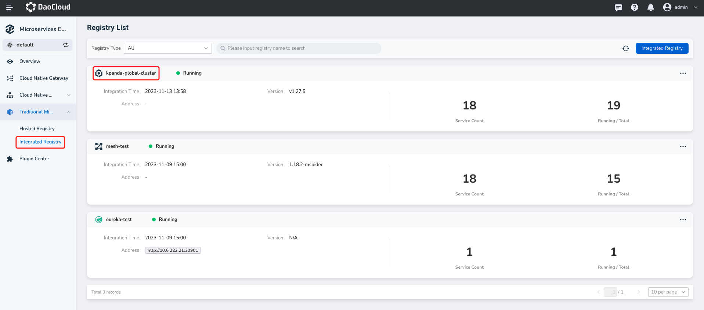
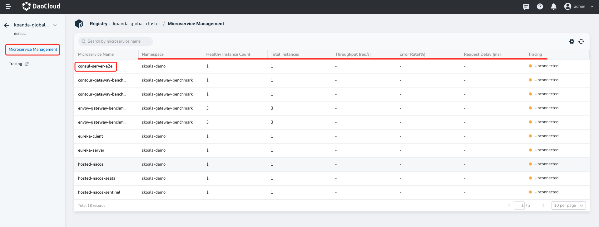

---
hide:
  - heel
---

# Microservice management

After [integrating a registry](index.md), you can manage the microservices in the registry. Microservice management refers to viewing the microservices in the registry.

!!! note

    An access-based registry center only supports basic management operations. For more complex management scenarios, it is recommended to create a [hosted registry center](../hosted/index.md) to perform more advanced operations.

1. Click the name of the target registry on the `In` page.

    

2. Click `Microservice Management` in the left navigation bar to view the list of micro-services and basic information.

    On the current page, you can copy the name of the micro-service and view all micro-services in the current registry, as well as the namespace, instance, and request statistics of each micro-service.

    

3. Click the name of the micro-service to view the instance list, interface list, and monitoring information of the micro-service.

    

    - Instance list: Displays instance status, IP address, and service port.

        You can click the instance name to view the monitoring information and metadata of the instance.

        <!--screenshots-->

    - Interface list: View the existing interfaces of the microservice, or create a new interface.

        <!--screenshots-->

    - Monitoring information: Displays monitoring information about the micro-service, including the number of requests, error rate, response time, and request rate.

        User-defined time range is supported.

        <!--screenshots-->
