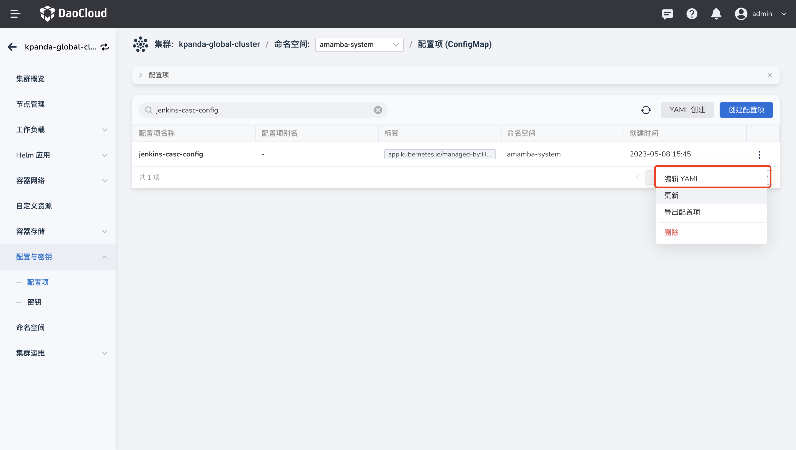
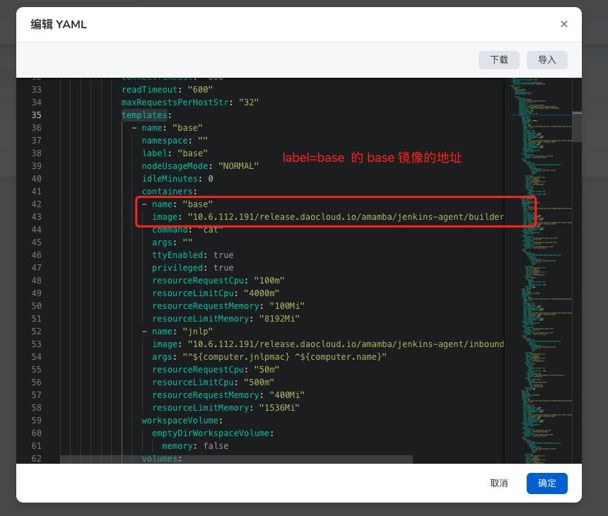
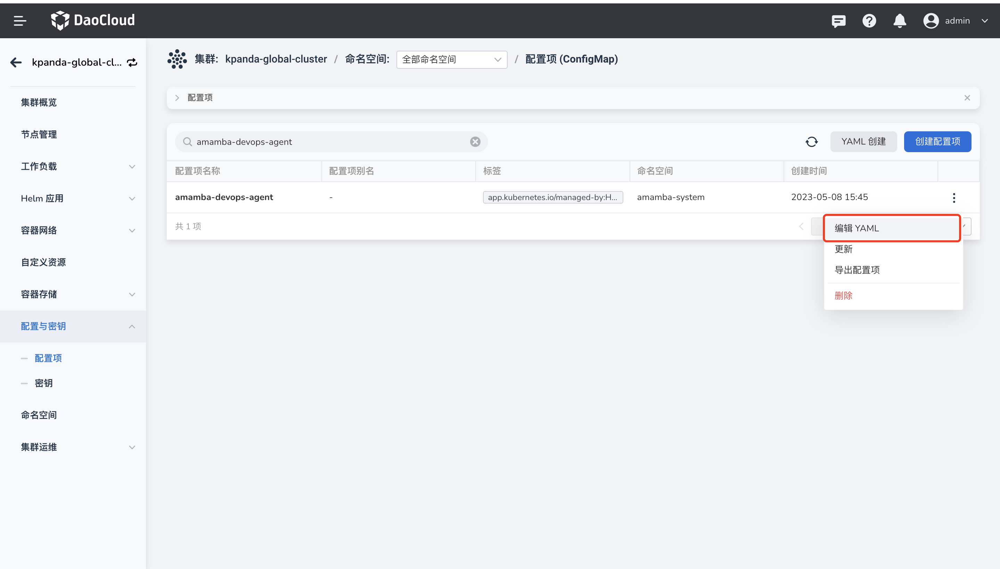
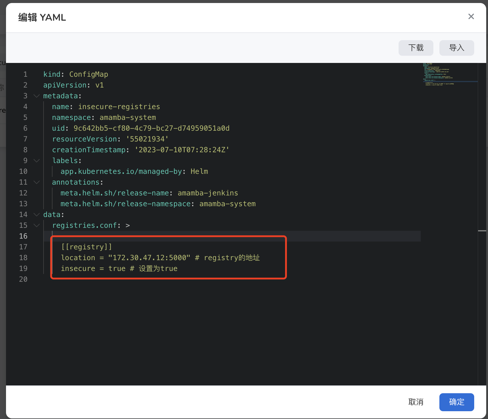
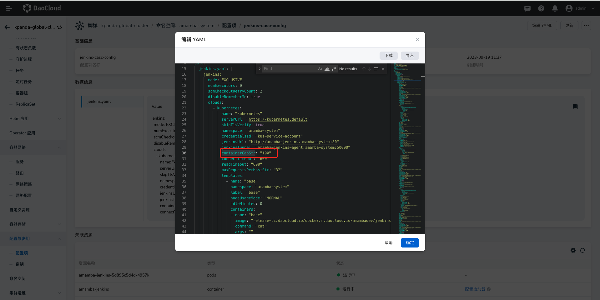

# 流水线相关问题

本页列出使用应用工作台的流水线功能时时可能遇到的一些问题，并给出相应的解决方案。

## 执行流水线时报错

当 Jenkins 所在集群与应用部署集群跨数据中心时，网络通信延迟会变高，可能遇到如下的报错信息：

```console
E0113 01:47:27.690555 50 request.go:1058] Unexpected error when reading response body: net/http: request canceled (Client.Timeout or context cancellation while reading body)
error: unexpected error when reading response body. Please retry. Original error: net/http: request canceled (Client.Timeout or context cancellation while reading body)
```

**解决方案**：

在该流水线的 Jenkinsfile 中将部署命令由 `kubectl apply -f` 修改为 `kubectl apply -f . --request-timeout=30m`。

## 如何更新内置 Label 的 podTemplate 镜像？

应用工作台通过 podTemplate 能力声明了 7 个 label：`base`、`maven`、`mavenjdk11`、`go`、`go16`、`node.js` 和 `python`。
您可以指定具体的 Agent 标签来使用对应的 podTemplate。

如果内置 podTemplate 中的镜像不满足您的需求，可以通过以下方式替换容器镜像或者添加容器镜像。

1. 前往容器管理模块，找到 Jenkins 组件所在的集群，点击集群名称。

    

2. 在左侧导航栏依次点击`配置与密钥` -> `配置项`。

3. 搜索 `jenkins-casc-config`，在操作列点击`编辑 YAML`。

    

4. 在 `data` -> `jenkins.yaml` -> `jenkins.clouds.kubernetes.templates` 字段下选择需要更改的 podTemplate 的镜像。

    

5. 更新完成后，前往`工作负载`重启 Jenkins。

## 流水线构建环境为 maven 时，如何在 settings.xml 中修改依赖包来源？

当流水线构建环境为 maven 时，大多数客户需要修改 `settings.xml` 以更换依赖源。可参考以下步骤：

1. 前往容器管理模块，在`集群列表` 界面选择 Jenkins 组件所在的集群，点击集群名称。

    

2. 在左侧导航栏依次点击`配置与密钥` -> `配置项`。

3. 搜索 `amamba-devops-agent`，在操作列点击 `编辑 YAML`。

    

4. 在 `data` 模块 下的 `MavenSetting` 按需修改。

    

5. 更新完成后，需要前往`工作负载`重启 Jenkins。

## 通过 Jenkins 构建镜像时，容器无法访问私有镜像仓库

### 集群运行时为 Podman

1. 在容器管理模块的 `集群列表` 界面找到 Jenkins 组件所在的集群，点击集群名称。

2. 在左侧导航栏依次点击`配置与密钥` -> `配置项`。

3. 搜索 `insecure-registries`，在操作列点击`编辑 YAML`。

4. 在 `data` 模块下的 `registries.conf` 下配置。

    修改时注意格式缩进，并且每个 registry 需要一个单独的 `[[registry]]` 部分，如下图所示：

    

    !!! note

        `registries` 关键字的值应该是完整的镜像仓库域名或 IP 地址，无需增加 `http` 或 `https` 前缀。
        如果镜像仓库使用非标准端口号，可以在地址后面加上冒号 `:` 和端口号。

        ```
        [[registry]]
        location = "registry.example.com:5000"
        insecure = true

        [[registry]]
        location = "192.168.1.100:8080"
        insecure = true
        ```

    另请参考 [Podman 官网指导文档](https://podman-desktop.io/docs/containers/registries/insecure-registry)。

### 集群运行时为 Docker

1. 打开 Docker 的配置文件。在大多数 Linux 发行版上，配置文件位于 `/etc/docker/daemon.json`，如果不存在，请创建此配置文件。

2. 在 `insecure-registries` 的字段将仓库地址添加进去。

    ```json
    {
      "insecure-registries": ["10.16.10.120:4443"]
    }
    ```

3. 保存后重启 Docker，执行如下命令：

    ```bash
    sudo systemctl daemon-reload
    sudo systemctl restart docker
    ```

!!! note

    参考 [Docker 官方指导文档](https://docs.docker.com/engine/reference/commandline/dockerd/#configuration-reload-behavior)。

## 如何修改 Jenkins 流水线并发执行数量

目前 DCE 5.0 部署出来后 Jenkins 流水线并发执行数量为 2，下述将描述如何更改并发执行数量：

1. 前往容器管理模块，找到 Jenkins 组件所在的集群，点击集群名称。

2. 在左侧导航栏依次点击`配置与密钥` -> `配置项`。

3. 搜索 `jenkins-casc-config`，在操作列点击`编辑 YAML`。

4. 在 `data` -> `jenkins.yaml` -> `jenkins.clouds.kubernetes.containerCapStr` 字段下修改数值。

    

5. 更新完成后，前往`工作负载`重启 Jenkins。
