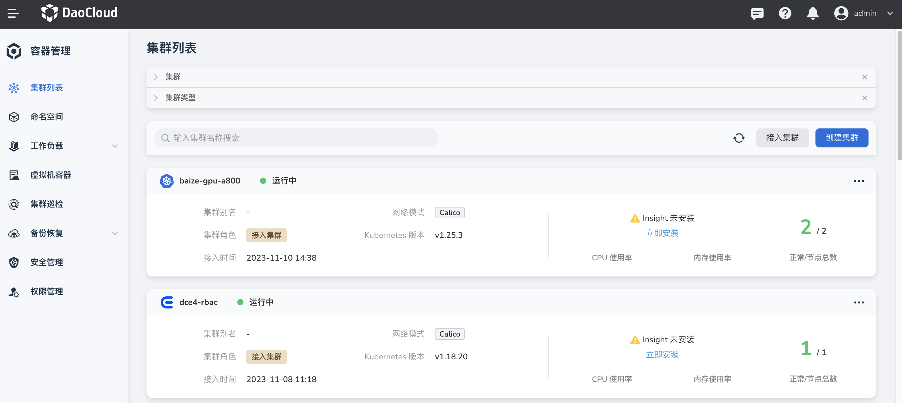

# 安装 Jenkins

## 前提条件

- 安装 Jenkins 之前需要确保将要安装 Jenkins 的集群中存在默认的存储类。
- 请确保安装在 `amamba-system` 命名空间下。
- 如果在全局服务集群安装，请确保在`容器管理` -> `helm 应用`，`amamba-system` 命名空间下的 `amamba-jenkins` 实例。

## 开始安装

1. 进入`容器管理`模块，在`集群列表`中找到需要安装 Jenkins 的集群，点击该集群的名称。

    !!! note

        需要根据实际情况选择 Jenkins 的部署集群。目前不建议将其部署在全局服务集群，因为 Jenkins 执行流水线高并发时会占用大量资源，可能会导致全局服务集群的瘫痪。

    

2. 在左侧导航栏中选择 `Helm 应用` -> `Helm 模板`，找到并点击 `Jenkins`。

    

3. 在`版本选择`中选择想要安装的版本，点击`安装`。

    

4. 在安装界面，填写所需的安装参数，最后在右下角点击`确定`按钮。

    

    以下是重要参数说明，根据实际业务需求进行参数更换编写。

    | 参数                                 | 描述                                                         |
    | ------------------------------------ | ------------------------------------------------------------ |
    | ContainerRuntime                     | 选择运行时，支持 podman、docker                                 |
    | AdminUser                            | Jenkins 的用户名                                             |
    | AdminPassword                        | Jenkins 的密码                                               |
    | Deploy.JenkinsHost                   | Jenkins 的访问链接。如果选择Node Port 方式，访问地址规则为：http://{集群地址:端口} |
    | JavaOpts                             | 指定启动 Jenkins 的 JVM 启动参数                             |
    | ServiceType                          | 默认为ClusterIP，支持ClusterIP、NodePort、LoadBalancer       |
    | ServicePort                          | 服务访问端口                                                 |
    | NodePort                             | 如果 ServiceType=NodePort 则需要必填，范围为：30000-32767    |
    | resources.requests                   | Jenkins 的资源请求值                                         |
    | resources.limits                     | Jenkins 的资源限制值                                         |
    | image.registry                       | jenkins 镜像                                                 |
    | eventProxy.enabled                   | true 代表部署在非全局服务集群 false 代表部署在全局服务集群 |
    | eventProxy.image.registry            | 如果 enabled=true 必须填写                                   |
    | eventProxy.image.repository          | 如果 enabled=true 必须填写                                   |
    | eventProxy.image.tag                 | 如果 enabled=true 必须填写                                   |
    | eventProxy.imagePullPolicy           | 如果 enabled=true 必须填写                                   |
    | eventProxy.configMap.eventroxy.host  | 如果 enabled=true 必须填写                                   |
    | eventProxy.configMap.eventroxy.proto | 如果 enabled=true 必须填写                                   |
    | eventProxy.configMap.eventroxy.token | 如果 enabled=true 必须填写 token 获取方式参考[全局管理访问密钥文档](../../../ghippo/user-guide/personal-center/accesstoken.md) |

5. 前往 Helm 应用查看部署结果。

    

## 集成 Jenkins

说明：目前仅支持集成通过 DCE 5.0 平台安装的 Jenkins。

1. 使用具有应用工作台管理员角色的用户登录 DCE 5.0 并进入应用工作台。

    

2. 在左侧导航栏点击平台管理下的`工具链集成`，点击右上角的`集成`按钮。

    

3. 选择工具链类型 `Jenkins`，填写集成名称、Jenkins 地址、用户名和密码。
   如果 Jenkins 地址为 https 协议时，需要提供证书。通过 Helm 部署出来的 Jenkins 默认账户密码为 `admin/Admin01`。

    

4. 集成完毕后会在`工具链列表`页面成功生成一条记录。

    

5. 接下来就可以前往工作空间内[创建流水线](create/custom.md)。

## 集成注意事项

如果集成的 Jenkins 实例部署在非 `kpanda-global-cluster` 集群时，会导致应用工作台无法更新 Jenkins 实例的配置文件（后续版本时会优化集成 Jenkins 实例需要填写所在集群、命名空间），从而引发出下述两个问题：

- 流水线`通知`步骤，在全局管理 -> 平台设置 -> 邮件服务器设置，配置好邮件服务器地址后，无法更新到 Jenkins 中配置中。
- 流水线 `SonarQube 配置` 步骤，在工具链集成 SonarQube 实例后并绑定到当前工作空间，使用该实例会失效。

针对上述问题，需要前往 Jenkins 后台进行相关配置。

### 针对通知步骤，在 Jenkins 后台配置邮件通知

1. 前往 Jenkins 后台，点击 Manage Jenkins -> Configure System，然后下拉找到 `邮件通知` 模块。

2. 填写相关参数，参数说明如下：

    - SMTP 服务器：能够提供邮件服务的 SMTP 服务器地址
    - 启用 SMTP 认证：根据需求选择，建议启用 SMTP 认证
    - 用户名：SMTP 用户的名称
    - 密码：SMTP 用户的密码
    - SMTP 端口：发送邮件的端口，不填写此项将使用协议默认端口.

    !!! note

        配置发件人邮箱地址需要点击 右上角个人头像 -> 设置，然后下拉找到 `邮件地址`

### 针对 SonarQube 配置步骤，在 Jenkins 后台配置 SonarQube 服务器地址

1. 前往 Jenkins 后台，点击 Manage Jenkins -> Configure System，然后下拉找到 `SonarQube servers`，然后点击 `Add SonarQube`。

2. 填写相关参数，参数说明如下：

    - Name：给 SonarQube 服务器配置一个名称，在应用工作台流水线的 SonarQube 配置步骤中需要输入该名字。
    - Server URL：SonarQube 服务器的 URL。
    - Server authentication token：SonarQube 服务器的身份验证令牌。您可以在 SonarQube 控制台中生成一个令牌。
