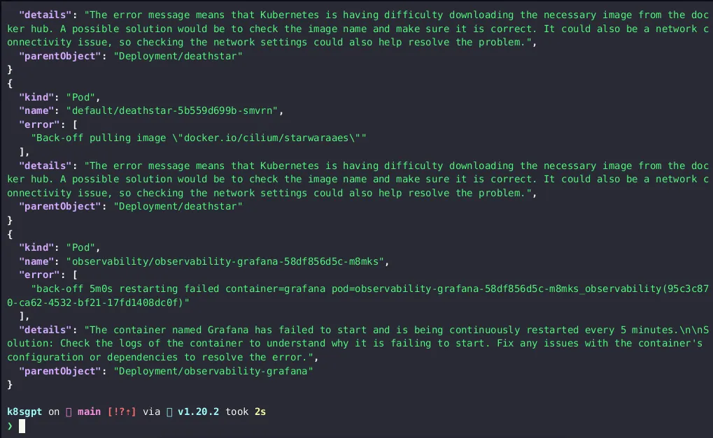
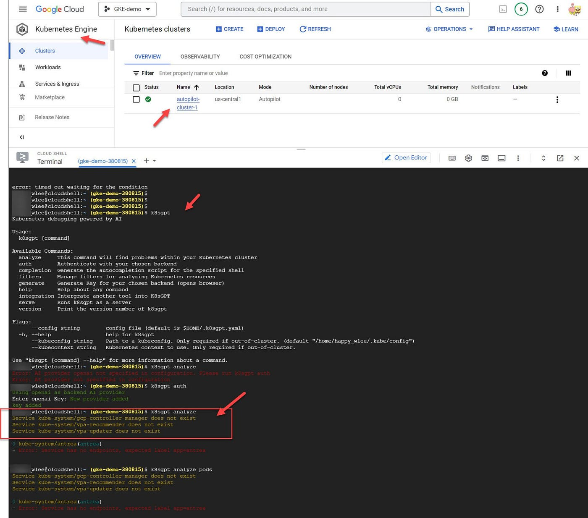

# 尝鲜：K8sGPT 赋能 Kubernetes

> 文章来源于 [Google Cloud](https://medium.com/google-cloud/unlocking-the-power-of-kubernetes-with-k8sgpt-c9b82d6ef205)，
> 作者 [Jasbir Singh](https://medium.com/@jasbir84)，译者 [windsonsea](https://github.com/windsonsea)

[K8sGPT](https://k8sgpt.ai/) 是一个非常新潮的云原生智能工具，它为 Kubernetes 云原生软件工程师 (SRE) 赋予了超能力。
提供了一种简单高效的方式来扫描 Kubernetes 集群并以简单的英文句子诊断集群、节点、Pod 的相关问题。
该工具旨在将工程师们的经验编码到其分析器中，从而帮助提取最相关的信息，并通过人工智能丰富了各种诊断和分析场景。

K8sGPT 将 ChatGPT 的能力引入 K8s 社区，它让用户能够智能化分析集群中的问题，并提供人性化的修复建议。

## 前提条件

1. 确保已正确安装 K8sGPT，请按照安装指南来安装。
2. 您需要连接到一个 Kubernetes 集群（例如 Minikube、Kind、GKE、EKS、AKS、DIY K8S 集群）。

## 安装 K8sGPT

安装 K8sGPT 可以采用多种方式，但其中一种简单方法是运行 brew 命令。
您可以参考官方[仓库](https://github.com/k8sgpt-ai/k8sgpt)以获取适用于您平台的相关命令。

```bash
brew tap k8sgpt-ai/k8sgpt
brew install k8sgpt
```

## 快速入门

准备好开始使用 K8sGPT 分析 Kubernetes 的配置了吗？参照以下步骤快速开始：

1. 运行命令 `k8sgpt generate` 来生成 OpenAI 的 API 密钥。
   这将在浏览器中打开一个链接以生成 API 密钥。目前，默认的 AI 提供商是 OpenAI，
   但您可以在将来切换到 Bard 或其他 AI 提供商。
2. 生成 API 密钥后，运行 `k8sgpt auth` 将其设置到 K8sGPT 中。
   还可以使用 `--password` 参数直接提供 API 密钥。
3. 如果想管理分析器使用的活动过滤条件，请运行 `k8sgpt filters`。
   默认情况下，在分析期间执行所有过滤条件。
4. 运行 `k8sgpt analyze` 开始扫描。它将分析 Kubernetes 配置并提供发现的任何问题的摘要。
5. 要获得更详细的问题说明，使用 `k8sgpt analyze` 命令的 `--explain` 参数。

就是这样！通过这些简单的步骤，您可以快速开始使用 K8sGPT 分析 Kubernetes 配置，确保您的集群安全且性能优化良好。

可以运行以下命令，并以 JSON 格式查看结果，以便更好地理解：

```bash
k8sgpt analyze -o json - explain - filter=Pod | jq .
```



K8sGPT 配备了一系列分析器，帮助您检测和解决 Kubernetes 集群中的问题。
这些分析器默认包含在 Kubernetes 平台中，并且其中一些甚至会自动启用。
内置的分析器包括 podAnalyzer、pvcAnalyzer、rsAnalyzer、serviceAnalyzer、eventAnalyzer 和 ingressAnalyzer。
此外，您还可以选择添加可选的分析器，例如 hpaAnalyzer 和 pdbAnalyzer。
另外，您甚至可以创建自己的分析器以满足特定需求。借助于 K8sGPT 的综合分析器集合，您可以确保集群始终平稳高效运行。

```console
Usage:
  k8sgpt [command]
Available Commands:
  analyze     This command will find problems within your Kubernetes cluster
  auth        Authenticate with your chosen backend
  completion  Generate the autocompletion script for the specified shell
  filters     Manage filters for analyzing Kubernetes resources
  generate    Generate Key for your chosen backend (opens browser)
  help        Help about any command
  version     Print the version number of k8sgptFlags:
      --config string       config file (default is $HOME/.k8sgpt.git.yaml)
  -h, --help                help for k8sgpt
      --kubeconfig string   Path to a kubeconfig. Only required if out-of-cluster.
      --master string       The address of the Kubernetes API server. Overrides any value in kubeconfig. Only required if out-of-cluster.
  -t, --toggle              Help message for toggleUse "k8sgpt [command] --help" for more information about a command.
```

在 K8sGPT 中，过滤条件用于管理要分析的资源。您可以通过运行命令 `k8sgpt filters list` 列出可用的过滤条件。
默认过滤条件已经启用，但您可以根据需要添加或删除过滤条件。要添加过滤条件，请运行 `k8sgpt filters add`，
然后加上您要添加的过滤条件。多个过滤条件之间可以用逗号分隔。要删除过滤条件，请运行 `k8sgpt filters remove`，然后加上您要删除的过滤条件。

```bash
k8sgpt filters list
```

添加一个过滤条件：

```bash
k8sgpt filters add Service
```

添加多个过滤条件：

```bash
k8sgpt filters add Ingress,Pod
```

移除一个过滤条件：

```bash
k8sgpt filters remove Service
```

移除多个过滤条件：

```bash
k8sgpt filters remove Ingress,Pod
```

要使用默认的分析器运行扫描并获取问题的详细解释，请执行以下操作：

```bash
k8sgpt generate
k8sgpt auth
k8sgpt analyze --explain
```

## 内置分析器

### 默认启用的分析器

- podAnalyzer
- pvcAnalyzer
- rsAnalyzer
- serviceAnalyzer
- eventAnalyzer
- ingressAnalyzer
- statefulSetAnalyzer
- deploymentAnalyzer
- cronJobAnalyzer
- nodeAnalyzer

### 可选的分析器

- hpaAnalyzer
- pdbAnalyzer
- networkPolicyAnalyzer

用 “Service” 这类特定的资源过滤结果：

```bash
k8sgpt analyze --explain --filter=Service
```

用 “default” 这类特定的命名空间过滤结果：

```bash
k8sgpt analyze --explain --filter=Pod --namespace=default
```

以 JSON 格式输出结果：

```bash
k8sgpt analyze --explain --filter=Service --output=json
```

## 匿名分析

安全性是首要任务，因此我们为您提供了匿名化功能。这个巧妙的匿名技巧将敏感数据（如 Kubernetes 对象名称和标签）
发送到 AI 后端进行分析之前对其进行屏蔽。

这意味着您的数据将安全可靠地保护起来，没有人能窥探不该看的东西。

以下是如何在 K8sGPT 中使用匿名化功能：

```bash
k8sgpt analyze --explain --anonymize
```

在分析过程中，K8sGPT 会检索敏感数据，然后对其进行屏蔽，然后再发送到 AI 后端。
后端接收到屏蔽后的数据，进行处理，并向用户返回解决方案。

一旦解决方案返回给用户，屏蔽的数据会被实际的 Kubernetes 对象名称和标签所替换。

注意：**匿名化不适用于事件。**

## 集成命令

您知道吗，您可以将其他工具与 K8sGPT 集成起来？通过 K8sGPT 集成命令，您可以轻松添加和删除这些有用的集成组件。

首先，让我们使用以下命令列出所有可用的集成组件。

```bash
k8sgpt integrations list
```

接下来，通过运行 `k8sgpt integration activate` 命令激活一个集成组件，然后输入您想要的集成组件名称。
例如，[trivy](https://www.jit.io/lp/automate-cloud-container-security-by-deploying-trivy-lp?utm_term=trivy&utm_campaign=container-scanning&utm_source=adwords&utm_medium=ppc&hsa_acc=1923149435&hsa_cam=19644458103&hsa_grp=148620235329&hsa_ad=647252997090&hsa_src=g&hsa_tgt=kwd-377124710088&hsa_kw=trivy&hsa_mt=e&hsa_net=adwords&hsa_ver=3&gclid=CjwKCAjwrpOiBhBVEiwA_473dDqEQlWIqTEfQb9Z3kVZuaCCbPGE-7eb8_n5Smn6wz96mcipjkD_6hoCyjYQAvD_BwE)
是一个流行的集成组件，它将在集群上安装 Trivy 的 Helm chart。

```bash
k8sgpt integration activate trivy
```

客官请稍候，集成组件还提供了更多可能！
您甚至可以在分析中使用这些集成组件，只需在 `--filter` 参数中指定这些集成组件即可。
所以如果您正在使用 Trivy，只需运行以下命令，就可以看到魔法了。

```bash
k8sgpt analyze --filter VulnerabilityReport
```

如果您需要删除一个集成组件，只需运行以下命令，后面加上集成组件的名称。

```bash
k8sgpt integration deactivate trivy
```

## 在 GKE 上使用 K8sGPT



请参考这个 GitHub 仓库 <https://github.com/k8sgpt-ai/k8sgpt> ，了解更多可用功能的细节，并进行实际操作以体验 K8sGPT 的魅力。
