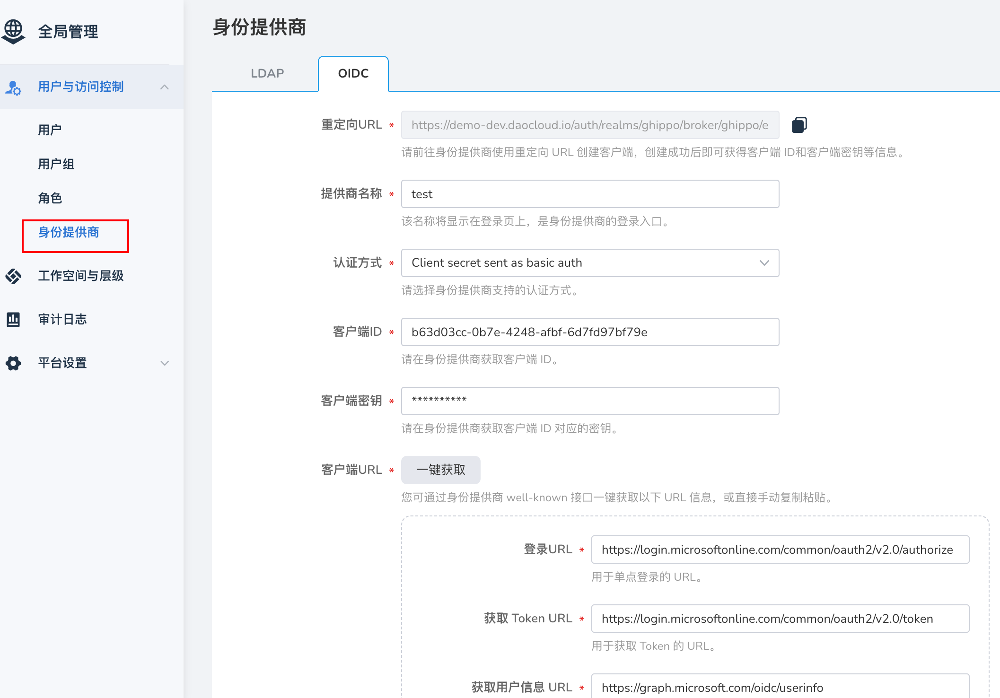
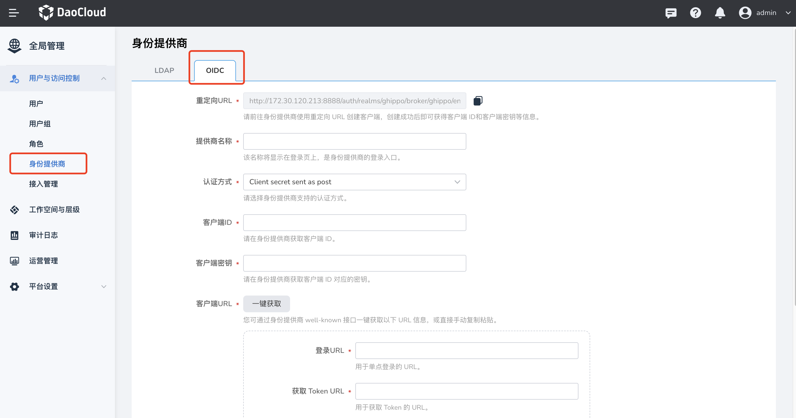
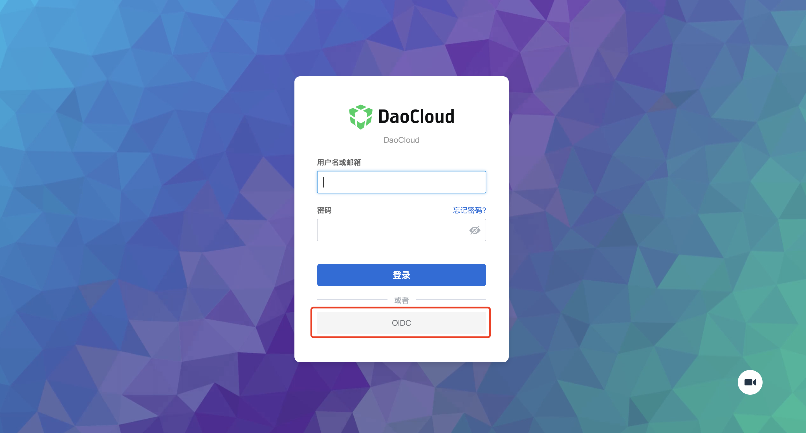
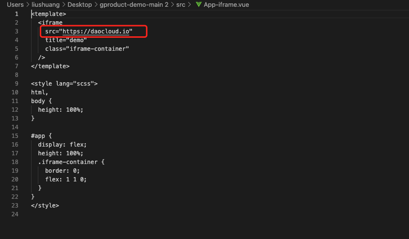
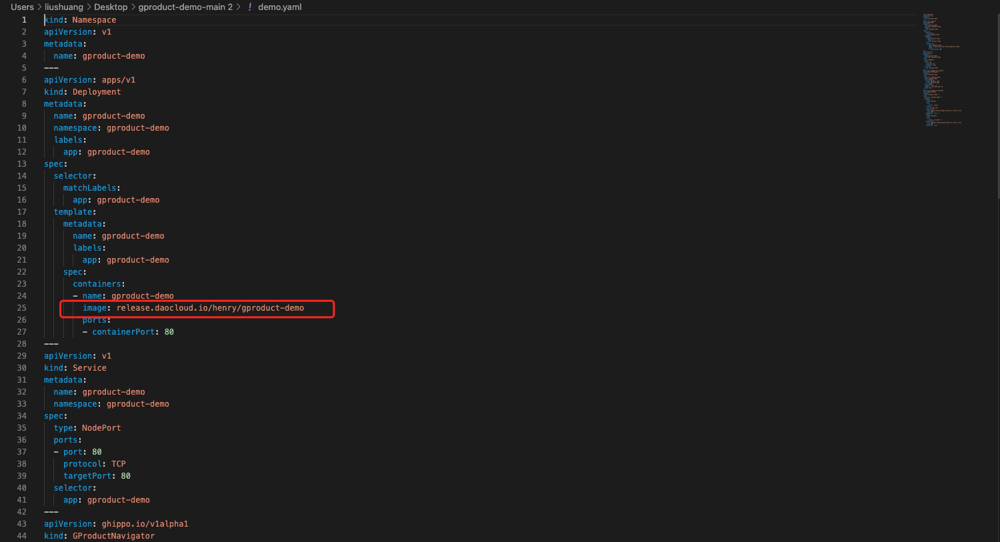
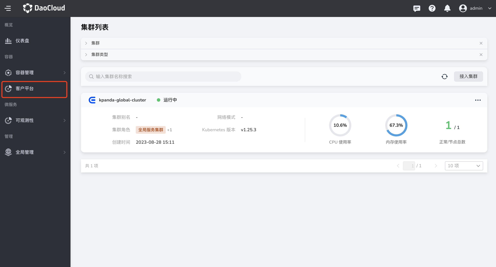

# 如何将客户平台集成到 DCE 5.0（OEM IN）

OEM IN 是指合作伙伴的平台作为子模块嵌入 DCE 5.0，出现在 DCE 5.0 一级导航栏。
用户通过 DCE 5.0 进行登录和统一管理。实现 OEM IN 共分为 5 步，分别是：

1. 统一域名
1. 打通用户体系
1. 对接导航栏
1. 定制外观
1. 打通权限体系（可选）

具体操作演示请参见：[OEM IN 最佳实践视频教程](../../videos/use-cases.md#dce-50_2)。

!!! note

    以下使用两套 DCE 5.0 来做嵌套演示。

## 环境准备

1. 部署两套 DCE 5.0 环境：
 
    - `http://192.168.1.6:30444` 作为 DCE 5.0
    - `http://192.168.1.6:30080` 作为客户平台
   
    应用过程中对客户平台的操作请根据实际情况进行调整。

2. 规划客户平台的 subpath 路径：`http://192.168.1.6:30080/external-anyproduct/`
  （强烈建议使用辨识度高的名称作为 subpath，不能与主 DCE 5.0 的 HTTP router 发生冲突！！！）

!!! note

    1. 本文采用了 HTTP 的方式部署 DCE 5.0，实际应用中可以使用 HTTP，或者使用公网的 TLS 证书。请勿使用自签的 TLS 证书。
    2. 本文中的 `/external-anyproduct` 是客户平台的 subpath，请将它替换成你的 subpath。
    3. 本文中 `http://192.168.1.6:30444` 是 DCE 5.0 的访问地址，
       `http://192.168.1.6:30080` 是客户平台的访问地址，请将它替换成你的 DCE 5.0 访问地址和客户平台访问地址。

## 统一域名

### 1. 为客户平台配置 subpath

1. ssh 登录到客户平台服务器。
1. 使用 vim 命令创建 subpath-envoyfilter.yaml 文件

    ```bash
    vim subpath-envoyfilter.yaml
    ```

    ```yaml
    apiVersion: networking.istio.io/v1alpha3
    kind: EnvoyFilter
    metadata:
      name: subpath-envoyfilter
      namespace: istio-system
    spec:
      workloadSelector:
        labels:
          istio: ingressgateway
      configPatches:
        - applyTo: HTTP_FILTER
          match:
            context: GATEWAY
            listener:
              filterChain:
                filter:
                  name: envoy.filters.network.http_connection_manager
                  subFilter:
                    name: envoy.filters.http.router
          patch:
            operation: INSERT_BEFORE
            value:
              name: envoy.lua
              typed_config:
                "@type": type.googleapis.com/envoy.extensions.filters.http.lua.v3.Lua
                inlineCode: |-
                  function envoy_on_request(request_handle)
                    local path = request_handle:headers():get(":path")
                    # 请改为你需要的 subpath 路径
                    local mysubpath = "/external-anyproduct"
                    if string.sub(path,1,string.len(mysubpath)) ~= mysubpath then
                        return
                    end
                    local _, _, rest = string.find(path, "/[^/]+/(.*)")
                    if rest then
                      request_handle:headers():replace(":path", "/" .. rest)
                    end
                  end
    ---
    apiVersion: security.istio.io/v1
    kind: AuthorizationPolicy
    metadata:
      # Please edit the object below. Lines beginning with a '#' will be ignored,
      name: mysubpath
      namespace: istio-system
    spec:
      rules:
        - to:
            - operation:
                paths:
                  # 请改为你需要的 subpath 路径
                  # 注意，此配置仅适用开发环境，请勿用于生产环境，因为可能会造成 AuthN 失效！！！
                  - /external-anyproduct*
        - from:
            - source:
                requestPrincipals:
                  - "*"
      selector:
        matchLabels:
          app: istio-ingressgateway
    ```

1. 使用 kubectl 命令应用 subpath-envoyfilter.yaml：

    ```bash
    kubectl apply -f subpath-envoyfilter.yaml
    ```

1. 使用 helm 命令获取 ghippo 版本号：

    ```bash
    helm get notes ghippo -n ghippo-system | grep "Chart Version" | awk -F ': ' '{ print $2 }'（本文ghippo版本是 0.19.2）
    ```

1. 使用 helm 命令获取 helm values：

    ```bash
    helm get values ghippo -n ghippo-system > dce5-slave-values.yaml
    ```

1. 使用 vim 命令，编辑 dce5-slave-values.yaml 文件：

    ```bash
    vim dce5-slave-values.yaml
    ```

    ```yaml
    USER-SUPPLIED VALUES:
    USER-SUPPLIED VALUES: null
    anakin:
      replicaCount: 1
    apiserver:
      replicaCount: 1
    auditserver:
      replicaCount: 1
    controllermanager:
      replicaCount: 1
    global:
      # 改为主 DCE 5.0 的域名（IP）+ subpath</font>
      reverseProxy: http://192.168.1.6:30444/external-anyproduct
      storage:
        audit:
        - driver: mysql
          dsn: audit:changeme@tcp(ghippo-mysql.ghippo-system.svc.cluster.local:3306)/audit?charset=utf8mb4&multiStatements=true&parseTime=true
        builtIn: true
        ghippo:
        - driver: mysql
          dsn: ghippo:changeme@tcp(ghippo-mysql.ghippo-system.svc.cluster.local:3306)/ghippo?charset=utf8mb4&multiStatements=true&parseTime=true
        keycloak:
        - driver: mysql
          dsn: keycloak:changeme@tcp(ghippo-mysql.ghippo-system.svc.cluster.local:3306)/keycloak?charset=utf8mb4
    keycloakx:
      replicas: 1
    ui:
      replicaCount: 1
    ```

1. 使用 helm 命令，应用 dce5-slave-values.yaml 配置（注意：替换版本号）：

    ```bash
    helm upgrade ghippo ghippo/ghippo -n ghippo-system -f dce5-slave-values.yaml --version v0.19.2 --debug
    ```

1. 使用 kubectl 重启 ghippo pod，使配置生效：

    ```bash
    kubectl rollout restart deploy/ghippo-apiserver -n ghippo-system
    kubectl rollout restart statefulset/ghippo-keycloakx -n ghippo-system
    ```

### 2. 为 DCE 5.0 配置客户平台的 jwksUri 发现地址

1. ssh 登录到 DCE 5.0 服务器。
1. 使用 vim 命令创建 `external-svc-anyproduct.yaml` 文件

    ```bash
    vim external-svc-anyproduct.yaml
    ```

    ```yaml
    apiVersion: networking.istio.io/v1beta1
    kind: ServiceEntry
    metadata:
      name: external-svc-anyproduct
      namespace: istio-system
    spec:
      exportTo:
      - "*"
      addresses:
      - 172.168.1.6
      hosts:
      - external.svc.anyproduct
      ports:
      # 改为客户平台的端口号
      - number: 30080
        name: http
        protocol: HTTP
      location: MESH_EXTERNAL
      resolution: STATIC
      endpoints:
      # 改为客户平台的域名（或IP）
      - address: 192.168.1.6
        ports:
          # 改为客户平台的端口号
          http: 30080
    ```

1. 使用 kubectl 命令应用  external-svc-anyproduct.yaml：

    ```bash
    kubectl apply -f external-svc-anyproduct.yaml
    ```

1. 使用 kubectl 命令，修改 DCE 5.0 RequestAuthentication CR 资源：

    ```bash
    kubectl edit RequestAuthentication ghippo -n istio-system
    ```

    ```yaml
    apiVersion: security.istio.io/v1
    kind: RequestAuthentication
    metadata:
      name: ghippo
      namespace: istio-system
    spec:
      jwtRules:
      # 新增规则1
      - forwardOriginalToken: true
        # 主 DCE 5.0 的域名（或IP）+ subpath + /auth/realms/ghippo
        issuer: http://192.168.1.6:30444/external-anyproduct/auth/realms/ghippo
        # 主 DCE 5.0 的域名（或IP）+ subpath + /auth/realms/ghippo/protocol/openid-connect/certs
        jwksUri: http://192.168.1.6:30444/external-anyproduct/auth/realms/ghippo/protocol/openid-connect/certs?1692515854
      # 新增规则2
      - forwardOriginalToken: true
        issuer: ghippo.io
        # 主 DCE 5.0 的域名（或IP）+ subpath + /apis/ghippo.io/v1alpha1/certs
        jwksUri: http://192.168.1.6:30444/external-anyproduct/apis/ghippo.io/v1alpha1/certs?1692515854

      - forwardOriginalToken: true
        issuer: http://192.168.1.6:30444/auth/realms/ghippo
        jwksUri: http://ghippo-keycloakx-http.ghippo-system.svc.cluster.local/auth/realms/ghippo/protocol/openid-connect/certs?1692515854
      - forwardOriginalToken: true
        issuer: http://ghippo-keycloakx-http.ghippo-system.svc.cluster.local/auth/realms/ghippo
        jwksUri: http://ghippo-keycloakx-http.ghippo-system.svc.cluster.local/auth/realms/ghippo/protocol/openid-connect/certs?1692515854
      - forwardOriginalToken: true
        issuer: ghippo.io
        jwksUri: http://ghippo-apiserver.ghippo-system.svc.cluster.local:80/apis/ghippo.io/v1alpha1/certs?1692515854
      selector:
        matchLabels:
          app: istio-ingressgateway
    ```

## 打通用户体系

将客户平台与 DCE 5.0 平台通过 OIDC/OAUTH 等协议对接，使用户登录 DCE 5.0 平台后进入客户平台时无需再次登录。

1. 在两套 DCE 5.0 的场景下，可以在 DCE 5.0 `全局管理` -> `用户与访问控制` -> `接入管理` 创建 SSO 接入。

    

    

2. 创建后将详情中的客户端 ID、密钥、单点登录 URL 等填写到客户平台的`全局管理` -> `用户与访问控制` -> `身份提供商` ->
   `OIDC` 中，完成用户对接。

    

3. 对接完成后，客户平台登录页面将出现 OIDC（自定义）选项，首次从 DCE 5.0 平台进入客户平台时选择通过 OIDC 登录，
   后续将直接进入客户平台无需再次选择。

    

## 对接导航栏

参考文档下方的 tar 包来实现一个空壳的前端子应用，把客户平台以 iframe 的形式放进该空壳应用里。

1. 下载 gproduct-demo-main.tar.gz 文件，将 src 文件夹下 App-iframe.vue 中的 src 属性值改为用户进入客户平台的绝对地址，如：
   `src="http://192.168.1.6/external-anyproduct" (DCE 5.0 地址 + subpath)` 或相对地址，如：`src="./external-anyproduct/insight"`

   

1. 删除 src 文件夹下的 App.vue 和 main.ts 文件，同时将 App-iframe.vue 重命名为 App.vue，main-iframe.ts 重命名为 main.ts
1. 编辑 demo.yaml 文件

    ```bash
    vim demo.yaml
    ```

    ```yaml
    kind: Namespace
    apiVersion: v1
    metadata:
      name: gproduct-demo
    ---
    apiVersion: apps/v1
    kind: Deployment
    metadata:
      name: gproduct-demo
      namespace: gproduct-demo
      labels:
        app: gproduct-demo
    spec:
      ...
    ---
    apiVersion: v1
    kind: Service
    metadata:
      name: gproduct-demo
      namespace: gproduct-demo
    spec:
      ...
    ---
    apiVersion: ghippo.io/v1alpha1
    kind: GProductNavigator
    metadata:
      name: gproduct-demo
    spec:
      ...
    ---
    apiVersion: ghippo.io/v1alpha1
    kind: GProductProxy
    metadata:
      name: gproduct-demo
    spec:
      gproduct: gproduct-demo
      proxies:
        ...
        # 添加一条规则，'/external-anyproduct' 替换成你的 subpath
        - match:
            uri:
              prefix: /external-anyproduct
          destination:
            host: external.svc.anyproduct
            # 端口号替换成客户平台的端口号（ServiceEntry 定义的端口号）
            port: 30080
          authnCheck: false
    ```

1. 按照 readme 步骤构建镜像（注意：执行最后一步前需要将 demo.yaml 中的镜像地址替换成构建出的镜像地址）

   

对接完成后，将在 DCE 5.0 的一级导航栏出现“客户平台”，点击可进入客户平台。



## 定制外观

!!! note

    DCE 5.0 支持通过写 CSS 的方式来实现外观定制。实际应用中客户平台如何实现外观定制需要根据实际情况处理。

登录客户平台，通过`全局管理` -> `平台设置` -> `外观定制`可以自定义平台背景颜色、logo、名称等，
具体操作请参照[外观定制](../user-guide/platform-setting/appearance.md)。

## 打通权限体系（可选）

**方案思路一：**

定制化团队可实现一定制模块，DCE 5 将每一次的用户登录事件通过 Webhook 的方式通知到定制模块，
定制模块可自行调用 AnyProduct 和 DCE 5.0 的 [OpenAPI](https://docs.daocloud.io/openapi/) 作该用户的权限信息同步。

**方案思路二：**

通过 Webhook 方式，将每一次的授权变化都通知到 AnyProduct (如有需求，后续可实现)。

### AnyProduct 使用 DCE 5.0 的其他能力(可选)

方法为：调用 DCE 5.0 [OpenAPI](https://docs.daocloud.io/openapi/)

## 参考资料

- [参考 OEM OUT 文档](./oem-out.md)
- 参阅 [gProduct-demo-main 对接 tar 包](./examples/gproduct-demo-main.tar.gz)
