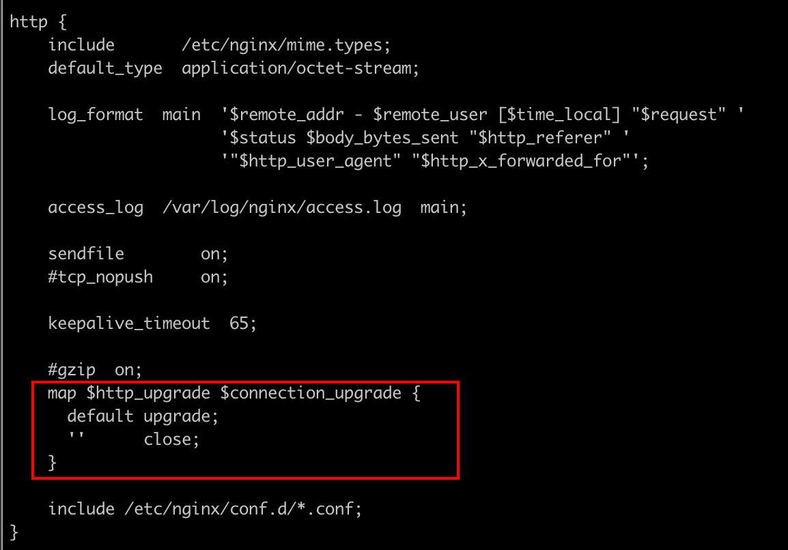
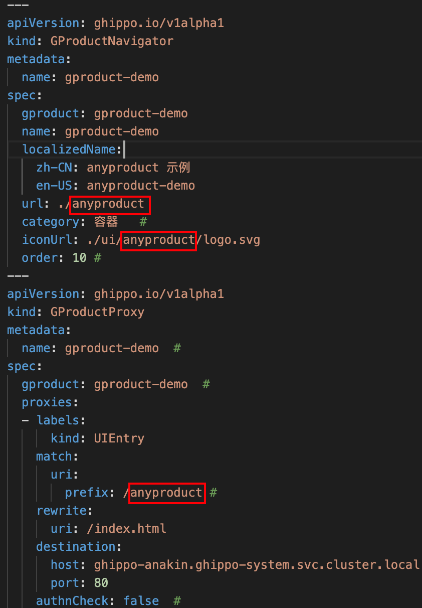

# OEM IN

OEM IN 是指合作伙伴作为 Anyproduct 嵌入 DCE 5.0，作为 DCE 5.0 的子模块出现在一级导航栏。
DCE 5.0 为用户源，用户通过 DCE 5.0 进行登录和统一管理。

AnyProduct：当客户系统需要使用 DCE 5.0 作为身份提供商（用户源），
将 DCE 5.0 作为门户入口时，该客户系统被称为 DCE 5.0 的 AnyProduct

## 如何实现 OEM IN

### 打通用户体系

用 DCE 5.0 作为用户源，实现统一登录认证，接入到导航栏，这一步是必需的。

具体操作步骤为：

1. [导航栏接入](../gproduct/nav.md)

2. AnyProduct 通过 OIDC 协议 接入 DCE 5.0 的用户系统。

3. （可选）如果 AnyProduct 需进行用户同步，DCE 5.0 可提供 Webhook 注册功能，
   将每一次的用户变化事件通过 Webhook 的方式通知到 AnyProduct。

### 嵌入 DCE 5.0 界面并将 DCE 5 作为门户

这一步操作可选。

前提条件：AnyProduct 系统本身需要支持 url 加前缀来访问（以 DX-ARCH 为例，需要给 url 加前缀）

具体操作步骤如下：

1. 部署 DCE 5.0（假设部署完的访问地址为 https://10.6.165.50:30443/ ），
   部署 AnyProduct 系统（假设 DX-ARCH 地址为 https://10.6.165.2:30034/ ）

1. DCE 5.0 和 AnyProduct 前可放一个 Nginx 反代来实现同域访问，`/` 路由到 DCE 5.0，
   `/dx-arch/` 路由到 AnyProduct 系统。

    1. 配置 [`/etc/nginx/conf.d/default.conf`](examples/default1.conf)
    2. 配置 [`/etc/nginx/nginx.conf`](examples/nginx.conf)

        

1. 假设 nginx 入口地址为 10.6.165.50，按[设置 DCE 5.0 反向代理步骤](../install/reverse-proxy.md)把 DCE_PROXY 设置为 http://10.6.165.50/

1. 参考[全局管理 GProduct 对接参考文档](../gproduct/intro.md)来实现一个空壳的 GProduct 前端子应用，把 DX-ARCH 以 iframe 形式放进该空壳应用里。

    1. git clone 这个仓库 https://gitlab.daocloud.cn/henry.liu/gproduct-demo

    2. 在 `App-iframe.vue` 中，把 src 属性值改成你需要的相对地址，如 `src="./dx-arch"`，
       如果想跳转到 http://10.6.165.50/dx-arch/ram/config/user，可以设置为 `src="./dx-arch/ram/config/user"`

    3. 删除 App.vue 和 main.ts，将 `App-iframe.vue` 重命名成 App.vue，将 `main-iframe.ts` 重命名成 main.ts

    4. 如你希望用浏览器访问该 dx-arch 时使用 anyproduct 作为 subpath，如 `http://{dce5_domain}/anyproduct`，需改如下内容：

        1. 在 [nginx.conf](examples/nginx.conf) 中，将 `location ~ /ui/demo/(._)$` 改成 `location ~ /ui/anyproduct/(._)$`

        2. 按 [gproduct-demo](./demo.md) 步骤 build 出 image

        3. 在 [demo.yaml](./examples/demo.yaml) 中，将 image 改成 build 出来的名字，这三个地方的 demo 改成 anyproduct：
        
            

        4. 把 demo.yaml 和 image 放到 DCE 5.0 集群上执行 apply 命令

            ```sh
            docker save anyproduct-dx-arch:v0.1.0 -o ./anyproduct-dx-arch-v0.1.0.tar
            scp ./anyproduct-dx-arch-v0.1.0.tar root@10.6.165.51:~
            ssh 到 51，docker load < anyproduct-dx-arch-v0.1.0.tar
            ```

### 用户信息同步(可选)

**方案思路为：**

通过 Webhook 方式，将每一次的用户变化都通知到 AnyProduct。

### 租户打通(可选)

**方案思路为：**

通过 webhook 方式，将每一次的租户变化都通知到 AnyProduct (如有需求，后续可实现)

### 权限打通(可选)

**方案思路一：**

定制化团队可实现一定制模块，DCE 5 将每一次的用户登录事件通过 Webhook 的方式通知到定制模块，
定制模块可自行调用 AnyProduct 和 DCE 5.0 的 [OpenAPI](https://docs.daocloud.io/openapi/) 作该用户的权限信息同步。

**方案思路二：**

通过 Webhook 方式，将每一次的授权变化都通知到 AnyProduct (如有需求，后续可实现)。

### AnyProduct 使用 DCE 5.0 的其他能力(可选)

方法为：调用 DCE 5.0 [OpenAPI](https://docs.daocloud.io/openapi/)

## 参考资料

- [参考 OEM OUT 文档](./oem-out.md)
- 参阅 [GProduct-demo 对接 tar 包](./examples/gproduct-demo-main.tar.gz)
