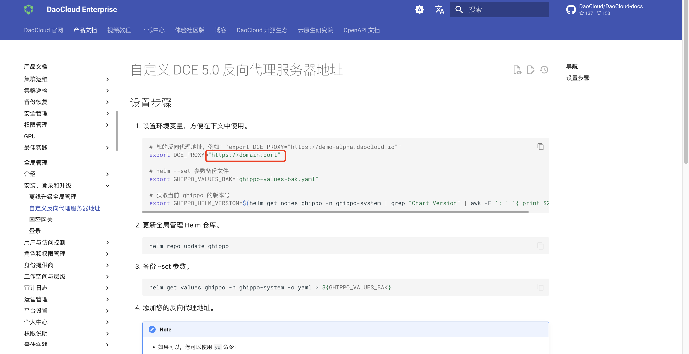
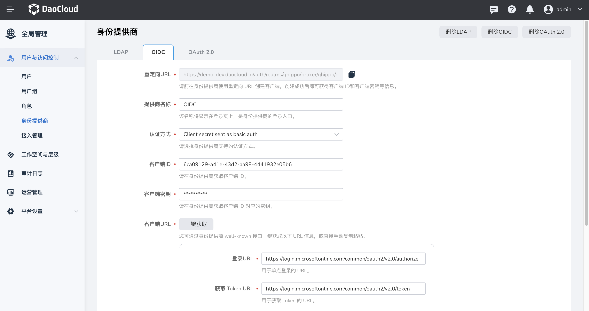
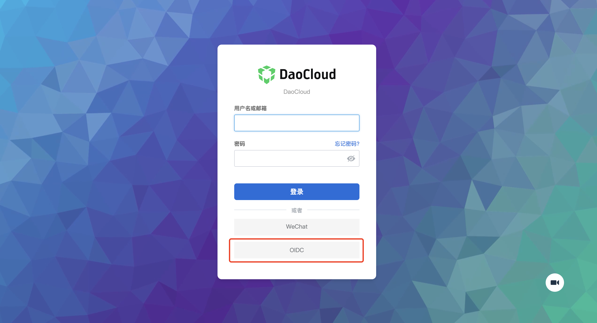

# 如何将DCE 5.0集成到客户系统（OEM OUT）

OEM OUT 是指将 DCE 5.0 作为子模块接入其他产品，出现在其他产品的菜单中。
用户登录其他产品后可直接跳转至 DCE 5.0 无需二次登录。实现 OEM OUT 共分为 5 步，分别是：

* [统一域名](#_1)
* [打通用户体系](#_2)
* [对接导航栏](#_3)
* [定制外观](#_4)
* [打通权限体系(可选)](#_5)

具体操作演示请参见 [OEM OUT 最佳实践视频教程](../../videos/use-cases.md#dce-50_2)。

## 统一域名

1. 部署 DCE 5.0（假设部署完的访问地址为 `https://10.6.8.2:30343/`）

1. 客户系统和 DCE 5.0 前可以放一个 Nginx 反代来实现同域访问，
   `/` 路由到客户系统，`/dce5 (subpath)` 路由到 DCE 5.0 系统，`vi /etc/nginx/conf.d/default.conf` 示例如下：

    ```nginx
    server {
        listen       80;
        server_name  localhost;
    
        location /dce5/ {
          proxy_pass https://10.6.8.2:30343/;
          proxy_http_version 1.1;
          proxy_read_timeout 300s; # 如需要使用 kpanda cloudtty功能需要这行，否则可以去掉
          proxy_send_timeout 300s; # 如需要使用 kpanda cloudtty功能需要这行，否则可以去掉
    
          proxy_set_header Host $host;
          proxy_set_header X-Real-IP $remote_addr;
          proxy_set_header X-Forwarded-For $proxy_add_x_forwarded_for;
    
          proxy_set_header Upgrade $http_upgrade; # 如需要使用 kpanda cloudtty功能需要这行，否则可以去掉
          proxy_set_header Connection $connection_upgrade; # 如需要使用 kpanda cloudtty功能需要这行，否则可以去掉
        }
        
        location / {
            proxy_pass https://10.6.165.50:30443/; # 假设这是客户系统地址(如意云)
            proxy_http_version 1.1;
    
            proxy_set_header Host $host;
            proxy_set_header X-Real-IP $remote_addr;
            proxy_set_header X-Forwarded-For $proxy_add_x_forwarded_for;
        }
    }
    ```

1. 假设 Nginx 入口地址为 10.6.165.50，按[自定义 DCE 5.0 反向代理服务器地址](../install/reverse-proxy.md)把
   DCE_PROXY 反代设为 `http://10.6.165.50/dce5`。确保能够通过 `http://10.6.165.50/dce5` 访问 DCE 5.0。
   客户系统也需要进行反代设置，需要根据不同平台的情况进行处理。
  
    

## 打通用户体系

将客户系统与 DCE 5.0 平台通过 OIDC/OAUTH 等协议对接，使用户登录客户系统后进入 DCE 5.0 时无需再次登录。
在拿到客户系统的 OIDC 信息后填入`全局管理` -> `用户与访问控制` -> `身份提供商`中。



对接完成后，DCE 5.0 登录页面将出现 OIDC（自定义）选项，首次从客户系统进入 DCE 5.0 时选择通过 OIDC 登录，
后续将直接进入 DCE 5.0 无需再次选择。



## 对接导航栏

对接导航栏是指 DCE 5.0 出现在客户系统的菜单中，用户点击相应的菜单名称能够直接进入 DCE 5.0。
因此对接导航栏依赖于客户系统，不同平台需要按照具体情况进行处理。

## 定制外观

通过`全局管理` -> `平台设置` -> `外观定制`可以自定义平台背景颜色、logo、名称等，
具体操作请参照[外观定制](../user-guide/platform-setting/appearance.md)。

## 打通权限体系（可选）

打通权限较为复杂，如有需求请联系全局管理团队。

## 参考

- [OEM IN 文档](./oem-in.md)
