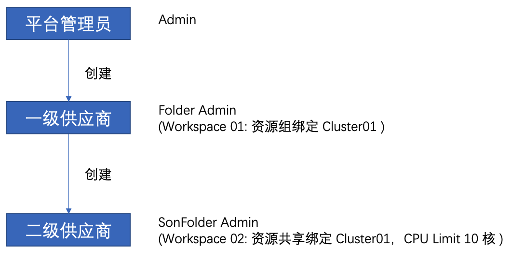

# 资源组与共享资源的区别

资源组与共享资源均支持绑定集群，但使用上存在很大区别。

## 使用场景区别

- 资源组绑定集群：资源组绑定集群通常被用来批量授权。资源组绑定集群后，
  工作空间管理员将被映射为集群管理员，能够管理并使用集群资源。
- 共享资源绑定集群：资源共享绑定集群通常被用来做资源限额。
  典型的场景是平台管理员将集群分配给一级供应商后，再由一级供应商分配给二级供应商并对二级供应商进行资源限额。

说明：在该场景中，需要平台管理员对二级供应商进行资源限制，暂时还不支持一级供应商限制二级供应商的集群额度。

## 集群额度的使用区别

- 资源组绑定集群：工作空间的管理员将被映射为该集群的管理员，相当于在容器管理-权限管理中被授予 Cluster Admin 角色，
  能够无限制支配该集群资源，管理节点等重要内容，且资源组不能够被资源限额。
- 共享资源绑定资源：工作空间管理员仅能够使用集群中的额度在应用工作台创建命名空间，不具备集群的管理权限。
  若对该工作空间限制额度，则工作空间管理仅能够在额度范围内创建并使用命名空间。

## 资源类型的区别

- 资源组：能够绑定集群、集群-命名空间、多云、多云-命名空间、网格、网格-命名空间
- 共享资源：仅能够绑定集群

## 资源组与共享资源的相同点

在资源组/共享资源绑定集群后都可以前往应用工作台创建命名空间，创建后命名空间将自动绑定到工作空间。
