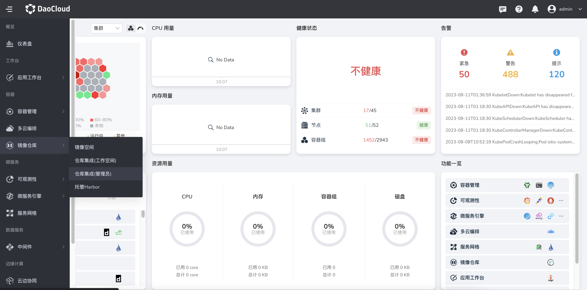
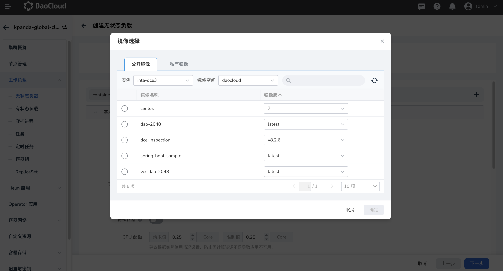

# 绑定/解绑工作空间

镜像空间有两种类型：公开和私有。公开镜像空间中的镜像为公开镜像，公开镜像可被平台所有用户拉取；私有镜像空间中的镜像为私有镜像，只有绑定了工作空间后，才能被工作空间下的成员拉取，非工作空间成员无法拉取。

- 对于公开镜像，用户在容器管理模块部署应用时能够通过`选择镜像`按钮，选择`镜像仓库` -> `仓库集成`中所有公开镜像空间中的镜像部署应用，无需任何配置。
- 对于私有镜像，则需要管理员将私有镜像空间分配给工作空间（租户）后，才能够被工作空间下的成员使用，确保私有镜像的安全性。

前提条件：已经创建或集成了一个外部 Harbor 仓库，且已[创建镜像空间](registry-space.md)。

## 绑定步骤

通常对私有的镜像空间，执行工作空间绑定，便于租户或成员使用其下的镜像。

1. 使用具有 Admin 角色的用户登录 DCE 5.0，从左侧导航栏点击`镜像仓库` -> `仓库集成(管理员)`。

    

1. 点击某个仓库名称。

    

1. 在左侧导航栏点击`镜像空间`，在某个镜像空间最右侧，点击 `⋮`，选择`绑定/解绑工作空间`。

    

    若没有绑定任何工作空间，`工作空间`一栏将显示`待分配`。

1. 在弹窗中，选择一个或多个工作空间，点击`确定`。

    

    若想取消某个工作空间的绑定，只需在已选中的工作空间列表中，点击 `x`。

1. 提示`绑定/解绑工作空间成功`，光标移到`工作空`间一栏，将显示所绑定的工作空间。

    

    该工作空间（租户）下的成员将都能拉取这个镜像空间中的镜像。

## FAQ

1. 在 Kubernetes 命名空间部署应用时，通过`选择镜像`按钮仍选择不到镜像空间中的镜像。

    - 排查该 Kubernetes 命名空间是否绑定了工作空间（需要绑定）。
    - 排查该镜像空间是否绑定了 Kubernetes 命名空间所在的工作空间（需要绑定）。
    - 排查该镜像空间状态是私有还是公开，切换如下 tab 查找。

      
    

2. 将镜像空间分配给工作空间使用，与在工作空间下集成仓库有什么区别？

    平台管理员 Admin 可以统一管理，批量将一个镜像空间分配给多个工作空间使用，而无需分别绑定。

    工作空间管理员 Workspace Admin 可以根据需要自己集成外部镜像仓库给成员使用，而无需全部依赖于平台管理员，使用起来更为灵活。

下一步：[部署应用](../../amamba/user-guide/wizard/create-app-git.md)