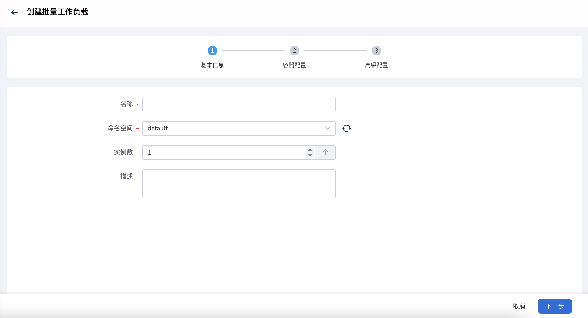
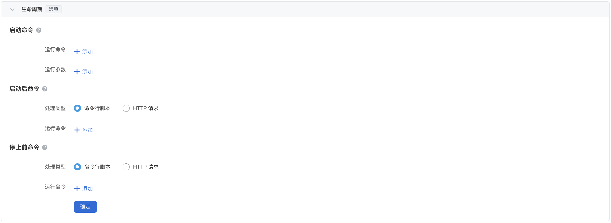
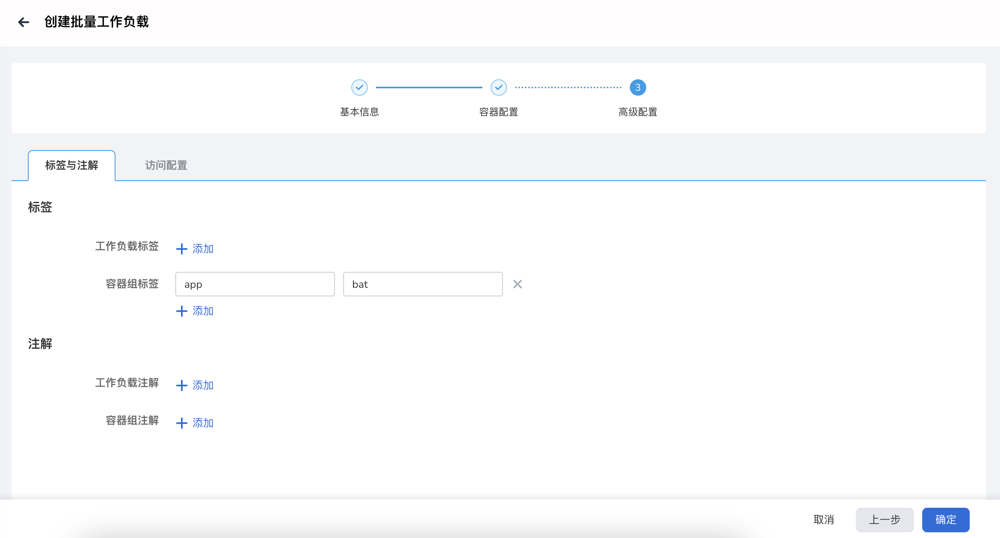
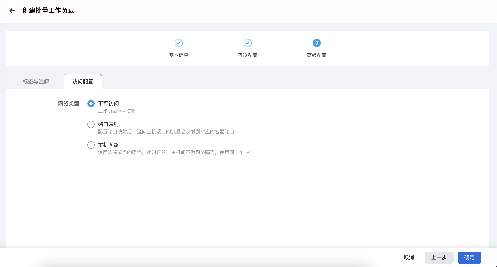
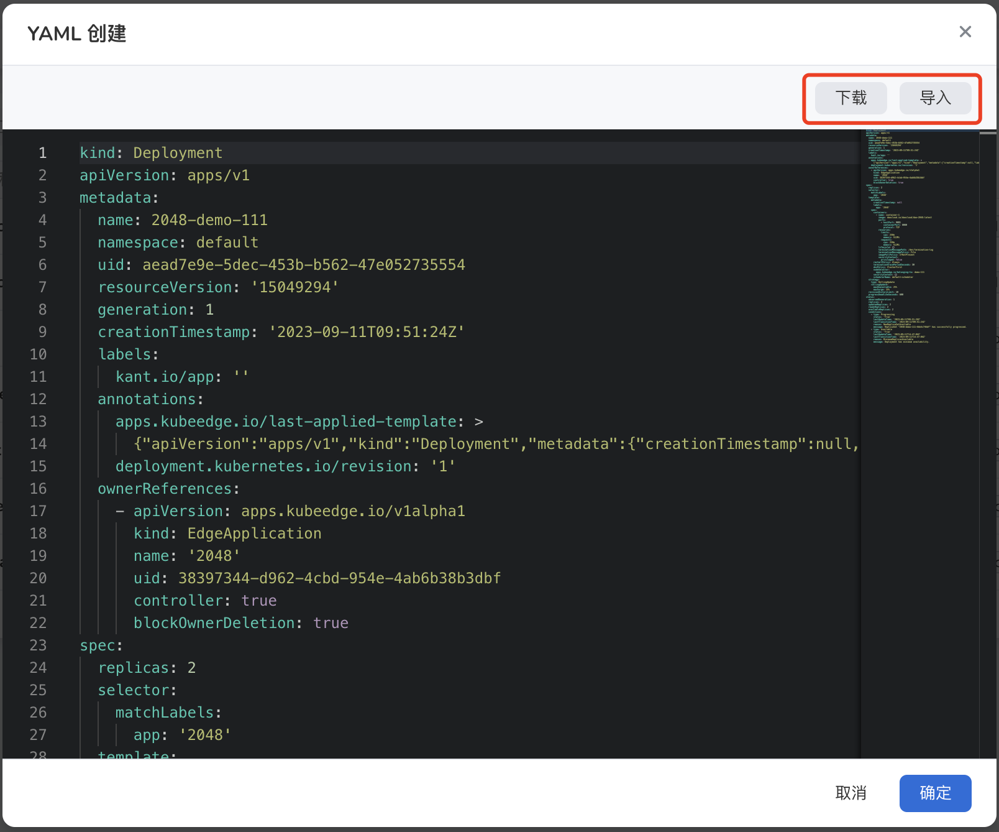

# 创建批量工作负载

将边缘节点按地区划或特性可以划分为不同的节点组，并将应用所需资源打包成一个整体在节点组上进行部署，降低了边缘应用生命周期管理的复杂度，有效减少运维成本。

本文介绍如何通过镜像和 YAML 文件两种方式创建批量工作负载。

## 镜像创建

参考以下步骤，使用镜像创建一个无状态负载。

1. 进入边缘单元详情页，选择左侧菜单`边缘应用` -> `批量工作负载`。

2. 点击批量工作负载列表右上角`镜像创建`按钮。

    

3. 填写基本信息

    - 负载名称：最多包含 63 个字符，只能包含小写字母、数字及分隔符（“-”），且必须以小写字母或数字开头及结尾，例如 deployment-01。同一命名空间内同一类型工作负载的名称不得重复，而且负载名称在工作负载创建好之后不可更改
    - 命名空间：选择将新建的负载部署在哪个命名空间，默认使用 default 命名空间。找不到所需的命名空间时可以根据页面提示去创建新的命名空间
    - 实例数：负载的 Pod 实例数量，默认创建 1 个 Pod 实例，不可修改
    - 描述：输入负载的描述信息，内容自定义

    

4. 填写容器配置

    容器配置分为基本信息、生命周期、健康检查、环境变量、数据存储、安全设置六部分，点击下方的相应页签可查看各部分的配置要求。

    > 容器配置仅针对单个容器进行配置，如需在一个容器组中添加多个容器，可点击右侧的 `+` 添加多个容器

    === "基本信息（必填）"

        在配置容器相关参数时，必须正确填写容器的名称、镜像参数，否则将无法进入下一步。参考以下要求填写配置后，点击确认。

        - 容器名称：最多包含 63 个字符，支持小写字母、数字及分隔符（“-”）。必须以小写字母或数字开头及结尾，例如 nginx-01。
        - 容器镜像：输入镜像地址或名称。输入镜像名称时，默认从官方的 [DockerHub](https://hub.docker.com/) 拉取镜像。接入 DCE 5.0 的[镜像仓库](../../../kangaroo/intro/index.md)模块后，可以点击右侧的选择镜像来选择镜像。
        - 更新策略：勾选总是拉取镜像后，负载每次重启/升级时都会从仓库重新拉取镜像。如果不勾选，则只拉取本地镜像，只有当镜像在本地不存在时才从镜像仓库重新拉取。更多详情可参考[镜像拉取策略](https://kubernetes.io/zh-cn/docs/concepts/containers/images/#image-pull-policy)。
        - 特权容器：默认情况下，容器不可以访问宿主机上的任何设备，开启特权容器后，容器即可访问宿主机上的所有设备，享有宿主机上的运行进程的所有权限。
        - CPU/内存配额：CPU/内存资源的请求值（需要使用的最小资源）和限制值（允许使用的最大资源）。请根据需要为容器配置资源，避免资源浪费和因容器资源超额导致系统故障。默认值如图所示。

        

    === "生命周期（选填）"

        设置容器启动时、启动后、停止前需要执行的命令。详情可参考容[容器生命周期配置](../../../kpanda/user-guide/workloads/pod-config/lifecycle.md)。

        

    === "健康检查（选填）"

        用于判断容器和应用的健康状态，有助于提高应用的可用性。详情可参考[容器健康检查配置](../../../kpanda/user-guide/workloads/pod-config/health-check.md)。

        

    === "环境变量（选填）"

        配置 Pod 内的容器参数，为 Pod 添加环境变量或传递配置等。详情可参考[容器环境变量配置](../../../kpanda/user-guide/workloads/pod-config/env-variables.md)。

        

    === "数据存储（选填）"

        配置容器挂载数据卷和数据持久化的设置。详情可参考[容器数据存储配置](../../../kpanda/user-guide/workloads/pod-config/env-variables.md)。

        

    === "安全设置（选填）"

        通过 Linux 内置的账号权限隔离机制来对容器进行安全隔离。您可以通过使用不同权限的账号 UID（数字身份标记）来限制容器的权限。例如，输入 0 表示使用 root 账号的权限。
        

5. 填写高级配置

    高级配置包括负载的标签与注解、访问配置两部分，可点击下方的页签查看各部分的配置要求。

    === "标签与注解"

        点击`添加`按钮，可以为工作负载和容器组添加标签和注解。

        

    === "访问配置"

        容器访问支持不可访问、端口映射和主机网络三种配置方式。

        - 不可访问：工作负载不可被外部访问。

        - 端口映射：容器网络虚拟化隔离，容器拥有单独的虚拟网络，容器与外部通信需要与主机做端口映射。配置端口映射后，流向主机端口的流量会映射到对应的容器端口。例如容器端口80与主机端口8080映射，那主机8080端口的流量会流向容器的80端口。

        - 主机网络：使用宿主机（边缘节点）的网络，即容器与主机间不做网络隔离，使用同一个IP。

        

6. 点击`确定`按钮，完成批量工作负载的创建。

## YAML 创建

除了通过镜像方式外，还可以通过 YAML 文件更快速地创建创建批量工作负载。

操作步骤如下：

1. 进入边缘单元详情页，选择左侧菜单`边缘应用` -> `批量工作负载`。

2. 点击终端设备列表右上角`YAML 创建`按钮。

    

3. 输入或粘贴事先准备好的 YAML 文件，点击`确定`即可完成创建。

**须知：**

在使用 YAML 创建批量工作负载的时候，建议加上以下限制。

标签（labels）用于标识边缘应用，workloadScope 字段用于对部署到节点组的边缘应用进行差异化配置，当前差异化支持镜像（imageOverriders）和副本数（replicas）设置。

参考示例如下。

```yaml
apiVersion: apps.kubeedge.io/v1alpha1
kind: EdgeApplication
metadata:
  name: nginx-app2
  namespace: default
spec:
  workloadScope:
    targetNodeGroups:
      - name: test
        overriders:
          imageOverriders:
            - component: Repository
              operator: replace
              predicate:
                path: /spec/template/spec/containers/0/image
              value: nginx1
            - component: Tag
              operator: replace
              predicate:
                path: /spec/template/spec/containers/0/image
              value: v1
          replicas: 1
  workloadTemplate:
    manifests:
      - apiVersion: apps/v1
        kind: Deployment
        metadata:
          labels:
            kant.io/app: ''
          name: nginx-test2
          namespace: default
        spec:
          replicas: 10
          selector:
            matchLabels:
              app: nginx-test2
          template:
            metadata:
              labels:
                app: nginx-test2
            spec:
              containers:
                - image: nginx
                  imagePullPolicy: IfNotPresent
                  name: nginx
 ```

    
  