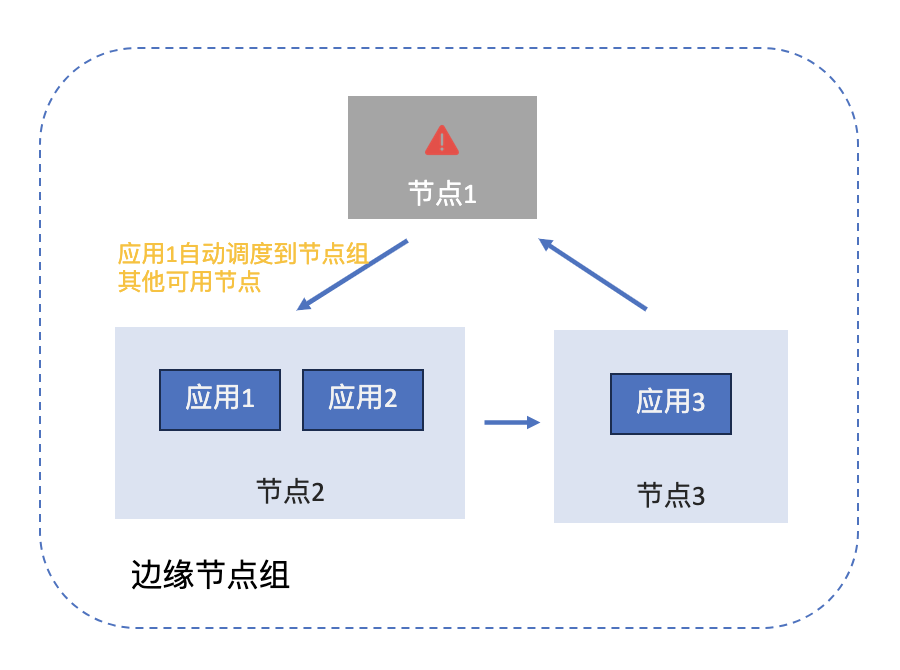

# 边缘应用概述

平台支持下发容器应用到边缘节点。容器应用可以直接从镜像仓库中拉取镜像。

容器镜像的架构必须与边缘节点架构一致。

## 工作负载

工作负载（Deployment）是管理应用副本的一种 API 对象，具体表现为没有本地状态的 Pod，
这些 Pod 之间完全独立、功能相同，能够滚动更新，其实例的数量可以灵活扩缩。

## 批量工作负载

将相同配置或差异化较小的工作负载定义部署到节点组，是一个任务或批量部署动作。

- 通过标签，将同一种类的的资源过滤出来，针对某一类或某一地域的资源，提供容器应用批量部署操作
- 每一个节点组部署对应一个批量部署任务，一个工作负载定义可以部署到多个节点组
- 避免由于网络抖动或高并发流量控制等导致的任务失败问题，平台提供可视化的部署视图，将批量部署的状态和结果及时同步

## 应用故障迁移

- 当节点组中应用实例出现异常或节点故障时，平台离线自愈功能能够快速将应用实例调度到节点组中其它可用的节点上运行，确保应用的自主运行，保障业务的持续性
- 即使在节点处于离线状态（边缘节点与云端断开连接）时仍然能够自动调度

## 配置项与密钥

配置项和密钥是用来存储和管理工作负载所需的认证信息、证书、密钥等重要、敏感信息的资源类型，内容由用户决定，资源创建完成后，可在容器应用中加载使用。

云边协同模块的配置项和密钥的创建和使用流程和容器管理模块的流程一致，在边缘单元详情页，进入到`配置项和密钥`菜单。创建和使用流程参考[创建配置项](../../../kpanda/user-guide/configmaps-secrets/create-configmap.md)。
