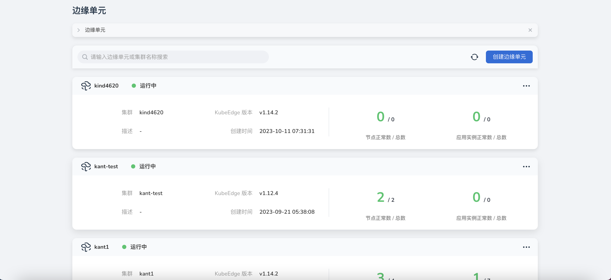
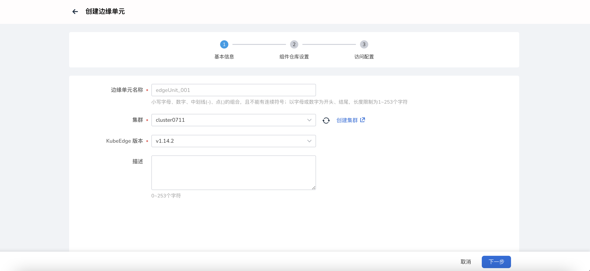
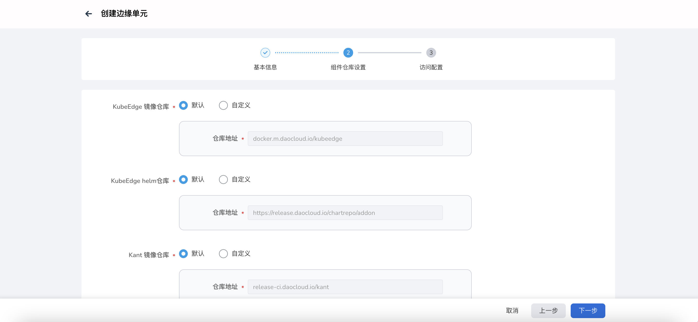
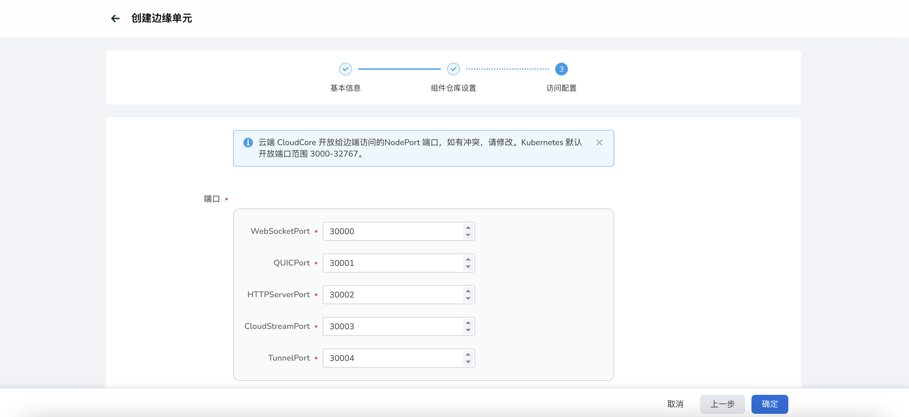

# 创建边缘单元

边缘单元定义：指容器运行所需计算资源的集合，包括云端 Master 和边端工作节点 Node。边缘单元跟 K8S 中的集群是同一概念，但组网方式有所不同，Master 节点部署在云端，一个云端 master (主备多台)对应一个边缘集群。

边缘单元业务：给指定工作集群安装 KubeEdge 云端套件（CloudCore、ControllerManager），并且对其进行全生命周期管理。

KubeEdge：是一个开源系统，将原生的容器化应用程序编排功能扩展到边缘节点。
CloudCore：KubeEdge 云端核心组件；
ControllerManager：KubeEdge CRD 扩展，目前应用于边缘应用和边缘节点组；
下文说明创建边缘单元的步骤：

1. 选择左侧导航栏的`边缘计算` -> `云边协同`，进入边缘单元列表页面，单击页面右上角的`注册边缘单元`按钮；

    

2. 填写基础信息；

    - 边缘单元名称：小写字母、数字、中划线（-）、点（.）的组合，且不能有连续符合，以字母或数字为开头、结尾。

    - 集群：运行边缘单元控制面的集群。

    - KubeEdge 版本：KubeEdge 开源系统发布的某一个版本，用于将容器化应用程序编排功能扩展到边缘的主机，它基于 kubernetes 构建，并为网络应用程序提供基础架构支持。

    <!--- 边缘组件副本数：云端边缘组件的副本数，确保云端节点故障时，边缘组件高可用。-->
    
    - 描述：边缘单元描述信息。

    

3. 组件仓库设置。KubeEdge 、Kant 的云端组件仓库设置；

    - KubeEdge 镜像仓库：KubeEdge 云端组件镜像仓库，批量节点模块中 KubeEdge 边端镜像仓库默认值。
        - 默认：系统提供的默认镜像仓库地址。
        - 自定义：用户可以选择填入企业常用的镜像仓库地址。

    - KubeEdge helm 仓库：KubeEdge helm 应用仓库。
        - 默认：系统提供的默认 helm 仓库地址。
        - 自定义：用户可以选择填入企业常用的 helm 仓库地址。

    - Kant 镜像仓库：系统所需云端组件镜像仓库，Kant 代指云边协同模块；边端安装包镜像仓地址。
        - 默认：系统提供的默认镜像仓库地址。
        - 自定义：用户可以选择填入企业常用的镜像仓库地址。

    

4. 访问设置。KubeEdge 云端组件的访问设置，边缘节点通过此设置与云端建立连接；

    - 访问地址：KubeEdge 云端组件 CloudCore 的访问地址，需要能被边缘节点访问。

    - 端口：
        - WebSocketPort ：访问协议 WebSocket 端口，默认30000。
        - QUICPort：访问协议 QUIC 端口，默认30001。
        - HTTPServerPort：HTTP 服务端口，默认30002。
        - CloudStreamPort：云端流处理接口端口，默认30003。
        - TunnelPort：边缘节点业务数据通道端口，默认30004。

    !!! note

        Kubernetes 默认开放端口范围 3000-32767。如果 NodePort 端口有冲突，请修改。

    

5. 完成以上信息配置后，点击`确定`按钮，完成边缘单元创建，自动返回边缘单元列表。

[管理边缘单元](./manage-unit.md)