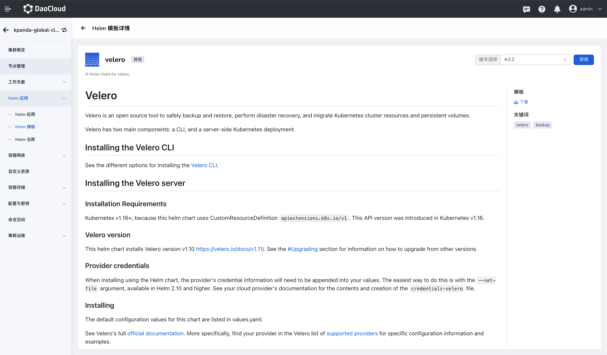
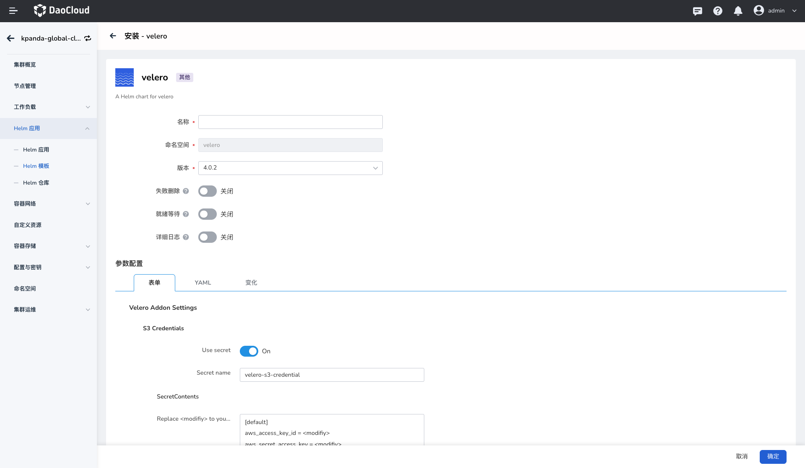

# 安装 velero 插件

velero 是一个备份和恢复 Kubernetes 集群资源的开源工具。它可以将 Kubernetes 集群中的资源备份到云存储服务、本地存储或其他位置，并且可以在需要时将这些资源恢复到同一或不同的集群中。

本节介绍如何在 DCE 5.0 中使用 `Helm 应用`部署 velero 插件。 

## 前提条件

安装 `velero` 插件前，需要满足以下前提条件：

- 容器管理模块[已接入 Kubernetes 集群](../clusters/integrate-cluster.md)或者[已创建 Kubernetes 集群](../clusters/create-cluster.md)，且能够访问集群的 UI 界面。

- 创建 `velero` [命名空间](../namespaces/createns.md)。

- 当前操作用户应具有 [`NS Edit`](../permissions/permission-brief.md#ns-edit) 或更高权限，详情可参考[命名空间授权](../namespaces/createns.md)。

## 操作步骤

请执行如下步骤为集群安装 `velero` 插件。

1. 在集群列表页面找到需要安装 `velero` 插件的目标集群，点击集群名称，在左侧导航栏依次点击 `Helm 应用`->`Helm 模板`，在搜索栏输入 `velero` 进行搜索。

    

2. 阅读 `velero` 插件相关介绍，选择版本后点击`安装`按钮。本文将以 `4.0.2` 版本为例进行安装，推荐安装 `4.0.2` 或更高版本。

    

3. 查看以下说明填写 **基本参数**。

    - 名称：必填参数，输入插件名称，请注意名称最长 63 个字符，只能包含小写字母、数字及分隔符（“-”）,且必须以小写字母或数字开头及结尾，例如 metrics-server-01。
    - 命名空间：插件安装的命名空间，默认为 `velero` 命名空间。
    - 版本：插件的版本，此处以 `4.0.2` 版本为例。
    - 就绪等待：可选参数，启用后，将等待应用下所有关联资源处于就绪状态，才会标记应用安装成功。
    - 失败删除：可选参数，开启后，将默认同步开启就绪等待。如果安装失败，将删除安装相关资源。
    - 详情日志：可选参数，开启后将输出安装过程的详细日志。

        

    !!! note

        开启`就绪等待`和/或`失败删除`后，应用需要经过较长时间才会被标记为`运行中`状态。

4. 参考以下说明配置 velero chart **参数配置**

    - `SecretContents`：配置对象存储（minio）的身份认证信息。

        - `Use secret`：保持默认配置 `true`。
        - `Secret name`：保持默认配置 `velero-s3-credential`。
        - `SecretContents.aws_access_key_id = <modifiy>`：配置访问对象存储的用户名，替换 `<modifiy>` 为真实参数。
        - `SecretContents.aws_secret_access_key = <modifiy>`：配置访问对象存储的密码，替换 `<modifiy>` 为真实参数。

    !!! note "`Use existing secret` 参数示例如下："

        ```yaml
        [default]
        aws_access_key_id = minio
        aws_secret_access_key = minio123
        ```

    - `Backupstoragelocation`：velero 备份数据存储的位置。
        - `S3 bucket`：用于保存备份数据的存储桶名称(需为 minio 已经存在的真实存储桶)。
        - `Is default BackupStorage`：保持默认配置 `true`。
        - `S3 access mode`：velero 对数据的访问模式，可以选择 `ReadWrite`：允许 velero 读写备份数据；`ReadOnly`：允许 velero 读取备份数据，不能修改备份数据;`WriteOnly`：只允许 velero 写入备份数据，不能读取备份数据。

    - `S3 Configs`：S3 存储（minio）的详细配置。
        - `S3 region`：云存储的地理区域。默认使用 `us-east-1` 参数，由系统管理员提供。
        - `S3 force path style`：保持默认配置 `true`。
        - `S3 server URL`：对象存储（minio）的控制台访问地址，minio 一般提供了 UI 访问和控制台访问两个服务，此处请使用控制台访问的地址。

        

5. 点击`确定`按钮，完成 `velero` 插件的安装，之后系统将自动跳转至 `Helm 应用`列表页面，稍等几分钟后，为页面执行刷新操作，即可看到刚刚安装的应用。
