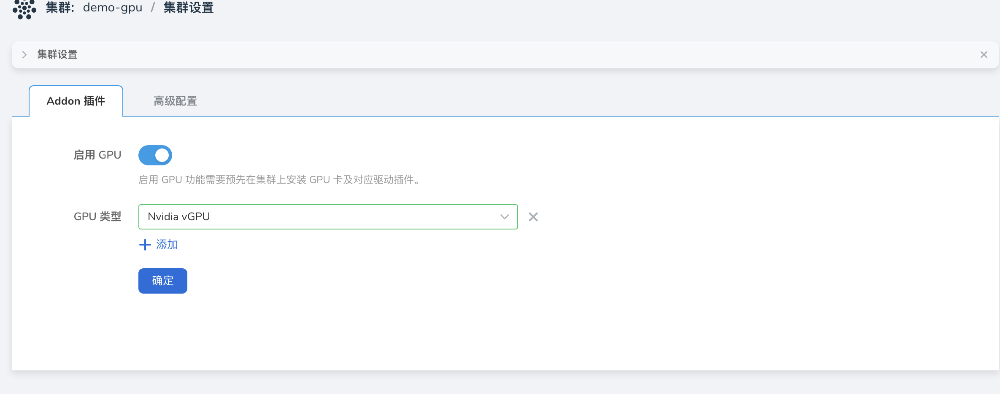

# 应用使用 NVIDIA vGPU

本节介绍如何在 DCE 5.0 平台使用 vGPU 能力。

## 前提条件

-  集群节点上具有[对应型号的 GPU 卡](../../gpu_matrix.md)
-  已成功安装 vGPU Addon，详情参考 [GPU Addon 安装 ](vgpu_addon.md)
- 已安装 GPU Operator，并已 **关闭**  `Nvidia.DevicePlugin` 能力，可参考 [GPU Operator 离线安装](../install_nvidia_driver_of_operator.md) 

## 操作步骤

### 界面使用 vGPU

1. 确认集群是否已检测 GPU 卡。点击对应`集群` -> `集群设置` -> `Addon 插件`，查看是否已自动启用并自动检测对应 GPU 类型。目前集群会自动启用 `GPU`，并且设置`GPU` 类型为 `Nvidia vGPU`。
   
   

2. 部署工作负载，点击对应`集群` -> `工作负载`，通过镜像方式部署工作负载，选择类型（Nvidia vGPU）之后，会自动出现如下几个参数需要填写：

    - **物理卡数量（nvidia.com/vgpu）**：表示当前 Pod 需要挂载几张物理卡，输入值必须为整数且 **小于等于** 宿主机上的卡数量。
    - **GPU 算力（nvidia.com/gpucores）**: 表示每张卡占用的 GPU 算力，值范围为 0-100；
      如果配置为 0， 则认为不强制隔离；配置为100，则认为独占整张卡。
    - **GPU 显存（nvidia.com/gpumem）**: 表示每张卡占用的 GPU 显存，值单位为 MB，最小值为 1，最大值为整卡的显存值。

    > 如果上述值配置的有问题则会出现调度失败，资源分配不了的情况。


###  YAML 配置使用 vGPU

参考如下工作负载配置，在资源申请和限制配置中增加 `nvidia.com/gpu: '1'` 参数来配置应用使用物理卡的数量。

```yaml
apiVersion: apps/v1
kind: Deployment
metadata:
  name: full-vgpu-demo
  namespace: default
spec:
  replicas: 1
  selector:
    matchLabels:
      app: full-vgpu-demo
  template:
    metadata:
      creationTimestamp: null
      labels:
        app: full-vgpu-demo
    spec:
      containers:
        - name: full-vgpu-demo1
          image: chrstnhntschl/gpu_burn
          resources:
            limits:
              nvidia.com/gpucores: '20'   # 申请每张卡占用 20% 的 GPU 算力
              nvidia.com/gpumem: '200'   # 申请每张卡占用 200MB 的显存
              nvidia.com/vgpu: '1'   # 申请GPU的数量
          imagePullPolicy: Always
      restartPolicy: Always
```