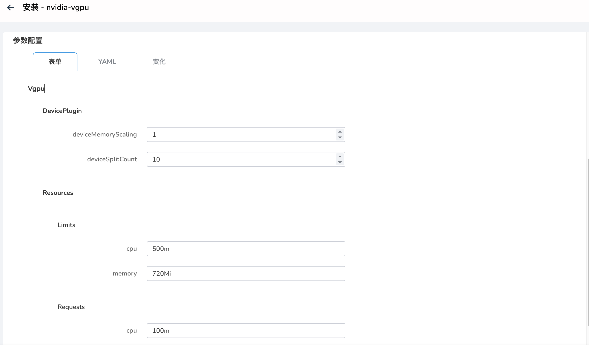

# 安装 NVIDIA vGPU Addon

如需将一张 Nvidia 虚拟化成多个虚拟 GPU，并将其分配给不同的虚拟机或用户，您可以使用 Nvidia 的 vGPU 能力。
本节介绍如何在 DCE 5.0 平台中安装 vGPU 插件，这是使用 Nvidia vGPU 能力的前提。
## 前提条件

- 参考 [GPU 支持矩阵](gpu_matrix.md) 确认集群节点上具有对应型号的 GPU 卡。
- 当前集群已通过 Operator 部署 Nvidia 驱动，具体参考 [GPU Operator 离线安装](./install_nvidia_driver_of_operator.md)。

## 操作步骤

1. 功能模块路径：`容器管理` -> `集群管理` -> 点击目标集群 -> `Helm应用` -> `Helm 仓库` -> 搜索 nvidia-vgpu。

    

2. 在安装 vGPU 的过程中提供了几个基本修改的参数，如果需要修改高级参数点击 YAML 列进行修改：

    - `deviceMemoryScaling`：

        浮点数类型，预设值是 1。NVIDIA 装置显存使用比例，可以大于 1（启用虚拟显存，实验功能）。
        对于有 M 显存大小的 NVIDIA GPU，如果我们配置 `devicePlugin.deviceMemoryScaling` 参数为 S，
        在部署了我们装置插件的 Kubenetes 集群中，这张 GPU 分出的 vGPU 将总共包含 `S * M` 显存。

    - `deviceSplitCount`：

        整数类型，预设值是 10。GPU 的分割数，每一张 GPU 都不能分配超过其配置数目的任务。
        若其配置为 N 的话，每个 GPU 上最多可以同时存在 N 个任务。

    - `Resources`：就是对应 vgpu-device-plugin 和 vgpu-schedule pod 的资源使用量。

    

3. 安装成功之后会在指定 `Namespace` 下出现如下两个类型的 Pod，
   即表示 Nvidia GPU 插件已安装成功：
   
    

安装成功后，[部署应用可使用 vGPU 资源](vgpu_user.md) 。
