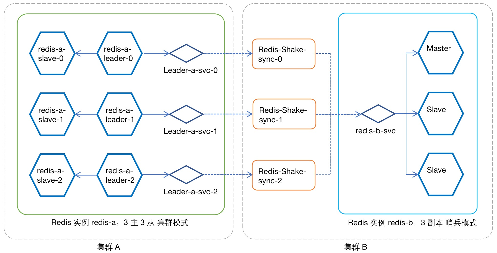
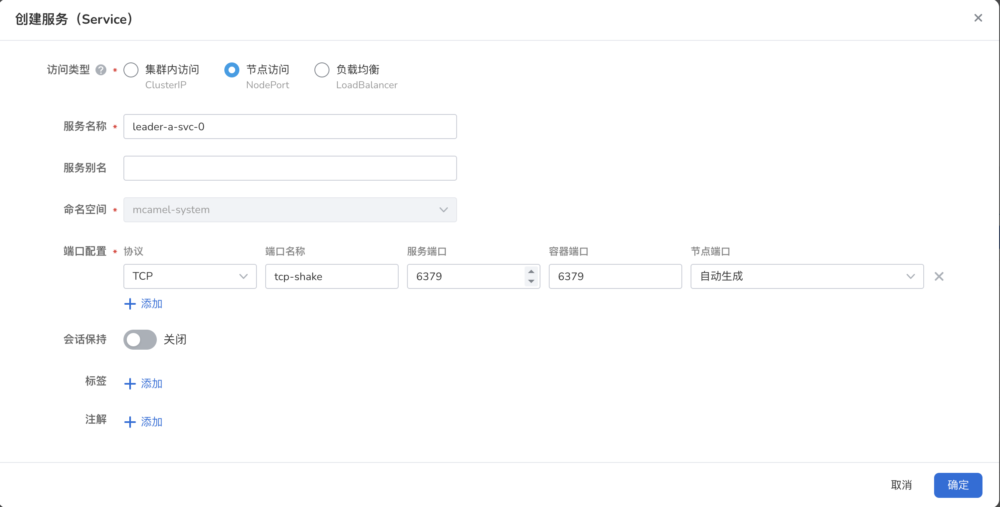
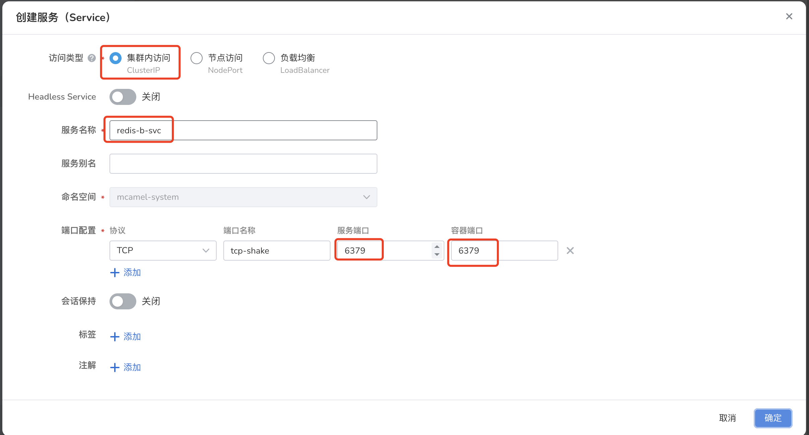
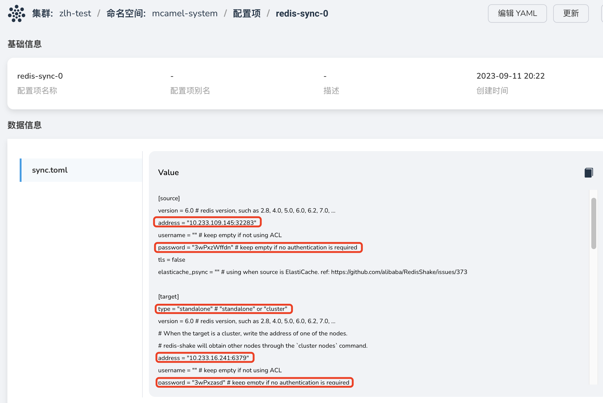
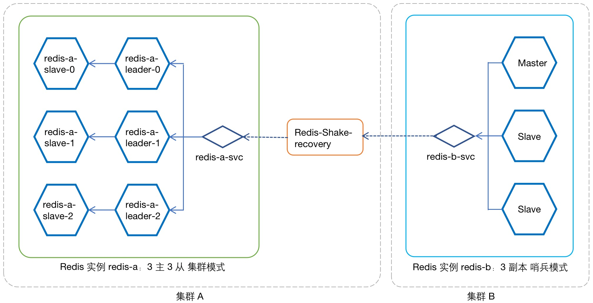
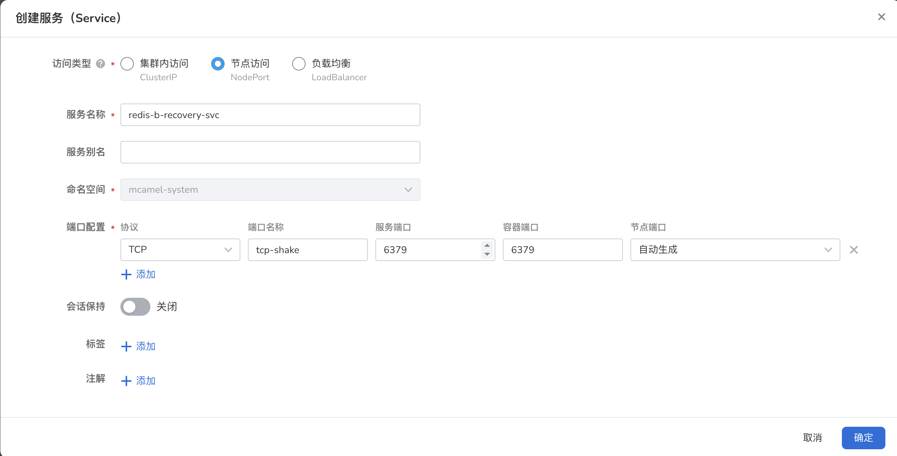
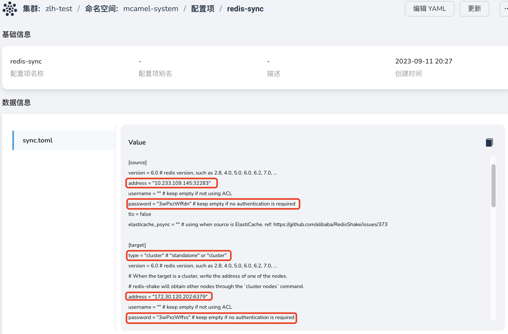
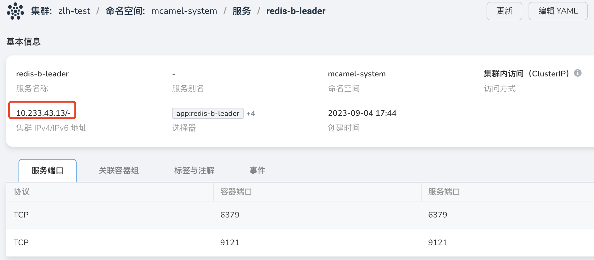

# 集群模式 to 哨兵模式

Redis-shake 支持不同部署模式实例间的数据同步与迁移能力，现以 3 主 3 从集群模式实例与 3 副本哨兵模式实例的场景为例，演示不同模式之间的同步配置方法。

假设 Redis **实例 redis-a** 为 3 主 3 从集群模式，**实例 redis-b** 为 3 副本哨兵模式，两实例处于不同集群。现将 **实例 redis-a** 作为主实例，**实例 redis-b** 作为从实例搭建同步结构，提供以下灾备支持：

- 正常状态下，由 **实例 redis-a** 对外提供服务，并持续同步数据 **实例 redis-a** >> **实例 redis-b** ；
- 当主 **实例 redis-a** 故障离线后，由 **实例 redis-b** 对外提供服务；
- 待 **实例 redis-a** 恢复上线后，**实例 redis-b** >> **实例 redis-a** 回写增量数据；
- **实例 redis-a** 数据恢复完成后，切换为初始状态，即由 **实例 redis-a** 提供服务，并向 **实例 redis-b** 持续数据同步。

!!! note

    数据传输的方式与传输源端实例有关，在`数据同步`中源端 **实例 redis-a** 为集群模式，需要为 3 个 leader 副本分别部署一个 Redis-shake（Redis-shake-sync）；在`数据恢复`中源端 **实例 redis-b** 为哨兵模式，则仅需部署一个 Redis-shake（Redis-shake-recovery）。

## 数据同步部署

图例：数据同步 **实例 redis-a** >> **实例 redis-b**



### 为 **实例 redis-a** 配置服务

为 Redis 实例的每一个 Leader Pod 创建一个 `Nodeport` 服务，用于 Redis-Shake 的数据同步访问。本例中需要为 **实例 redis-a** 的 3 个 Leader Pod 分别创建服务，下面以 Pod `redis-a-leader-0` 为例，为其创建服务：

1. 进入`容器管理` - `源端实例所在集群` - `有状态工作负载`：选择工作负载 `redis-a-leader`，为其创建一个服务，命名为 `redis-a-leader-svc-0`，访问类型为 `Nodeport`，容器端口和服务端口均为 6379。

    

2. 查看该服务。并确定工作负载选择器包含以下标签
   
    ```yaml
    app.kubernetes.io/component: redis
    app.kubernetes.io/managed-by: redis-operator
    app.kubernetes.io/name: redis-a
    role: leader
    # 注意 pod-name 一定要选择正确的 leader pod 名称
    statefulset.kubernetes.io/pod-name: redis-a-leader-0
    ```

    

重复执行以上操作，为 `redis-a-leader-1` `redis-a-leader-2` 分别创建服务。

### 为 **实例 redis-b** 配置服务

参考`图例：数据同步 **实例 redis-a** >> **实例 redis-b**` 可见，**实例 redis-b** 与 `redis-shake` 处于同一集群，因此为 **实例 redis-b** 创建一个 ClusterIP 服务即可,端口指向 6379，如下图所示：




### Redis-shake 部署

Redis-shake 通常与数据传输的目标 Redis 实例运行于同一集群及命名空间上，因此，本例中为了实现数据同步，需要在 **实例 redis-b** 所在集群部署 redis-shake，配置方式如下。

注意，在集群模式下，Redis-shake 要求与源端 Redis 实例的 Leader Pod 形成一对一关系（请参考图例：数据同步 **实例 redis-a** >> **实例 redis-b**），因此这里需要部署 3 个独立的 Redis-shake。以 `redis-a-leader-0` 为例，创建 `Redis-shake-sync-0`：

#### 1. 创建配置项

在`容器管理` - `目标端实例所在集群` - `配置与存储` - `配置项`为 Redis-shake 实例创建配置项 `redis-sync-0`。导入文件 `sync.toml`（文件内容见附录），并注意需要修改以下内容：



- source.address：源端 **实例 redis-a** 的 `redis-a-leader-svc-0` 服务地址：

    ```toml
    address = "10.233.109.145:32283"
    ```
    
- 源端实例的访问密码：可在`数据服务`实例的概览页获取该信息：

    ```toml
    password = "3wPxzWffdn" # keep empty if no authentication is required
    ```

    

- 目标端实例访问地址，采用上一步为 **实例 redis-b** 创建的 ClusterIP 服务（端口 6379）作为目标端的访问地址：

    ```toml
    # 注意：由于 headless 服务可直接连接工作负载，因此可以通过该服务访问工作负载默认端口 6379。
    address = "10.233.16.241:6379"
    ```

- 目标端实例的访问密码，可在`数据服务`模块下的 Redis 实例概览页获取该信息:

    ```toml
    password = "3wPxzasd" # keep empty if no authentication is required
    ```

- 目标端类型需设置为 `standalone`：

    ```toml
    [target]
    type = "standalone" # "standalone" or "cluster"
    ```

#### 2. 创建 Redis-shake

1. 打开`应用工作台`，选择`向导` -> `基于容器镜像`，创建一个应用 `Redis-shake-sync-0`：

    

2. 参考如下说明填写应用配置。
    
    - 应用所属集群、命名空间需与 Redis 实例一致；
    - 镜像地址：

        ```yaml
        release.daocloud.io/ndx-product/redis-shake@sha256:46652d7d8893fa4508c3c6725afc1e211fb9cb894c4dc85e94287395a32fc3dc
        ```

    - 默认服务的访问类型为 Nodeport ，容器端口和服务端口设置为 6379。

        

    - `高级设置` - `生命周期`  - `启动命令` - `运行参数` 填入：

        ```yaml
        /etc/sync/sync.toml
        ```

        

    - `高级设置` - `数据存储 `：添加配置项 `redis-sync-0`，路径必须设置为：

        ```yaml
        /etc/sync
        ```

    - `高级设置` -`数据存储`：添加一个临时路径，读写权限为`读写`，容器路径必须为：

        ```yaml
        /data
        ```

       

3. 点击`确定`，完成 Redis-shake 创建。

重复执行以上操作，分别为其他两个 Leader Pod 创建 `Redis-shake-sync-1`，`Redis-shake-sync-2`。

完成 Redis-shake 的创建后，实际就已经开始 Redis 实例间的同步，此时可通过 `redis-cli` 工具验证同步，这里就不做赘述。

## 数据恢复

图例：数据恢复 **实例 redis-b** >> **实例 redis-a**



当源端实例 **实例 redis-a** 发生故障离线后，将由目标端 **实例 redis-b** 提供服务，该过程必然产生新增数据。**实例 redis-a** 恢复上线后，首先需要从 **实例 redis-b** 恢复增量数据，此时 **实例 redis-a** 与 **实例 redis-b** 角色互换， **实例 redis-b** 作为数据源向 **实例 redis-a** 同步数据。

参考`图例：数据恢复  **实例 redis-b** >> 实例 redis-a`，因 **实例 redis-a** 为集群模式，需要在其所在集群部署 3 个 redis-shake 实例，实现 **实例 redis-b** >>  **实例 redis-a** 的数据回传，配置方式如下。

!!! note

    **实例 redis-a** 上线前，请先关闭用于实例 **redis-a** >> **实例 redis-b** 数据同步的 3 个 Redis-shake 实例(`edis-shake-sync-0`、`edis-shake-sync-1`、`edis-shake-sync-2`)，避免发生错误的数据同步覆盖掉新增数据。

### 为 **实例 redis-b** 配置服务

恢复流程中 **实例 redis-b** 为数据源，因此需要为该实例创建一个 Nodeport 服务，用于 Redis-shake 的跨集群访问。

此时的数据源 **实例 redis-b** 为哨兵模式，因此仅需要创建 1 个服务，以下为创建过程 ：

1. 进入`容器管理` - `源端实例所在集群` - `有状态工作负载`：选择工作负载 `redis-b`，创建一个 `Nodeport` 服务 `redis-b-recovery-svc`，容器端口和服务端口均为 6379

    

2. 查看该服务。并确定工作负载选择器包含以下标签
   
    ```yaml
    app.kubernetes.io/component: redis
    app.kubernetes.io/managed-by: redis-operator
    app.kubernetes.io/name: redis-b
    app.kubernetes.io/part-of: redis-failover
    redis-failover: master
    redisfailovers.databases.spotahome.com/name: redis-b
    ```

    

### Redis-shake 部署

Redis-shake 通常与数据传输的目标 Redis 实例运行于同一集群上，因此，本例中为了实现数据同步，需要在目标端部署redis-shake，配置方式如下。

#### 1. 创建配置项

在`容器管理` - `目标端实例所在集群` - `配置与存储` - `配置项`为 Redis-shake 实例创建配置项 `redis-sync`。导入文件 `sync.toml` （文件内容见`附录`），并注意需要修改以下内容：



- source.address：此时的源端为 **实例 redis-b** ，填写上一步骤为该实例创建的服务地址：

    ```toml
    address = "10.233.109.145:32283"
    ```
    
- 源端实例的访问密码：可在 **实例 redis-b** 的概览页获取该信息：

    ```toml
    password = "3wPxzWffdn" # keep empty if no authentication is required
    ```
    

- 目标端实例访问地址，此时的目标端为 **实例 redis-a** ，这里可以采用系统默认创建的服务 `redis-a-leader`（端口：6379），无需创建：

    ```toml
    address = "172.30.120.202:6379"
    ```

    该配置可在`集群管理` - `redis-a 所在集群` - `工作负载` - `访问方式` 中查看。如下图所示：

    

    点击服务名称，进入服务详情，可见 ClusterIP 地址：

    

- 目标端实例的访问密码，可在 **实例 redis-a** 的概览页获取该信息:

    ```toml
    password = "3wPxzWffss" # keep empty if no authentication is required
    ```

- 此时数据接收端为 **实例 redis-b**，因此目标端类型需设置为 `cluster`：

    ```toml
    [target]
    type = "cluster" # "standalone" or "cluster"
    ```

#### 2. 创建 Redis-shake

1. 打开`应用工作台`，选择`向导` -> `基于容器镜像`，创建一个应用 `Redis-shake-recovery`：

    

2. 参考如下说明填写应用配置。
    
    - 应用所属集群、命名空间需与 Redis 实例一致；
    - 镜像地址：

        ```yaml
        release.daocloud.io/ndx-product/redis-shake@sha256:46652d7d8893fa4508c3c6725afc1e211fb9cb894c4dc85e94287395a32fc3dc
        ```

    - 默认服务的访问类型为 Nodeport，容器端口和服务端口设置为 6379。

        

    - `高级设置` - `生命周期` - `启动命令` - `运行参数`填入：

        ```yaml
        /etc/sync/sync.toml
        ```

        

    - `高级设置` - `数据存储`：添加配置项 `redis-sync`，路径必须设置为：

        ```yaml
        /etc/sync
        ```

    - `高级设置` - `数据存储`：添加一个临时路径，容器路径必须为：

        ```yaml
        /data
        ```

       

3. 点击`确定`，完成 Redis-shake 创建。

完成 Redis-shake 的创建后，实际就已经开始 Redis 实例间的同步，此时可通过 `redis-cli` 工具验证同步，这里就不做赘述。

## 复原主从关系

如需复原初始的主从同步关系 **实例 redis-a** >> **实例 redis-b**，需在`容器管理`中停止当前运行在 **实例 redis-a** 所在集群的 `Redis-shake-sync` 实例，重新启动目标端实例所在集群中的 3 个 `Redis-shake` 实例，即可重建初始主从关系。


## 附录

??? note “请点击查看配置文件” title="sync.toml"

    ```toml
    type = "sync"
     
    [source]
    version = 6.0 # redis version, such as 2.8, 4.0, 5.0, 6.0, 6.2, 7.0, ...
    address = "10.233.109.145:6379"
    username = "" # keep empty if not using ACL
    password = "3wPxzWffdn" # keep empty if no authentication is required
    tls = false
    elasticache_psync = "" # using when source is ElastiCache. ref: https://github.com/alibaba/RedisShake/issues/373
     
    [target]
    type = "cluster" # "standalone" or "cluster"
    version = 6.0 # redis version, such as 2.8, 4.0, 5.0, 6.0, 6.2, 7.0, ...
    # When the target is a cluster, write the address of one of the nodes.
    # redis-shake will obtain other nodes through the `cluster nodes` command.
    address = "10.233.103.2:6379"
    username = "" # keep empty if not using ACL
    password = "Aa123456" # keep empty if no authentication is required
    tls = false
     
    [advanced]
    dir = "data"
     
    # runtime.GOMAXPROCS, 0 means use runtime.NumCPU() cpu cores
    ncpu = 4
     
    # pprof port, 0 means disable
    pprof_port = 0
     
    # metric port, 0 means disable
    metrics_port = 0
     
    # log
    log_file = "redis-shake.log"
    log_level = "info" # debug, info or warn
    log_interval = 5 # in seconds
     
    # redis-shake gets key and value from rdb file, and uses RESTORE command to
    # create the key in target redis. Redis RESTORE will return a "Target key name
    # is busy" error when key already exists. You can use this configuration item
    # to change the default behavior of restore:
    # panic:   redis-shake will stop when meet "Target key name is busy" error.
    # rewrite: redis-shake will replace the key with new value.
    # ignore:  redis-shake will skip restore the key when meet "Target key name is busy" error.
    rdb_restore_command_behavior = "rewrite" # panic, rewrite or skip
     
    # pipeline
    pipeline_count_limit = 1024
     
    # Client query buffers accumulate new commands. They are limited to a fixed
    # amount by default. This amount is normally 1gb.
    target_redis_client_max_querybuf_len = 1024_000_000
     
    # In the Redis protocol, bulk requests, that are, elements representing single
    # strings, are normally limited to 512 mb.
    target_redis_proto_max_bulk_len = 512_000_000
    ```

