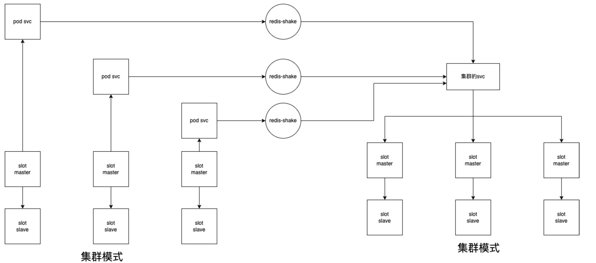
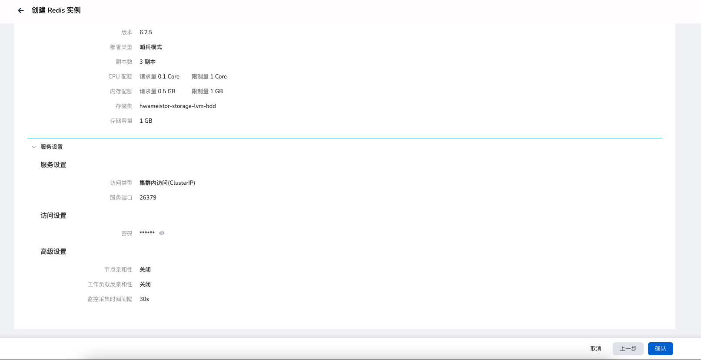
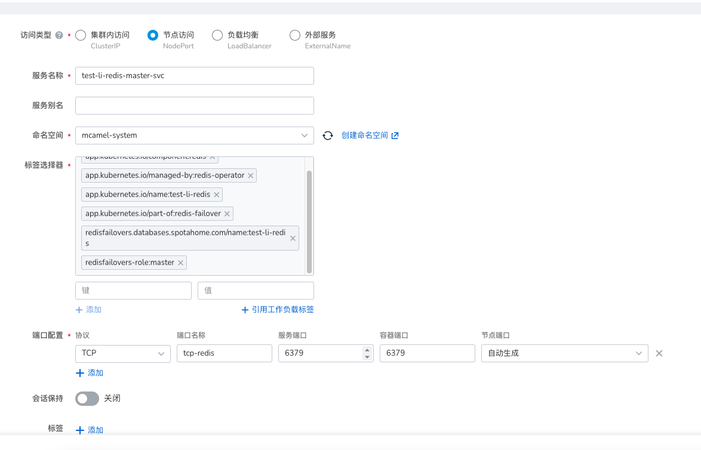

# Redis 容灾部署方案

Redis 作为开源的内存数据存储系统，具备出色的性能、高可用性和实时性能，可满足应用和服务的大量访问请求以及数据存储需求。
然而，由于缺乏内置的数据安全保护功能，因此在实际应用中，需要采取容灾技术来保障 Redis 数据的可靠性。

容灾技术主要通过数据复制和数据备份等手段实现，以提供冷备和热备两种备份方式。在网络、服务器或数据库发生故障导致数据丢失时，通过主备切换和数据恢复等方式，确保企业数据的安全性，确保业务的连续性。

## 方案一：Redis-Shake 同步模式

Redis-Shake 是一个用于合并、过滤和迁移Redis数据的工具。它支持三种数据迁移模式：sync、restore 和 scan。

本方案将采用 Redis-Shake 实现跨集群的 Redis 实例数据同步。


Github 仓库地址: <https://github.com/tair-opensource/RedisShake>

### 同步模式简要说明

=== "哨兵模式"
  
    1. 在源端的 `master` 节点创建一个 `NodePort` 服务.

    2. 编辑 Redis-Shake 的同步配置文件，使用目标实例对源实例的配置方式

        

=== "集群模式"
 
    1. 在源端的每一个节点都要创建一个 `NodePort` 服务。

    2. 配置多个 Redis-Shake，使用目标实例的各主节点分别对源集群实例的配置方式。

        

### 操作步骤

#### 源集群

1. 在 DCE 5.0 中创建 Redis 中间件实例。

    

2. 进入`容器管理`，给 `master` 节点创建一个服务。

    

    

    并配置相关标签选择器：

    ```shell
    app.kubernetes.io/component: redis
    app.kubernetes.io/managed-by: redis-operator
    app.kubernetes.io/name: test-li-redis
    app.kubernetes.io/part-of: redis-failover
    redisfailovers-role: master
    redisfailovers.databases.spotahome.com/name: test-li-redis
    ```

#### 目标集群

将 Redis-Shake 与目标集群部署在同一宿主机上，并按照以下配置进行操作：

```shell
wget https://github.com/tair-opensource/RedisShake/releases/download/v3.1.11/redis-shake-linux-amd64.tar.gz
mkdir redisShake
cd redisShake
cp ../redis-shake-linux-amd64.tar.gz .
tar -xzvf redis-shake-linux-amd64.tar.gz
vi sync.toml
./redis-shake sync.toml
```

编辑 `sync.toml` 配置文件：

```yaml
type = "sync"
 
[source]
version = 6.0 # redis version, such as 2.8, 4.0, 5.0, 6.0, 6.2, 7.0, ...
address = "10.233.109.145:6379"
username = "" # keep empty if not using ACL
password = "3wPxzWffdn" # keep empty if no authentication is required
tls = false
elasticache_psync = "" # using when source is ElastiCache. ref: https://github.com/alibaba/RedisShake/issues/373
 
[target]
type = "standalone" # "standalone" or "cluster"
version = 6.0 # redis version, such as 2.8, 4.0, 5.0, 6.0, 6.2, 7.0, ...
# When the target is a cluster, write the address of one of the nodes.
# redis-shake will obtain other nodes through the `cluster nodes` command.
address = "10.233.103.2:6379"
username = "" # keep empty if not using ACL
password = "Aa123456" # keep empty if no authentication is required
tls = false
 
[advanced]
dir = "data"
 
# runtime.GOMAXPROCS, 0 means use runtime.NumCPU() cpu cores
ncpu = 4
 
# pprof port, 0 means disable
pprof_port = 0
 
# metric port, 0 means disable
metrics_port = 0
 
# log
log_file = "redis-shake.log"
log_level = "info" # debug, info or warn
log_interval = 5 # in seconds
 
# redis-shake gets key and value from rdb file, and uses RESTORE command to
# create the key in target redis. Redis RESTORE will return a "Target key name
# is busy" error when key already exists. You can use this configuration item
# to change the default behavior of restore:
# panic:   redis-shake will stop when meet "Target key name is busy" error.
# rewrite: redis-shake will replace the key with new value.
# ignore:  redis-shake will skip restore the key when meet "Target key name is busy" error.
rdb_restore_command_behavior = "rewrite" # panic, rewrite or skip
 
# pipeline
pipeline_count_limit = 1024
 
# Client query buffers accumulate new commands. They are limited to a fixed
# amount by default. This amount is normally 1gb.
target_redis_client_max_querybuf_len = 1024_000_000
 
# In the Redis protocol, bulk requests, that are, elements representing single
# strings, are normally limited to 512 mb.
target_redis_proto_max_bulk_len = 512_000_000
```

> 更多方案正在制作过程中...
