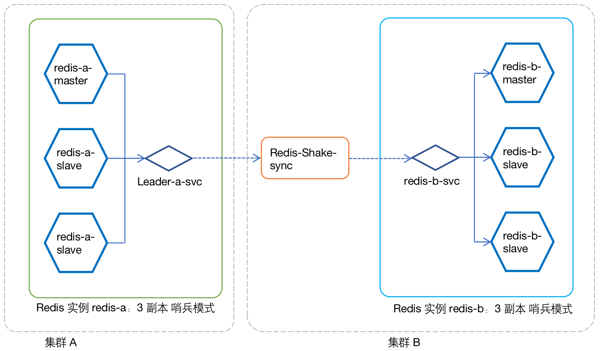
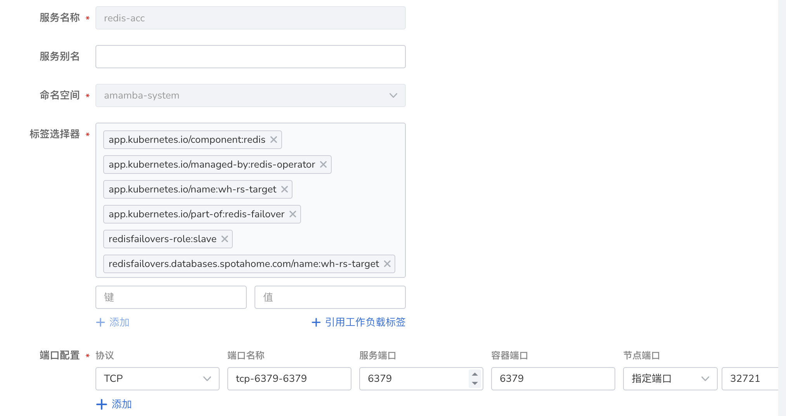
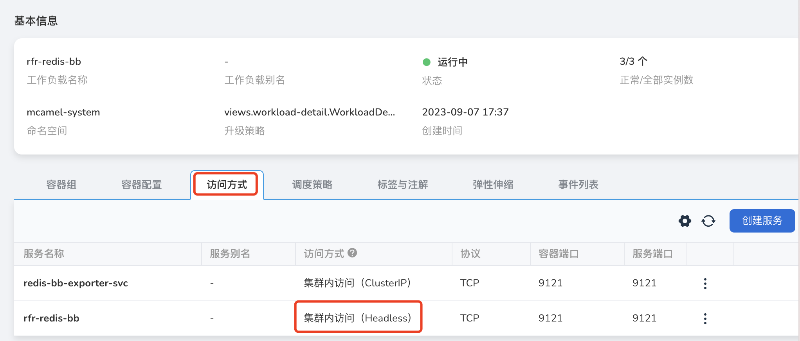
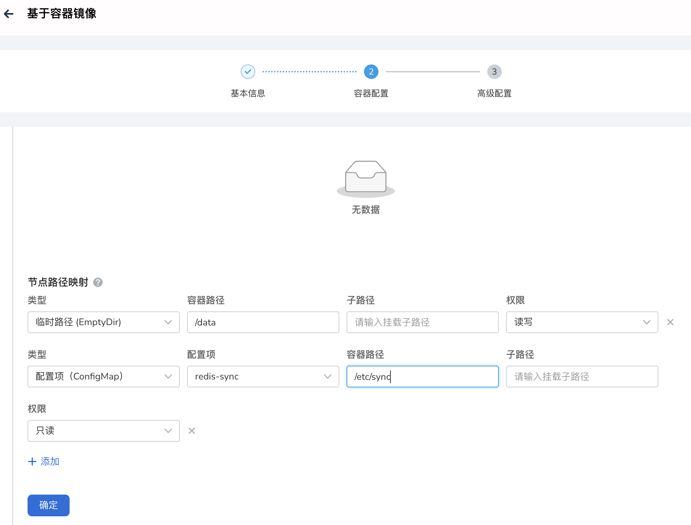
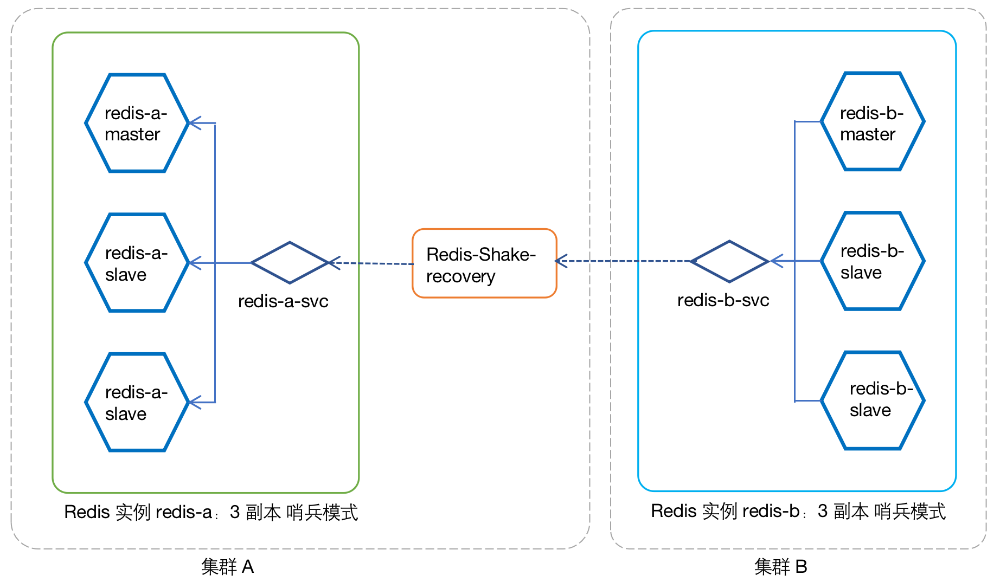

# 哨兵模式 to 哨兵模式

[RedisShake](https://tair-opensource.github.io/RedisShake/) 支持哨兵模式实例间的数据同步与迁移能力，现以 3 副本哨兵模式 Redis 为例，演示跨集群同步配置方法。

假设 `实例 redis-a` 与 `实例 redis-b` 处于不同集群，二者均为 3 副本哨兵模式，现将 `实例 redis-a` 作为主实例，`实例 redis-b` 作为从实例搭建同步结构，提供以下灾备支持：

- 正常状态下，由 `实例 redis-a` 对外提供服务，并持续同步数据 `实例 redis-a` >> `实例 redis-b`；
- 当主 `实例 redis-a` 故障离线后，由 `实例 redis-b` 对外提供服务；
- 待 `实例 redis-a` 恢复上线后，`实例 redis-b` >> `实例 redis-a` 回写增量数据；
- `实例 redis-a` 数据恢复完成后，切换为初始状态，即由 `实例 redis-a` 提供服务，并向 `实例 redis-b` 持续数据同步。

!!! note

    数据同步与数据恢复需要通过不同的 RedisShake 组完成，因此在本例中需要分别创建 `Redis-shake-sync`、`Redis-shake-recovery` 两个 RedisShake 实例。

## 数据同步部署

图例：数据同步 `实例 redis-a` >> `实例 redis-b` 



### 为源端实例配置服务

如果源端实例处于 DCE 5.0 的集群中，可在`数据服务` - `Redis` - `解决方案` - `跨集群主从同步`中开启方案，将自动完成服务配置工作。


如果源端实例处于第三方集群上，则需要手工完成服务配置，配置方法如下文：

为 Redis 实例创建一个 `Nodeport` 服务，用于 RedisShake 的数据同步访问。本例中需要为 `实例 redis-a` 创建 1 个服务，以下为创建过程 ：

1. 进入`容器管理` - `源端实例所在集群` - `有状态工作负载`：选择工作负载 `redis-a`，创建一个 `Nodeport` 服务，容器端口和服务端口均为 6379

    

2. 查看该服务。并确定工作负载选择器包含以下标签
   
    ```yaml
    app.kubernetes.io/component: redis
    app.kubernetes.io/managed-by: redis-operator
    app.kubernetes.io/name: redis-a
    app.kubernetes.io/part-of: redis-failover
    redis-failover: master
    redisfailovers.databases.spotahome.com/name: redis-a
    ```

    

### RedisShake 部署

RedisShake 通常与数据传输的目标 Redis 实例运行于同一集群上，因此，本例中为了实现数据同步，需要在 `实例 redis-b` 所在集群部署 RedisShake，配置方式如下。

#### 创建配置项

在`容器管理` - `目标端实例所在集群` - `配置与存储` - `配置项`为 RedisShake 实例创建配置项 `redis-sync`。导入文件 `sync.toml` （文件内容见`附录`），并注意需要修改以下内容：


- source.address：上一步骤创建的源端 `redis-a` 的服务地址：

    ```toml
    address = "10.233.109.145:31278"
    ```
    
- 源端实例的访问密码：可在 Redis 实例的概览页获取该信息：

    ```toml
    password = "3wPxzWffdn" # keep empty if no authentication is required
    ```
    

- 目标端实例访问地址，该地址可以采用新建的 `ClusterIP` 服务地址，也可以采用实例 `redis-b` 的默认 `Headless` 服务 `rfr-redis-b` 的地址，本例中采用 `Headless` 服务地址：

    ```toml
    address = "rfr-redis-b:6379"
    ```
 
    该服务信息可在`集群管理` - `目标端所在集群` - `工作负载` - `访问方式`中查看。类似下图所示页面

    

- 目标端实例的访问密码，可在`数据服务`模块下的 Redis 实例概览页获取该信息:

    ```toml
    password = "3wPxzWffdn" # keep empty if no authentication is required
    ```

    类似下图位置：

    

- 目标端类型需设置为 `standalone`：

    ```toml
    [target]
    type = "standalone" # "standalone" or "cluster"
    ```

#### 创建 RedisShake

1. 打开`应用工作台`，选择`向导` - `基于容器镜像`，创建一个应用 `Redis-shake-sync`：

    

2. 参考如下说明填写应用配置。
    
    - 应用所属集群、命名空间需与 Redis 实例一致；
    - 镜像地址：

        ```yaml
        release.daocloud.io/ndx-product/redis-shake@sha256:46652d7d8893fa4508c3c6725afc1e211fb9cb894c4dc85e94287395a32fc3dc
        ```

    - 默认服务的访问类型为 Nodeport，容器端口和服务端口设置为 6379。

        

    - `高级设置` - `生命周期` - `启动命令` - `运行参数`填入：

        ```yaml
        /etc/sync/sync.toml
        ```

        

    - `高级设置` - `数据存储`：添加配置项 `redis-sync`，路径必须设置为：

        ```yaml
        /etc/sync
        ```

    - `高级设置` - `数据存储`：添加一个临时路径，容器路径必须为：

        ```yaml
        /data
        ```

       

3. 点击`确定`，完成 RedisShake 创建。

完成 RedisShake 的创建后，实际就已经开始 Redis 实例间的同步，此时可通过 `redis-cli` 工具验证同步，这里就不做赘述。

## 数据恢复

图例：数据恢复 `实例 redis-b` >> `实例 redis-a`



当源端 `实例 redis-a` 恢复上线后，首先需要从目标端 `实例 redis-b` 恢复增量数据，因此需要在 `实例 redis-a` 再次部署 1 个 RedisShake 实例，实现 `实例 redis-b` >> `实例 redis-a` 的数据回传，此处配置方法与数据同步过程类似，执行 **反方向** 配置部署即可，完成 RedisShake 创建后，即自动开始数据恢复。

!!! note

    源端实例上线前，请先关闭用于正常同步的 `Redis-shake-sync`，避免发生错误的数据同步覆盖掉新增数据。

## 复原主从关系

如需复原初始的主从同步关系 `实例 redis-a` >> `实例 redis-b`，需在`容器管理`中停止 `实例 redis-a` 所在集群中正在运行的 `Redis-shake-recovery` 实例，重新启动目标端集群中的 `Redis-shake-sync` 实例，即可重建初始主从关系。


## 附录

```toml title="sync.toml"
type = "sync"
 
[source]
version = 6.0 # redis version, such as 2.8, 4.0, 5.0, 6.0, 6.2, 7.0, ...
address = "10.233.109.145:6379"
username = "" # keep empty if not using ACL
password = "3wPxzWffdn" # keep empty if no authentication is required
tls = false
elasticache_psync = "" # using when source is ElastiCache. ref: https://github.com/alibaba/RedisShake/issues/373
 
[target]
type = "standalone" # "standalone" or "cluster"
version = 6.0 # redis version, such as 2.8, 4.0, 5.0, 6.0, 6.2, 7.0, ...
# When the target is a cluster, write the address of one of the nodes.
# RedisShake will obtain other nodes through the `cluster nodes` command.
address = "10.233.103.2:6379"
username = "" # keep empty if not using ACL
password = "Aa123456" # keep empty if no authentication is required
tls = false
 
[advanced]
dir = "data"
 
# runtime.GOMAXPROCS, 0 means use runtime.NumCPU() cpu cores
ncpu = 4
 
# pprof port, 0 means disable
pprof_port = 0
 
# metric port, 0 means disable
metrics_port = 0
 
# log
log_file = "redis-shake.log"
log_level = "info" # debug, info or warn
log_interval = 5 # in seconds
 
# redis-shake gets key and value from rdb file, and uses RESTORE command to
# create the key in target redis. Redis RESTORE will return a "Target key name
# is busy" error when key already exists. You can use this configuration item
# to change the default behavior of restore:
# panic:   redis-shake will stop when meet "Target key name is busy" error.
# rewrite: redis-shake will replace the key with new value.
# ignore:  redis-shake will skip restore the key when meet "Target key name is busy" error.
rdb_restore_command_behavior = "rewrite" # panic, rewrite or skip
 
# pipeline
pipeline_count_limit = 1024
 
# Client query buffers accumulate new commands. They are limited to a fixed
# amount by default. This amount is normally 1gb.
target_redis_client_max_querybuf_len = 1024_000_000
 
# In the Redis protocol, bulk requests, that are, elements representing single
# strings, are normally limited to 512 mb.
target_redis_proto_max_bulk_len = 512_000_000
```
