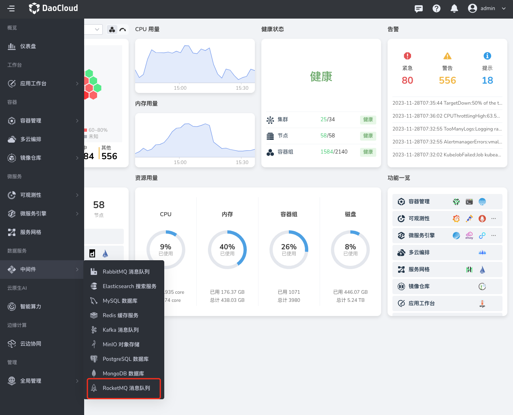
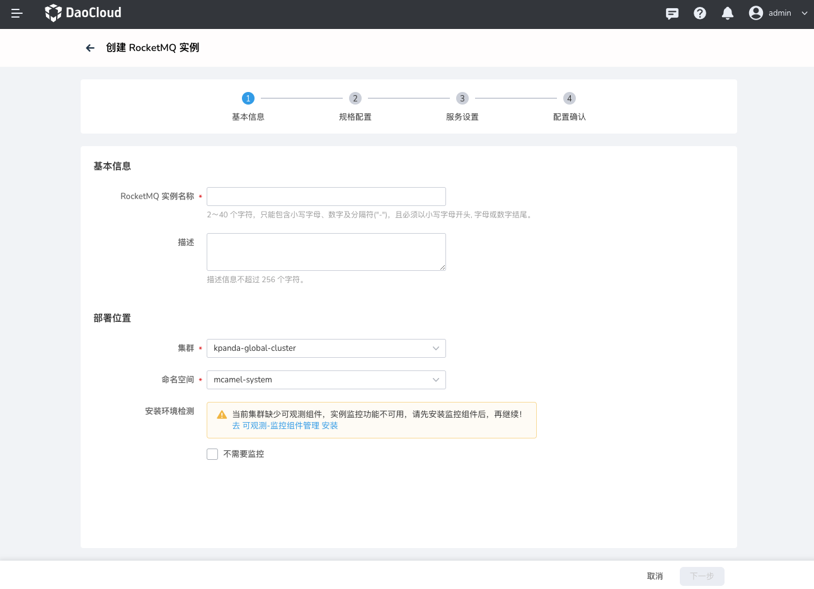
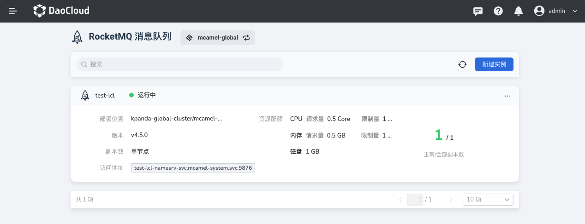

# 创建 RocketMQ 实例

1. 点击一级导航栏选择 `中间件 > RocketMQ 消息队列` 。

    { width=1000px}

2. 进入目标工作空间，点击`新建实例`。

    - 实例名称：2～40 个字符，只能包含小写字母、数字及分隔符 ("-")，且必须以小写字母开头，字母或数字结尾。
    - 集群 / 命名空间：选择实例部署的位置。
    - 安装环境检测：如未通过安装环境检测，需要根据提示安装组件之后方可进行下一步。

    { width=1000px}

3. 参考下方信息填写配置规格，然后点击下一步。
    - 部署模式在实例创建之后不可更改
    - 生产模式下建议采用高可用部署模式
    - 高可用模式下需要至少 4 个副本
    - 存储类：所选的存储类应有足够的可用资源，否则会因资源不足导致实例创建失败
    - 存储容量：每个磁盘具有多少容量。实例创建之后不可调低
    - 每副本磁盘数：为每个副本提供多少个次盘。实例创建之后不可调低。

    { width=1000px}

4. 参考下方信息填写服务设置，点击下一步。

    - 集群内访问：只能在同一集群内部访问服务
    - 节点端口：通过节点的 IP 和静态端口访问服务，支持从集群外部访问服务
    - 负载均衡器：使用云服务提供商的负载均衡器使得服务可以公开访问
    - 负载均衡器/外部流量策略：规定服务将外部流量路由到节点本地还是集群范围内的断点
    - Cluster：流量可以转发到集群中其他节点上的 Pod
    - Local：流量只能转发到本节点上的 Pod
    - 控制台账号：访问此新建实例时需要用到的用户名、密码

    { width=1000px}

5. 确认实例配置信息无误，点击确认完成创建。

    { width=1000px}

6. 返回实例列表页查看实例是否创建成功。

    - 创建中的实例状态为未就绪，等所有相关容器成功启动之后状态变为运行中。

    { width=1000px}