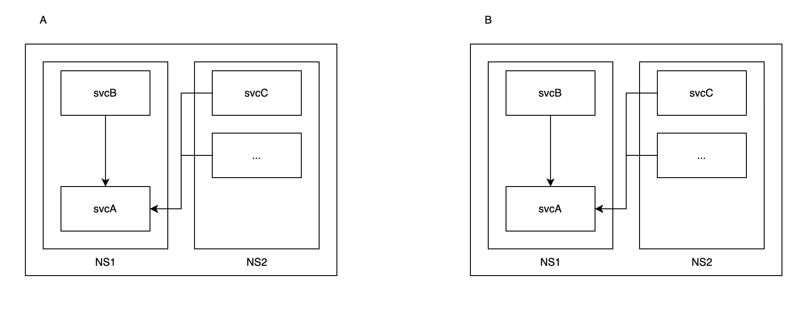
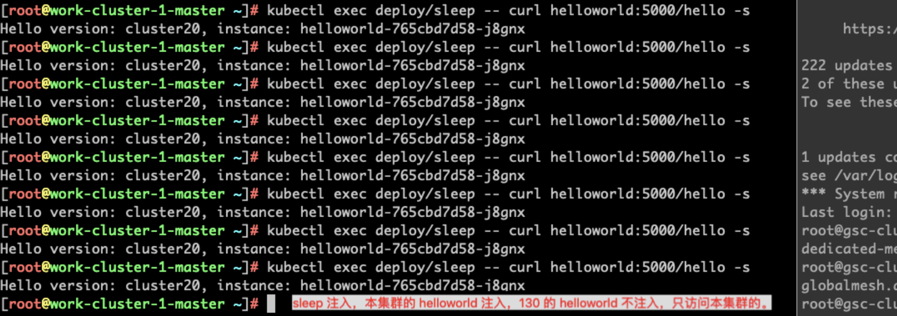
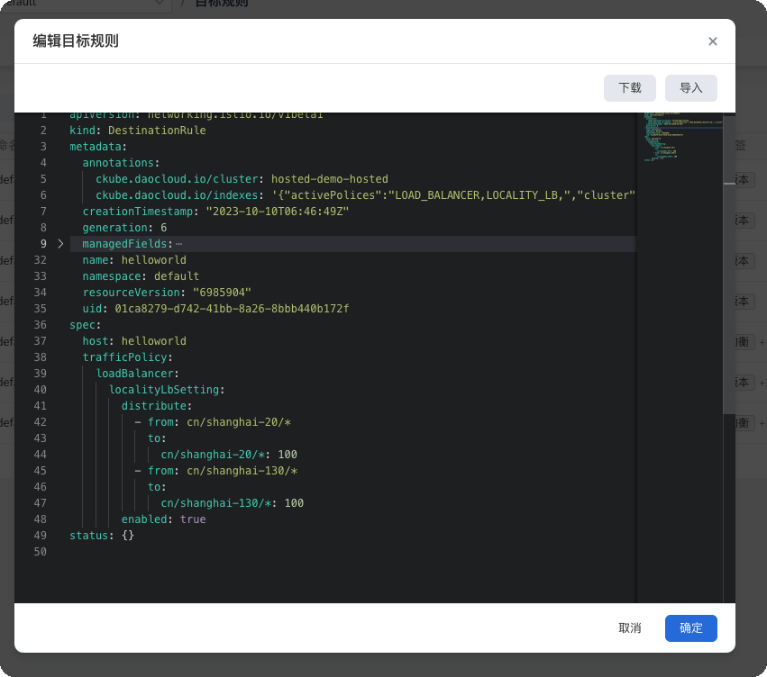
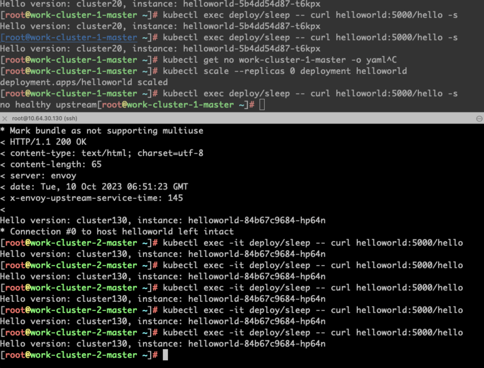

# 基于多云互联网格同名服务访问及流量的精准控制案例

> 本文中介绍的均为基于客户的真实业务应用演化的案例分析
>
> 开启多云互联的网格基础环境后业务访问流量不跨集群的需求

## 环境

- 集群：A、B
- 命名空间：NS1、NS2
- 服务：svcA，svcB ... （若干服务）

## 背景

在 A、B 两个集群的 NS1 和 NS2 中，都存在若干相同名称的服务（svcA，svcB ...），其他服务都调用 svcA，如下图：

两个集群中相同名称的服务并不是同一业务逻辑，比如：集群 A 中 NS1 中的 svcA 和集群 B 中 NS1 中 svcA，不是同一个业务服务，只是名称和为止对等，业务逻辑不通，其他服务亦然。

## 场景 1：正常双活灾备

如果集群 A 和集群 B 中的服务都注入 Istio Sidecar，如下：

在不经过其他特殊配置的情况下，两个集群的流量互通，相关服务互为灾备方案。
举个例子，集群 A 中的 svcB 可以访问到集群 A 中的 svcA，也可以访问到集群 B 中的 svcA。

**结论：这是典型的利用网格多云能力的灾备场景，但是在本案例中，由于两个集群中对等服务的业务逻辑不通，就会产生业务问题。**

## 场景 2：通过边车限制跨级群通讯

其中一个集群的服务注入 Istio Sidecar，另一个集群的服务不注入 Istio Sidecar，如下：

这种情况下无需额外配置，两个集群的流量不会互通，比如集群 B 中的 svcB 只会访问到集群 B 中的 svcA，
但是不会访问到集群 A 中的 svcA，通过 Istio 官方 Demo 的模拟结果也可以证实：

而集群 A 中的服务没有注入 Sidecar，所以也无法通过 Istio 能力访问到集群 B 中的服务。

反之亦然，
**结论：简单的说就是一个集群的服务注入 Sidecar，另一个集群的服务不注入 Sidecar，默认情况下不会产生跨集群流量，在本案例中由于两个集群对等服务的业务逻辑不通，这样的结果符合业务需求。**

## 场景 3：通过流量规则限制跨级群通讯

如果集群 A 和集群 B 中的服务都注入 Istio Sidecar，但是还需要双方独立流量不进行跨级群通讯，
比如网格环境中有些业务需要跨级群灾备，由于资源有限，有些业务应用也要部署在这样的基础多云互联环境下，但是不希望这些应用跨级群通讯。

首先答案是可行，需要特殊配置路由规则，限制远程集群的流量：

规则生效情况下，服务只会访问到本机群的上游服务：

即使本机群的上游服务不可达，也不会访问到远程集群：

**结论：通过 DR 精准限制流量也可以在完全注入 Sidecar 的情况下限制跨级群访问，所以在本案例中也符合业务预期，可以精准控制某些业务流量的跨级群通讯，从而保证业务逻辑正常。**
