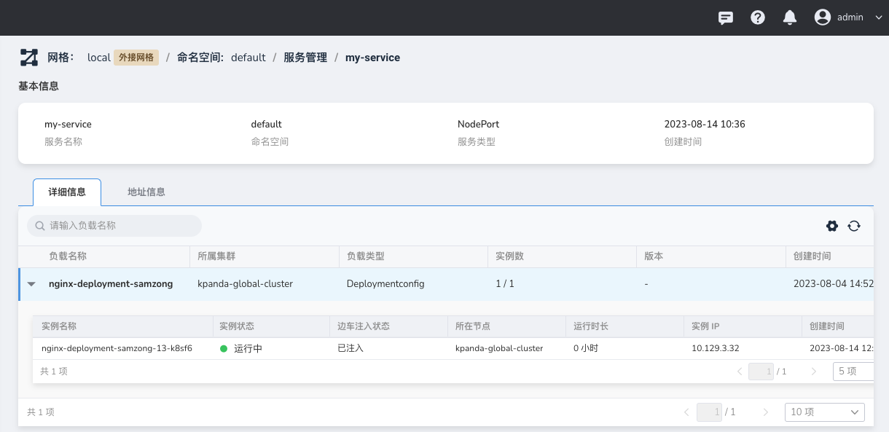

# 支持接入自定义工作负载类型

DCE 5.0 提供了增强的服务网格模块，能够部署在 Kubernetes 集群中，并且自动纳管集群内的服务，实现流量控制、服务发现、流量监控和故障熔断等功能。

DCE 5.0 服务网格默认支持注入 Deployment、DaemonSet 和 StatefulSet 类型的工作负载，可直接在工作负载页面执行 Sidecar 注入动作，将服务加入到网格中。

然而在实际的生产业务中，可能会因为集群发行版本的问题，导致出现特殊的工作负载类型，传统服务网格的能力对此类特殊工作负载类型无法支持治理能力。

DCE 5.0 服务网格提供的 Istio 版本中已对此能力进行了增强，用户仅需简单的配置即可完成对特殊工作负载类型的治理。

## 网格控制面启用自定义工作负载能力

通过标准方式，`helm upgrade` 升级的方式，为网格控制面模块增加对应的特殊工作负载类型。

### 备份参数

```shell
# 首先，备份现有的网格 Helm 参数配置
helm -n mspider-system get values mspider > mspider.yaml
```

### 更新配置

编辑上述备份的 `mspider.yaml`，并追加自定义工作负载类型的配置，如果存在多个配置类型，可以增加多个：

```yaml
global:
  # 以 DeploymentConfig 为例
  # --- add start ---
  custom_workloads:
    - localized_name: # 中英文必须要写
        en-US: DeploymentConfig
        zh-CN: 自定义工作负载类型
      name: deploymentconfigs
      path:
        pod_template: .spec.template # 定义工作负载 Pod 内容
        replicas: .spec.replicas # 定义工作负载副本数
        status_ready_replicas: .status.availableReplicas # 定义健康的副本数
      resource_schema:
        group: apps.openshift.io # 自定义工作负载的 CRD 的属组
        kind: DeploymentConfig
        resource: deploymentconfigs
        version: v1 # 自定义工作负载的 CRD 的版本
  # --- add end ---
  debug: true
  # ...
```

使用 Helm 更新 `mspider` ：

```shell
# 添加 repo，如果不存在的话
helm repo add mspider https://release.daocloud.io/chartrepo/mspider
helm repo update mspider

# 执行更新
export VERSION=$(helm list -n mspider-system | grep "mspider" | awk '{print $NF}')
helm upgrade --install --create-namespace \
-n mspider-system mspider mspider/mspider \
--cleanup-on-fail \
--version=$VERSION \
--set global.imageRegistry=release.daocloud.io/mspider \
-f mspider.yaml
```

更新网格控制面的工作负载：

```shell
# 执行更新命令在 kpanda-global-cluster
kubectl -n mspider-system rollout restart deployment mspider-api-service mspider-ckube-remote mspider-gsc-controller mspider-ckube mspider-work-api
```

## 为指定的网格实例添加自定义工作负载类型

在我们为网格全局控制面启动了自定义工作负载能力之后，我们只需要在对应的网格控制面的实例中启用对应的自定义工作负载类型即可

```shell
# 这里仍旧是 kpanda-global-cluster 操作
[root@ globalcluster]# kubectl -n mspider-system get globalmesh
NAME      MODE       OWNERCLUSTER            DEPLOYNAMESPACE   PHASE       MESHVERSION
local     EXTERNAL   kpanda-global-cluster   istio-system      SUCCEEDED   1.16.1
test-ce   HOSTED     dsm01                   istio-system      SUCCEEDED   1.17.1-mspider

# 编辑 需要启用的网格实例的 CR 配置
[root@ globalcluster]# kubectl -n mspider-system edit globalmesh test-ce

apiVersion: discovery.mspider.io/v3alpha1
kind: GlobalMesh
metadata:
  finalizers:
  - gsc-controller
  generation: 31
  name: test-ce
  ...
spec:
  clusters:
  - dsm01
  hub: release.daocloud.io/mspider
  mode: HOSTED
  ownerCluster: dsm01
  ownerConfig:
    controlPlaneParams:
      global.high_available: "true"
      global.istio_version: 1.17.1-mspider
      ...
    controlPlaneParamsStruct:  # <<< 注意找到这一行
      # --- add start ---
      global:
        custom_workloads:
        - localized_name:
            en-US: DeploymentConfig
            zh-CN: DeploymentConfig
          name: deploymentconfigs
          path:
            pod_template: .spec.template
            replicas: .spec.replicas
            status_ready_replicas: .status.availableReplicas
          resource_schema:
            group: apps.openshift.io
            kind: DeploymentConfig
            resource: deploymentconfigs
            version: v1
      # --- end ---
      istio:
        custom_params:
          values:
            sidecarInjectorWebhook:
              injectedAnnotations:
                k8s.v1.cni.cncf.io/networks: default/istio-cni
    deployNamespace: istio-system
```

网格实例的 CR 修改成功，注意网格控制面所在集群的控制面服务

```shell
# 这里需要在网格控制面所在的集群操作
[root@ meshcontorlcluster]#kubectl -n istio-system rollout restart deployment mspider-mcpc-ckube-remote mspider-mcpc-mcpc-controller mspider-mcpc-reg-proxy test-ce-hosted-apiserver
```

## 示例应用

在 OCP 中，支持一个新的工作负载 `DeploymentConfig`，本文以此为例演示如何成功支持纳管此工作负载。

### DeploymentConfig

```yaml
# filename dc-nginx.yaml
apiVersion: apps.openshift.io/v1
kind: DeploymentConfig
metadata:
  name: nginx-deployment-samzong
spec:
  replicas: 1
  selector:
    app: nginx-app-samzong
  template:
    metadata:
      labels:
        app: nginx-app-samzong
    spec:
      containers:
        - image: nginx:latest
          imagePullPolicy: Always
          name: nginx-samzong
          ports:
            - containerPort: 80
              protocol: TCP
```

使用上面的 yaml 创建一个名为 `nginx-deployment-samzong` 的应用，然后创建关联的 svc：

```yaml
# filename dc-nginx-svc.yaml
apiVersion: v1
kind: Service
metadata:
  name: my-service
spec:
  selector:
    app: nginx-app-samzong
  ports:
  - port: 80
    protocol: TCP
    targetPort: 80
```

这是一个标准的 Kubernetes 服务，我们通过 `app: nginx-app-samzong` 来绑定到预先创建的 `DeploymentConfig`。

```bash
kubectl -n NS_NAME apply -f dc-nginx.yaml dc-nginx-svc.yaml
```

### 效果

在工作负载成功启动之后，可以在`边车管理`中查看工作负载。默认为未注入，我们可以手工注入。


在服务列表可以看到对应的服务，此时服务的工作负载也是正常在运行的，我们可以增加对应的策略来提供对服务的访问。



## 结语

通过上面的操作，我们可以看到，通过简单的配置，就可以支持自定义的工作负载类型。
这样就可以支持更多的工作负载类型，让用户可以更加灵活地使用 DCE 5.0 服务网格。
