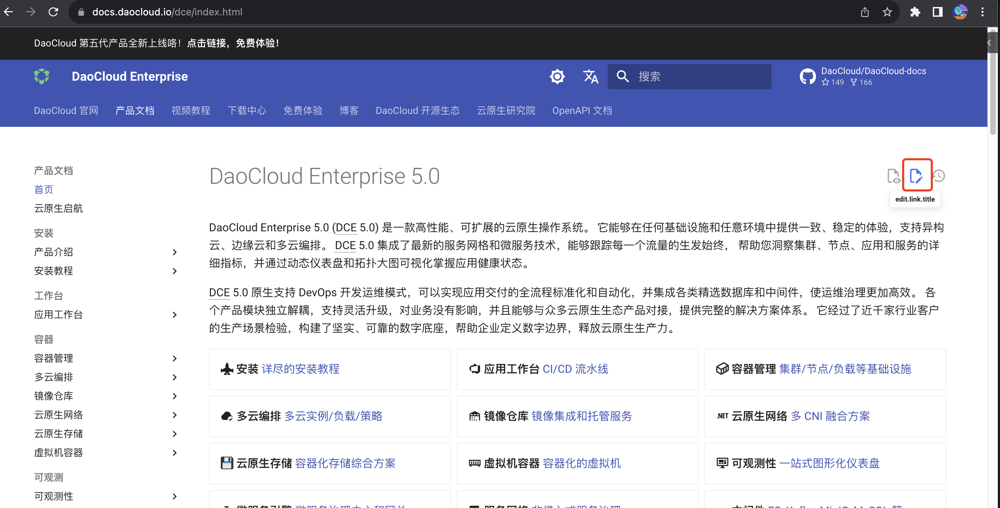
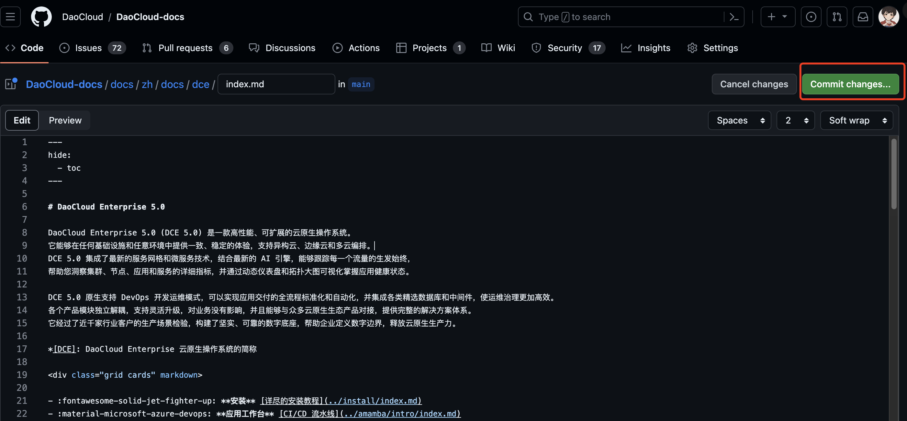
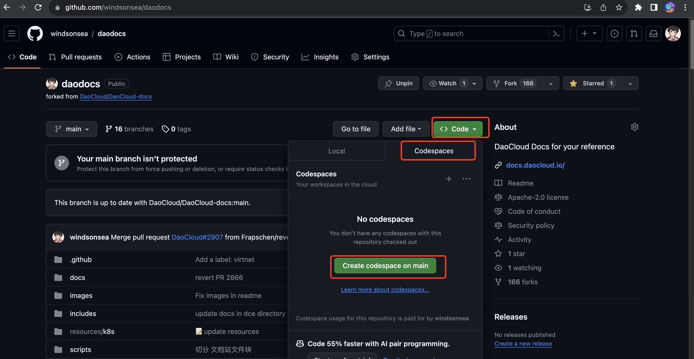
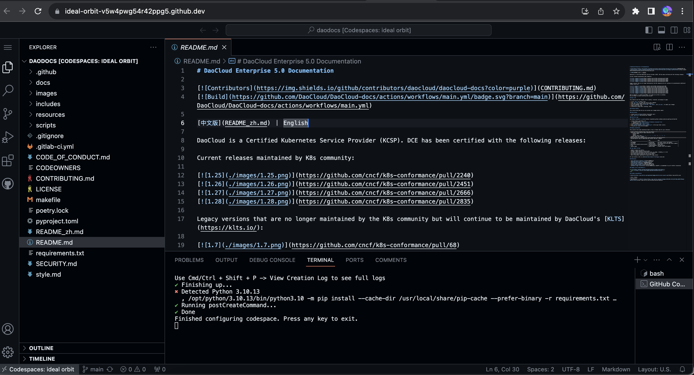
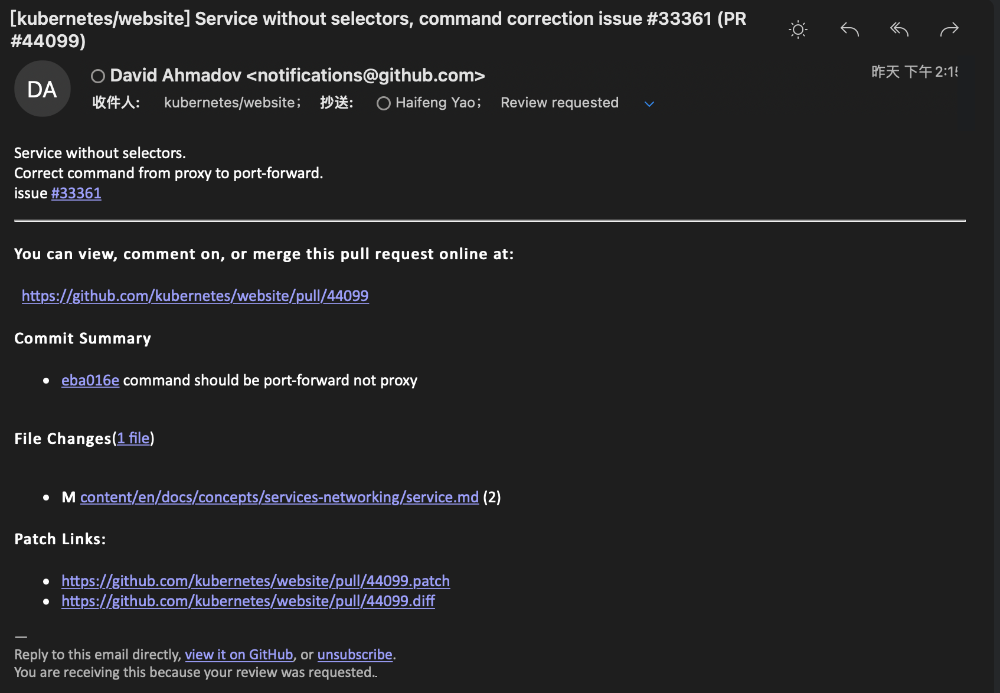

# Git 文档流程

本页简要说明一些通用的 Git 文档编写、评审、翻译流程和技巧。

## 工具

预先安装几个工具：

- [科学上网 🪜](./proxy.md)
- [Git](https://git-scm.com/downloads)，必需，装完才能支持各种 Git 命令
- [VScode](https://code.visualstudio.com/)，推荐，常用的 Markdown 编辑器
- [Typora](https://macwk.com/soft/typora)，可选，可以粘贴网页的图表文字，转换成 markdown 格式

学习资料：

- [Material for MkDocs](https://squidfunk.github.io/mkdocs-material/reference/)：
  这是整个文档站的编译软件帮助手册

## Git 云端编写 (For Author)

如今云无处不在，只要能连通互联网，就可以在线编辑，无需在本地安装上述工具。

### 网页直接修改

这种方式适合只改一个文件的小幅修改。

1. 在任何一个网页上点击编辑图标。

    

1. 完成编辑操作后，点击右上角的 `Commit changes` 按钮。

    

1. 修改 `Commit message`，填写 `Extended description` 后，点击 `Propose changes` 按钮。

    

1. 点击 `Create pull request` 按钮就完成了提交 PR 的操作。

    

### 通过 Codespace 编辑

如果你修改的文件不止 1 个，那可以试试 Codespace。Codespace 是一个云端的 VSCode 环境。
这种云端的 VSCode 好处是随时随地，缺点是免费版本只能保留几小时的环境，只有 VIP 才能长期留存数据。

1. 进入你的 Fork，点击 `Code` -> `Codespaces` -> `Create Codespace on main`。

    

1. 稍待片刻完成环境的创建，

    

1. 你可以在底部 TERMINAL 中运行各种命令，从左侧目录树中找到要修改的文件。

    

1. 编辑完成后，跟在本地一样，运行 git 命令提交修改。

!!! tip

    目前免费的 Codespace 只能留存 4 小时的数据。

## Git 本地编写 (For Author)

1. Fork 后克隆 GitHub 仓库。

    ```bash
    git clone https://github.com/windsonsea/daodocs.git
    ```

1. 在本地创建分支。

    ```bash
    git checkout -b yourbranch
    ```

1. 在本地完成编辑工作后，推荐在本地运行 `mkdocs serve` 进行预览，以免把错误带到线上。
   
    

    !!! tip
    
        - 每天开始前，切到 main 分支，运行 `git pull` 更新本地数据，与服务器的文件保持同步，以免跟别人的修改发生冲突。
        - 每天结束前，要将当天的修改提交上去。Git 是一种小步快走的开发模式，只需保证每一步正确，那天长日久将成就伟业。

1. 本地预览正常后，依次运行以下命令提交修改的内容。
   参见更多 [GitHub 命令](https://education.github.com/git-cheat-sheet-education.pdf)。

    ```bash
    git add .
    git commit -m "fix a typo in chapter 1" 
    git push origin yourbranch
    ```

1. 从网页上进入 GitHub 仓库，提交 PR。
   
    

    > - 有些项目要求 1 个 commit 提交 1 次 PR，如遇到 rebase 提示可参考 [GitHub rebase 问题](rebase.md)
    > - 对于 Scrum 开发组，若改动较大，请在 main/release-notes/notes 目录仿照其他文件创建一个 yaml，填写必要的信息
    > - 有关 GitHub 基础知识，参阅 [B 站教程](https://www.bilibili.com/video/BV18y4y1S7VC?p=9&spm_id_from=pageDriver)

## Git 评审流程 (For Reviewer)

这是代码、文档和任何修改都通用的评审流程。

1. 作者提交 PR 后，相关 Reviewer 会收到一封邮件。

    

1. 点击 `Files changed` 查看改了什么内容。

    

1. 如果对某句话有不同想法，可以直接添加 comments。

    

    - 建议点击 `Add a suggestion` 图标后进行修改，这样 PR 作者可以清晰看到评审建议。
    - 写好 comment 后，点击 `Start a review` 按钮，继续看其他字句，全部看完以后统一 `Submit review`

1. PR 作者修复所有问题后，运行以下命令覆盖原来的提交。

    ```git
    git add .
    git commit --amend --no-edit
    git push origin yourbranch -f
    ```

1. 经作者反复修改后，若没有其他问题，Reviewer 会给出以下标记，批准合并 PR：

    

    ```git
    /lgtm
    /approve
    ```
  
> 对于 Spiderpool、Spidernet 这几个网络项目，push 之前需要运行以下命令校验 markdownlint、拼写和 YAML 语法：

```shell
make lint-markdown-format
make lint-markdown-spell-colour
make lint-yaml
```

## 前端 UI 翻译 (For Translator)

对于前端 UI 文字翻译，除了 Weblate 翻译外，还可以用 i18n 插件。以 VScode 为例：

1. 安装 `i18n Ally` 插件。

    

1. 运行以下命令安装所有依赖项：

    ```shell
    npm i
    ```

1. 点击左侧的 `i18n Ally` 页签，找到 `No Translation` 内容，点击 `Open in editor` 图标。

    

1. 翻好一个字段后，点击下一个字段。可以在 Source Control 部分查看完成的译文。

    

1. 译文检查无误后，依次运行以下命令提交。

    ```shell
    git add .
    npm run commit
    git push origin branch-name
    ```

## 长句高效折行 (Make Prettier)

过长的语句不方便以 Git 方式更新，因为更新长句时很难从 PR 中一眼找出变化，所以需要将长句折行。

通常如果某个文件有长句 wraps > 80，可以先运行以下命令：

```shell
npx prettier -w filename
```

然后手动修改对应的文件，实现折行。
