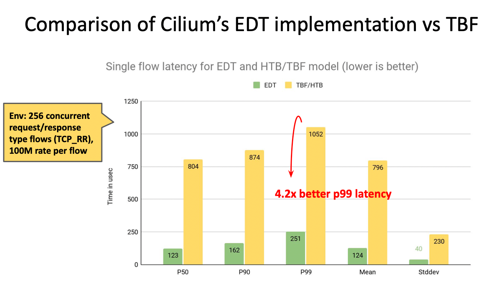
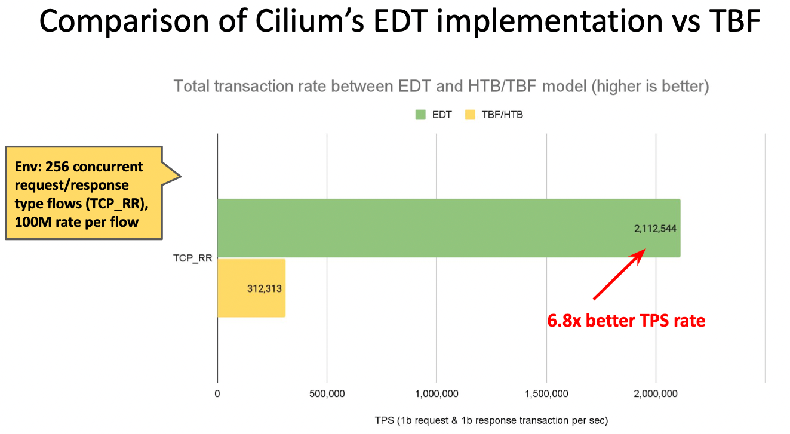

# Cilium 基于 eBPF 技术实施 Pod 带宽管控场景下的性能测试

Cilium 基于 eBPF 技术提升了 Pod 带宽的性能。本页介绍Cilium 基于 eBPF 技术实施 Pod 带宽管控场景下的性能测试结果。

## 测试对象

- 在传统方案中，基于 Linux 相同的 TC 模块，使用 HTB/TBF qdisc 来实施 Pod 流量的整形管控
- 在 Cilium 中，使用 eBPF 技术实现了一种 Earlist Departure Time（EDT）限速模型，实其无锁（lockless）实施的特点，有着优秀的性能表现

## 测试工具及测试环境

- 测试工具：netperf

- 测试环境：256 个并发会话的请求/响应类型流（TCP_RR），每个流的速率为 100M

## 测试结果

- Cilium 的 EDT Pod 带宽管控对数据包的延时影响极低，而传统的基于 HTB qdisc 的 TC 方案，对数据包通信的延时影响较大

    

- Cilium 的 EDT Pod 带宽管控对应用通信的 TPS 影响有限，而传统的基于 HTB qdisc 的 TC 方案，对应用通信的 TPS 影响较大

    
