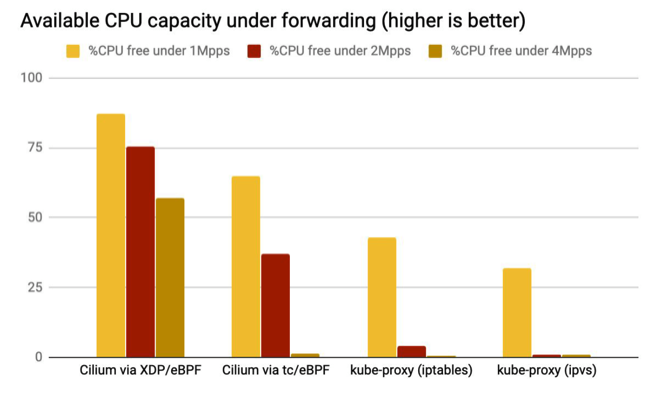

# Cilium 在 nodePort 场景下的访问加速测试

本页介绍 Cilium 在 nodePort 场景下的访问加速测试结果。

## 测试对象

在本测试中，对如下几个方案进行了 Kubernetes nodePort 的转发性能比较：

- 方案一：Cilium 的 eBPF XDP 加速 nodePort

    在 eBPF 的 XDP 模式下，nodePort 的转发规则能够 offload 运行到物理网卡上。该功能需要运行在裸金属机器上，需要物理硬件网卡的功能支持，当前，主流厂商的主流网卡是支持该功能的。该功能加速效果极好，硬件成本低，没有软件适配成本，是除了 DPDK 技术外的一个最佳选择

- 方案二：Cilium 的 eBPF TC 加速 nodePort

    在 eBPF 的 TC 模式下，nodePort 的转发规则在 linux 内核网络协议栈的最底层完成，加速效果欠缺于eBPF XDP 加速，但是效果比传统的基于 iptables 转发方案还是要好很多。
    该方案能运行在任意的机器上，包括裸金属机器和虚拟机，对硬件没有要求。

- 方案三：Kubernetes 传统的 kube-proxy 转发  nodePort

    kube-proxy 组件是 kubernetes 平台下完成 service 转发（包括 nodePort 转发）的一个组件，其原理是基于了 iptables 规则 或 ipvs 规则来实现，其转发性能普通。

## 测试一：测试 nodePort 的转发吞吐量

在裸金属机器测试环境下，使用发包工具 pktgen 产生了  10Mpps 的请求向数据，查看各个方案的 nodePort 转发吞吐量：

从上图可以看出：

- Cilium 的 eBPF XDP 加速 nodePort

    能完全处理 10Mpps 的请求向数据，完成 nodePort 解析后，其能转发出 10Mpps 的请求向数据到后端。

- Cilium 的 eBPF TC 加速 nodePort

    对于 10Mpps 的请求向数据，该访问只能完成约 3.5Mpps 的请求。

- kube-proxy 基于 iptables 转发 nodePort

    对于 10Mpps 的请求向数据，该访问只能完成约 2.3Mpps 的请求

- kube-proxy 基于 ipvs 转发 nodePort

    对于 10Mpps 的请求向数据，该访问只能完成约 1.9Mpps 的请求。注：它相比 iptables 的优势要在 backend 数量很多的时候才能体现出来。

### 结论

Cilium 的 eBPF TC 和 eBPF XDP 加速 nodePort，其性能都远远超过了 Kubernetes 传统的 kube-proxy 组件性能，保障了集群北向访问入口的优秀网络转发性能。

## 测试二：测试 nodePort 转发的资源开销

在裸金属机器测试环境下，使用发包工具 pktgen 方便产生 1Mpps、2Mpps、4Mpps 的请求向数据，测试几种方案中实施 nodePort 转发主机 CPU 开销：

从上图可以看出：

- Cilium 的 eBPF XDP 加速 nodePort 方案

    主机的 CPU 空闲率最高，意味着其转发 nodePort 请求所产生的 CPU 开销最小，即使在 4Mpps 的请求向压力下，主机还有大量的空闲 CPU 资源。

- Cilium 的 eBPF TC 加速 nodePort

    主机的 CPU 空闲率比较高，意味着其转发 nodePort 请求所产生的 CPU 开销比较小，在 4Mpps 的请求向压力下，主机的 CPU 已经完全被耗尽。

- kube-proxy 基于 iptables 转发 nodePort

    主机的 CPU 空闲率比较第，意味着其转发 nodePort 请求所产生的 CPU 开销比较高，在 2Mpps 和 4Mpps 的请求向压力下，主机的 CPU 已经完全被耗尽。

- kube-proxy 基于 ipvs 转发 nodePort

    主机的 CPU 空闲率比较第，意味着其转发 nodePort 请求所产生的 CPU 开销比较高，在 2Mpps 和 4Mpps 的请求向压力下，主机的 CPU 已经完全被耗尽。

### 结论

Cilium 的 eBPF TC 和 eBPF XDP 加速 nodePort，其所消耗的主机 CPU 资源较低，从而能够使得这些 CPU 资源可用于保障主机上的其它业务。

